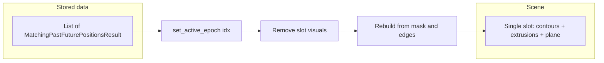

# Single-slot epoch rendering for `Volumentric2DTimeSeriesPlotter`

## Problem

In `[predicitive_decoding_vispy.py](h:\TEMP\Spike3DEnv_ExploreUpgrade\Spike3DWorkEnv\pyPhoPlaceCellAnalysis\src\pyphoplacecellanalysis\Pho2D\vispy\predicitive_decoding_vispy.py)`, the current flow registers **every** epoch via `add_epoch_visuals` (contours + optional extrusions + emphasis plane under an `epoch_group_nodes[epoch_idx]` node). `[set_active_epoch](h:\TEMP\Spike3DEnv_ExploreUpgrade\Spike3DWorkEnv\pyPhoPlaceCellAnalysis\src\pyphoplacecellanalysis\Pho2D\vispy\predicitive_decoding_vispy.py)` then loops **all** `epoch_visual_groups` and flips visibility ([lines 2845–2868](h:\TEMP\Spike3DEnv_ExploreUpgrade\Spike3DWorkEnv\pyPhoPlaceCellAnalysis\src\pyphoplacecellanalysis\Pho2D\vispy\predicitive_decoding_vispy.py)). That keeps a full GPU scene object set per epoch (expensive memory / scene graph cost) even when only one epoch is shown.

## Direction

- **Source of truth**: Hold a reference to `epoch_flat_mask_future_past_result: List[MatchingPastFuturePositionsResult]` (already imported at line 80). Per epoch, extract `per_t_bin_mask = epoch_result.epoch_t_bins_high_prob_pos_mask` and `t_bin_edges = epoch_result.decoded_epoch_result.time_bin_edges` (same as your notebook snippet and existing docstrings around `add_emphasis_volume` / `add_posterior_contours`).
- **Rendering**: Maintain **at most one** “slot” of visuals in the scene at a time: on epoch change, **detach/remove** the previous slot’s posteriors (which already cascades extrusion removal via existing `remove_posterior_contours` → `remove_contour_extrusions`) and emphasis plane, then **call the same building path** as today (`add_posterior_contours` → optional `build_contour_extrusions` → `add_emphasis_plane`) for the newly active epoch.
- **Stable identifiers**: Use fixed keys for the single slot (e.g. `contour[active]` / `plane[active]`) so removal does not depend on the logical epoch index. The scene parent can remain one reusable `scene.Node` (e.g. name `Epoch active` or include the current index in the node name only for the tree label).




## API changes (minimal surface)

1. **New method** on `Volumentric2DTimeSeriesPlotter`, e.g. `set_epoch_visual_source(epoch_flat_mask_future_past_result: List[MatchingPastFuturePositionsResult], *, extrude: bool = False, contour_kwargs=..., plane_kwargs=..., extrusion_kwargs=..., initial_epoch_idx: int = 0)`
  - Stores the list + render options on the instance.  
  - Updates epoch slider max/label via existing `_update_epoch_slider_range` / label logic, but driven by `len(epoch_flat_mask_future_past_result)` instead of `len(epoch_visual_groups)`.  
  - Calls `set_active_epoch(initial_epoch_idx)` to render the first view.
2. **Refactor `set_active_epoch`** into two behaviors:
  - **Single-source mode** (when the new source list is set): if index unchanged, no-op; else `_clear_active_slot_visuals()` then build from `epoch_flat_mask_future_past_result[epoch_idx]`. For `epoch_idx is None`, clear slot only (define explicitly: hide epoch overlays — no “show all” in this mode).
  - **Legacy mode** (no source list): keep current visibility-walk over `epoch_visual_groups` so existing callers that still loop `add_epoch_visuals` are unchanged.
3. **Navigation helpers** used by Up/Down and `on_epoch_slider_value_changed`: replace `sorted(self.epoch_visual_groups.keys())` with a small helper, e.g. `_iter_epoch_nav_indices()`, that returns `range(n)` when single-source mode is active, else sorted legacy keys.
4. `**n_epoch_groups` property**: return `len(source)` in single-source mode, else `len(epoch_visual_groups)` so keys/slider text stay consistent.

## Small supporting pieces

- `**remove_emphasis_plane(unique_identifier: str) -> bool`** (or private equivalent): pop from `emphasis_planes_by_key`, set `plane_mesh` / `edge_line` `parent = None`, `_refresh_scene_tree`. Today there is add/get/set visibility but no symmetric remove; single-slot swap needs it.
- `**_clear_active_slot_visuals()`**: `remove_posterior_contours('contour[active]')` (already removes extrusions), then `remove_emphasis_plane('plane[active]')`, detach/reuse the optional `epoch` group node if desired.
- **Internal build**: Either factor a private `_add_epoch_visuals_single_slot(epoch_idx, per_t_bin_mask, t_bin_edges, ...)` that duplicates the body of `add_epoch_visuals` with fixed ids, or add optional parameters to `add_epoch_visuals` for fixed contour/plane id strings and a flag to skip `register_epoch_visual` legacy bookkeeping when in single-source mode.

## Notebook / caller migration

Replace the loop:

```python
for an_epoch_idx in np.arange(len(epoch_flat_mask_future_past_result)):
    _out_contour_img_objs[an_epoch_idx] = viewer_3d.add_epoch_visuals(...)
viewer_3d.set_active_epoch(35)
```

with:

```python
viewer_3d.set_epoch_visual_source(epoch_flat_mask_future_past_result, extrude=True, extrusion_kwargs={'tube_radius': 1.1, 'tube_alpha': 0.6}, initial_epoch_idx=35)
```

(Optionally keep `_out_contour_img_objs` out entirely; the return dict from `add_epoch_visuals` is less meaningful when not pre-building all epochs.)

## Files to touch

- Primary: `[pyphoplacecellanalysis/Pho2D/vispy/predicitive_decoding_vispy.py](h:\TEMP\Spike3DEnv_ExploreUpgrade\Spike3DWorkEnv\pyPhoPlaceCellAnalysis\src\pyphoplacecellanalysis\Pho2D\vispy\predicitive_decoding_vispy.py)` — `Volumentric2DTimeSeriesPlotter` fields + methods above.
- Optional follow-up: `[InteractivePipelineLoadFromPickle_Bapun_Day4OpenField.ipynb](h:\TEMP\Spike3DEnv_ExploreUpgrade\Spike3DWorkEnv\Spike3D\InteractivePipelineLoadFromPickle_Bapun_Day4OpenField.ipynb)` (and any other notebook using the old loop) to use `set_epoch_visual_source`.

## Trade-off (call out in code docstring)

- **Memory / scene size**: Much smaller scene (one epoch at a time).  
- **CPU on epoch change**: Rebuilds meshes each time you switch epochs. If that becomes a bottleneck, a later optional **LRU cache of built visuals per epoch index** can be added without changing the external API much.

