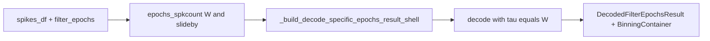

# Sliding / overlapping decoding windows (pipeline-wide)

## Naming (canonical)

| Concept                                    | API / code                                                                        | Notes                                                                                                          |
| ------------------------------------------ | --------------------------------------------------------------------------------- | -------------------------------------------------------------------------------------------------------------- |
| Window width (integration time, Zhang τ)   | `decoding_time_bin_size`, `epochs_spkcount(..., bin_size=...)`                    | Unchanged meaning.                                                                                             |
| Step between consecutive window **starts** | `**slideby`** in functions; `**decoding_slideby`** on `DecodedFilterEpochsResult` | `None` → treat as `slideby == W` (non-overlapping). Require `0 < slideby ≤ W` (float tolerance).               |
| Legacy pickle field                        | `decoding_time_bin_hop`                                                           | **Read-only migration**: `__setstate__` / merge may still see it; dropped after mapping to `decoding_slideby`. |

Do **not** use `time_bin_hop` in new API surfaces; keep `**slideby`** everywhere user-facing.

## Semantics (lock these in code + docstrings)

- `**decoding_time_bin_size`** = integration **window width** `W` (seconds). Passed to `decode(..., time_bin_size=...)` / Zhang τ — unchanged meaning.
- `**slideby`** = **step** between consecutive window **start** times (seconds). Default `**None`** → `slideby` resolves to `W` (today’s non-overlap). Require `0 < slideby ≤ W` (with float tolerance).
- **Alignment**: left-aligned windows `[t, t+W)` with `t = t0 + k·slideby` while `t+W ≤ epoch.stop` (drop partial tail for consistency with `compute_spanning_bins` ethos).

---

## Implementation status (library code)

### 1) NeuroPy — spike counts for overlapping windows

**File:** [NeuroPy/neuropy/analyses/decoders.py](h:\TEMP\Spike3DEnv_ExploreUpgrade\Spike3DWorkEnv\NeuroPy\neuropy\analyses\decoders.py)

- `**epochs_spkcount(..., slideby: Optional[float] = None)`** — done.
- When resolved hop equals `W`: existing contiguous-bin path.
- When hop `< W`: dedicated sliding path builds per-window counts and `**BinningContainer.from_sliding_windows(...)`**.

### 2) NeuroPy — `BinningContainer` for non-contiguous windows

**File:** [NeuroPy/neuropy/utils/mixins/binning_helpers.py](h:\TEMP\Spike3DEnv_ExploreUpgrade\Spike3DWorkEnv\NeuroPy\neuropy\utils\mixins\binning_helpers.py)

- Sliding mode: parallel start/stop arrays; `**left_edges` / `right_edges`** match spike-count columns — done.

### 3) pyPhoPlaceCellAnalysis — decode pipeline

**File:** [pyPhoPlaceCellAnalysis/.../Analysis/Decoder/reconstruction.py](h:\TEMP\Spike3DEnv_ExploreUpgrade\Spike3DWorkEnv\pyPhoPlaceCellAnalysis\src\pyphoplacecellanalysis\Analysis\Decoder\reconstruction.py)

- `**slideby`** threaded through `decode_specific_epochs`, prebuild, shell, `hyper_perform_decode`, `init_from_single_epoch_result`, etc.; `**decoding_slideby`** stored on `**DecodedFilterEpochsResult`** — done.
- `**_perform_decoding_specific_epochs`**: still `active_decoder.decode(..., time_bin_size=W)`; slide affects binning only — done.
- **Merge**: equality / hop handling uses `**decoding_slideby`** with fallback to legacy attribute on old objects — done.
- **Pickle**: `**decoding_slideby`**; migrate from `**decoding_time_bin_hop`** then remove legacy key — done.

### 4) Pseudo-epochs from decoding bins

**Same file** — `SingleEpochDecodedResult.build_pseudo_epochs_df_from_decoding_bins`:

- Uses `**time_bin_container.left_edges` / `right_edges`** — done.
- `**epoch_end_non_overlapping_difference` shrink** applies only when all bin widths are equal (contiguous non-overlapping case); overlapping sliding windows skip shrink — done.

### 5) Directional / continuous cache — no key collisions

**File:** [DirectionalPlacefieldGlobalComputationFunctions.py](h:\TEMP\Spike3DEnv_ExploreUpgrade\Spike3DWorkEnv\pyPhoPlaceCellAnalysis\src\pyphoplacecellanalysis\General\Pipeline\Stages\ComputationFunctions\MultiContextComputationFunctions\DirectionalPlacefieldGlobalComputationFunctions.py)

- `**decoding_continuous_cache_key(decoding_time_bin_size, slideby)`** and `**normalize_continuous_decoding_cache_lookup_key`** — done.
- `**PredictiveDecodingComputations`** passes `**extant_decoded_slideby`** where needed — done.

### 6) Notebook / glue

- **[PendingNotebookCode.py](h:\TEMP\Spike3DEnv_ExploreUpgrade\Spike3DWorkEnv\pyPhoPlaceCellAnalysis\src\pyphoplacecellanalysis\SpecificResults\PendingNotebookCode.py)** — contextual decoder path uses `**slideby`** and `**decoding_continuous_cache_key(..., slideby)`** where appropriate — done for that entry point.

---

## What still needs adapting to *use* sliding windows end-to-end

These are **adoption / validation** gaps, not missing core library pieces:

1. **Interactive notebooks (Spike3D repo)**
  Many cells call `decode_specific_epochs(..., decoding_time_bin_size=...)` only. To get sliding windows, add `**slideby=...`** (e.g. `0.05` with `W=0.25`).  
   If you cache decoders or continuous results in dicts keyed **only** by `decoding_time_bin_size`, extend keys to `**decoding_continuous_cache_key(W, slideby)`** (or equivalent tuple) so different hops do not overwrite the same slot.
2. **Automated tests**
  - NeuroPy: `tests/test_decoders.py` expects `**neuropy_pf_testing.h5`**; without it, epochs tests fail at collection/setup. **Pending:** either commit the fixture, DVC-pull, or add **fully synthetic** `epochs_spkcount` tests (no HDF5).  
  - pyPho: same file + env issues (e.g. pytest auto-loaded napari → lxml_html_clean). Use `**PYTEST_DISABLE_PLUGIN_AUTOLOAD=1`** or add optional dep when running locally/CI.
3. **Downstream analysis assumptions**
  Any code that assumes `**n_time_bins == epoch_duration / W`** or a single posterior sample per non-overlapping bin must be reviewed when `**slideby < W`** (more time points, correlated samples). Predictive-decoding `**window_size`** (in bins) may need interpretation in docs.
4. **Visualization (optional)**
  VisPy / notebook plots that map “one screen pixel / row per bin” remain valid but denser in time when sliding; no separate `**slideby`** knob was required in vispy modules at last check—only if you add UI to compare hops.
5. **Performance / memory**
  `n_windows ~ (duration - W) / slideby + 1`; small `**slideby`** on long epochs increases arrays and decode cost—document in user-facing docstrings (already noted in NeuroPy `epochs_spkcount`).

---

## Tests (target)

- **NeuroPy:** `epochs_spkcount` with `slideby=None` (or `slideby=W`) matches pre-change counts on a short synthetic epoch; with `slideby < W`, compare to brute-force per-window histogram for a few units.
- **pyPho:** smoke `decode_specific_epochs(..., slideby=...)` — posterior time dimension equals `n_windows`, and `time_bin_containers[i].num_bins` matches window count.

---

## Risk notes

- **Perf/memory:** large `W/slideby` ratios — cap or warn in notebooks.
- **Short epochs:** `epoch_duration < W` — existing edge-case handling; add tests if you rely on sliding in very short filters.

