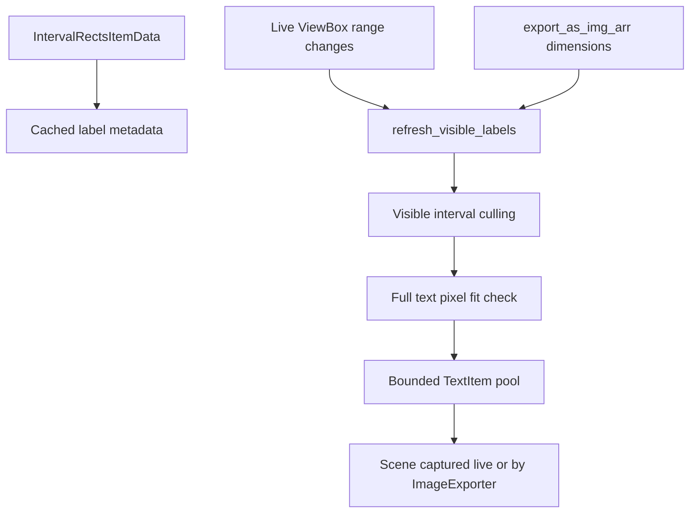

# Smart Epoch Interval Labels

## Approach
Add lazy, viewport-aware interval labels to `IntervalRectsItem`, then refresh them from both the interactive view and the pyqtgraph export path. The interval-track creation code in `[SpecificDockWidgetManipulatingMixin.py](h:\TEMP\Spike3DEnv_ExploreUpgrade\Spike3DWorkEnv\pyPhoPlaceCellAnalysis\src\pyphoplacecellanalysis\GUI\PyQtPlot\DockingWidgets\SpecificDockWidgetManipulatingMixin.py)` should not need direct label logic; it will benefit through the interval items already added to each plot.

## Implementation Details
- In `[IntervalRectsItem.py](h:\TEMP\Spike3DEnv_ExploreUpgrade\Spike3DWorkEnv\pyPhoPlaceCellAnalysis\src\pyphoplacecellanalysis\GUI\PyQtPlot\Widgets\GraphicsObjects\IntervalRectsItem.py)`, replace eager label creation in `rebuild_label_items()` with lightweight cached metadata and a small reusable pool of `CustomRectBoundedTextItem` objects.
- Add a public method like `refresh_visible_labels(canvas_width_px, canvas_height_px, x_range=None, y_range=None, immediate=True)` that:
  - uses sorted start/end arrays to only inspect visible intervals;
  - computes each interval rect's pixel size from `(duration / x_span) * canvas_width_px` and `(series_height / y_span) * canvas_height_px`;
  - uses `QFontMetricsF` to show a label only when the full text plus padding fits;
  - caps active labels with `max_visible_labels` to protect dense tracks;
  - hides pooled labels for intervals that leave view or stop fitting.
- Keep labels sourced from `IntervalRectsItemData.label` when present, with `format_label_fn` remaining optional. Empty or missing labels produce no label item and no overhead beyond metadata.
- Add live updates by connecting `IntervalRectsItem` to its `ViewBox.sigRangeChanged` when it enters a scene/view, using a debounced `QTimer` so pan/zoom does not scan repeatedly during drag.
- In `[EpochRenderingMixin.py](h:\TEMP\Spike3DEnv_ExploreUpgrade\Spike3DWorkEnv\pyPhoPlaceCellAnalysis\src\pyphoplacecellanalysis\GUI\PyQtPlot\Widgets\Mixins\RenderTimeEpochs\EpochRenderingMixin.py)`, wire a small `_custom_format_label_for_rect_data(...)` alongside the existing tooltip formatter and pass it when creating or updating `IntervalRectsItem` instances.
- In `[PyqtgraphTimeSynchronizedWidget.py](h:\TEMP\Spike3DEnv_ExploreUpgrade\Spike3DWorkEnv\pyPhoPlaceCellAnalysis\src\pyphoplacecellanalysis\Pho2D\PyQtPlots\TimeSynchronizedPlotters\PyqtgraphTimeSynchronizedWidget.py)`, refresh interval labels immediately after export `setXRange` / exporter width-height calculation and before `ImageExporter.export(toBytes=True)`. Use the export dimensions, not the on-screen widget dimensions, then restore the live label state in `finally` after restoring the original ranges.

## Validation
- Run focused syntax/lint checks on the changed Python files after implementation.
- Exercise the live path by adding labeled interval tracks and confirming labels appear/disappear with zoom while dense tiny intervals remain cheap.
- Exercise the export path with `active_2d_plot.export_all_tracks_to_image(custom_figure_output_path=out_path, curr_active_pipeline=curr_active_pipeline)` and confirm exported labels follow the same full-fit rule using export canvas dimensions.