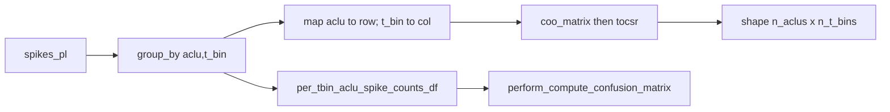

# Sparse `(n_aclus, n_t_bins)` Spike-Count Matrix

**File:** [`pyPhoPlaceCellAnalysis/src/pyphoplacecellanalysis/Analysis/reliability.py`](h:\TEMP\Spike3DEnv_ExploreUpgrade\Spike3DWorkEnv\pyPhoPlaceCellAnalysis\src\pyphoplacecellanalysis\Analysis\reliability.py) — `CellIndividualReliabilityMatrix.compute_reliability_matrix` (~860–973).

## Approach

Reuse the existing Polars `group_by(["aclu", "t_bin_idx"]).agg(pl.len())` result (already COO-like nonzero entries). Build a `scipy.sparse.csr_matrix` via `coo_matrix` — do **not** densify to `(n_aclus, n_t_bins)`.



## Indexing (critical)

- **Rows:** order of `neuron_ids` (same as reliability DF).
- **Cols:** 0-based `0 .. n_t_bins-1`, aligned with `time_bin_info_df['t_bin_idx']` / `bin_container.centers`.
- Spike `t_bin_idx` from `add_binned_time_column` uses **1-based** labels (`bin_indicies[1:]`). Convert with `col = t_bin_idx - 1` when placing into the matrix. Drop out-of-range / unmapped aclus.

## Implementation (minimal edit in `compute_reliability_matrix`)

1. Import `coo_matrix` (or `csr_matrix`) from `scipy.sparse` near the class / existing scipy import.
2. After building `per_tbin_aclu_spike_counts_df` (keep Polars agg result available before or after `.to_pandas()`):

```python
n_aclus = len(neuron_ids)
aclu_to_row = {int(a): i for i, a in enumerate(neuron_ids)}
# from aggregated aclu, t_bin_idx, n_spikes arrays:
row_i = np.fromiter((aclu_to_row[a] for a in aclus if a in aclu_to_row), dtype=np.int64)  # prefer vectorized map
col_j = t_bin_idx.astype(np.int64) - 1  # 1-based labels -> 0-based columns
valid = (col_j >= 0) & (col_j < n_t_bins) & mapped_rows
per_tbin_aclu_spike_counts_sparse = coo_matrix((n_spikes[valid], (row_i[valid], col_j[valid])), shape=(n_aclus, n_t_bins), dtype=np.int32).tocsr()
```

Prefer a vectorized row map (e.g. `pd.Categorical(..., categories=neuron_ids).codes` or a NumPy searchsorted on sorted ids) over a Python loop.

3. **Return API (default):** add as 4th value — preserves current 3-tuple notebook unpacks if callers ignore extras only when they use explicit unpack of 3 (Python will error on 4→3, so update the class docstring example):

```python
return t_bin_aclus_reliability_df, per_tbin_aclu_spike_counts_df, time_bin_info_df, per_tbin_aclu_spike_counts_sparse
```

Update the class docstring usage block (~843–854) to unpack four values. Do **not** edit the notebook unless you ask.

4. Docstring: document shape, CSR dtype, row/col semantics, and that zeros mean no spikes in that bin.

## Out of scope

- Rewriting `perform_compute_confusion_matrix` to consume the sparse matrix (keep long DF path).
- Fixing the separate `active_pos_df['t_bin_idx'] = spikes_df['t_bin_idx']` bug (~913).
- Adding a NeuroPy `SpikesAccessor` sparse helper (there is already a dense `compute_unit_time_binned_spike_counts`).

## Sanity check

- `sparse.shape == (len(neuron_ids), n_t_bins)`
- `sparse.sum() == len(spikes_df)` (or sum of `n_spikes` after filtering to `neuron_ids`)
- For a known `(aclu, t_bin)` with spikes: `sparse[row, t_bin_idx - 1] == n_spikes` from the long DF
