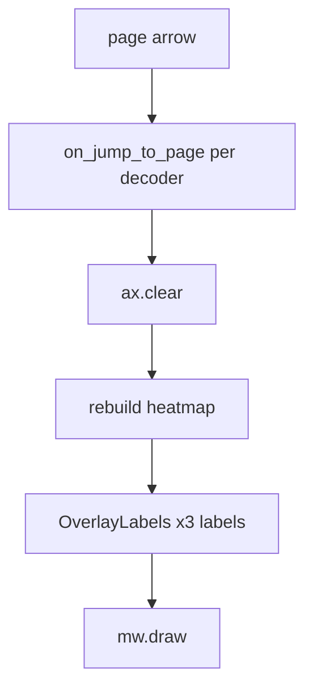

# Speed up OverlayLabels page flips

## Context

Arrow clicks run [`on_jump_to_page`](h:/TEMP/Spike3DEnv_ExploreUpgrade/Spike3DWorkEnv/pyPhoPlaceCellAnalysis/src/pyphoplacecellanalysis/Pho2D/stacked_epoch_slices.py) per decoder column: `ax.clear()` → heatmap rebuild → every `on_render_page_callbacks` entry (now includes OverlayLabels with **3** artists: wcorr / heuristic / radon). After the rename/force-enable work, labels actually draw again, so that path is paid on every page.

DecodedEpochSlices already sets `use_AnchoredCustomText=False`, so the intended update path is `AnchoredText.txt.set_text` — not AnchoredCustomText rebuild. Equal-spacing work in OverlayLabels stays as-is.

## Root causes (locked)

1. **Print spam on the hot path** — OverlayLabels/Radon callbacks default `debug_print=kwargs.pop(..., True)`; YellowBlue defaults even hardcode `'debug_print': True` ([`stacked_epoch_slices.py` ~3262](h:/TEMP/Spike3DEnv_ExploreUpgrade/Spike3DWorkEnv/pyPhoPlaceCellAnalysis/src/pyphoplacecellanalysis/Pho2D/stacked_epoch_slices.py)). Soft-guard `WARNING:` prints are ungated. With 4 decoders × ~10 axes × several callbacks, console I/O dominates.
2. **Stale artists after `ax.clear()`** — OverlayLabels keeps refs keyed by `curr_ax`. After clear, `artist.axes is None`; upsert re-`add_artist` then updates. Prefer treating detached artists as dead (`None`) and creating a single fresh label only when showing text — avoids reattaching cleared OffsetBoxes and keeps the dict honest after clear.
3. **Per-axis kwargs churn** — every axis rebuilds font props / `deepcopy(text_kwargs)` ×3. Cheap vs heatmaps, but easy to trim once prints are gone.

## Changes (locked)

### 1. Silence hot-path logging

In [`DecoderPredictionError.py`](h:/TEMP/Spike3DEnv_ExploreUpgrade/Spike3DWorkEnv/pyPhoPlaceCellAnalysis/src/pyphoplacecellanalysis/General/Pipeline/Stages/DisplayFunctions/DecoderPredictionError.py):
- OverlayLabels update/remove and Radon update: `kwargs.pop('debug_print', False)`.
- Gate the new `WARNING: ... overlay_labels_data ...` / radon-miss prints behind `debug_print`.

In [`stacked_epoch_slices.py`](h:/TEMP/Spike3DEnv_ExploreUpgrade/Spike3DWorkEnv/pyPhoPlaceCellAnalysis/src/pyphoplacecellanalysis/Pho2D/stacked_epoch_slices.py) YellowBlue defaults (~3262): `'debug_print': False`.

### 2. Treat cleared overlay artists as dead

In `_subfn_upsert_overlay_label`:
- If `extant_artist is not None` and `extant_artist.axes is None` (cleared by page jump): set `extant_artist = None` and fall through to the create branch when `should_show` (do not `add_artist` a detached OffsetBox).
- Keep in-place `txt.set_text` only when the artist is still attached to `curr_ax` (`use_AnchoredCustomText=False` path).

### 3. Trim per-axis OverlayLabels overhead

Still in the OverlayLabels callback only:
- Build shared inset `text_kwargs` once; for the three blocks, shallow-copy / update stroke + `bbox_to_anchor` instead of `deepcopy(text_kwargs)` ×3.
- Construct `ValueFormatter` only when `use_AnchoredCustomText` is True (already gated; leave that).

Do not change `on_jump_to_page` heatmap/clear structure in this pass.

## Verification

Flip pages with arrows on the multi-decoder window after `add_data_overlays(included_columns=['radon','wcorr','coverage','mseq_tcov'])`. Expect: labels still equally stacked top-right; no per-axis WARNING spam; noticeably snappier page changes vs current.