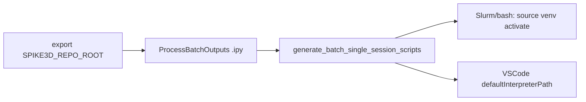

# Pass SPIKE3D_REPO_ROOT into batch script generation

**Goal:** Generated batch wrappers activate `${SPIKE3D_REPO_ROOT}/Spike3D/.venv_modern` (and VSCode uses that tree’s `python`).

**Architecture:** Shell exports `SPIKE3D_REPO_ROOT` → `.ipy` reads it → builds `venv_activate_path` / `vscode_default_interpreter_path` → existing `generate_batch_single_session_scripts` + Jinja templates already bake `source '{{ venv_activate_path }}'` into Slurm/bash. No changes to [`pythonScriptTemplating.py`](h:\TEMP\Spike3DEnv_ExploreUpgrade\Spike3DWorkEnv\pyPhoPlaceCellAnalysis\src\pyphoplacecellanalysis\General\Batch\pythonScriptTemplating.py) or templates.



## Changes

### 1. Shell instructions — [`EXTERNAL/DEVELOPER_NOTES/2026-09-14_GreatlakesBatchRunInstructions.md`](h:\TEMP\Spike3DEnv_ExploreUpgrade\Spike3DWorkEnv\Spike3D\EXTERNAL\DEVELOPER_NOTES\2026-09-14_GreatlakesBatchRunInstructions.md)

After assigning `SPIKE3D_REPO_ROOT`, add `export SPIKE3D_REPO_ROOT` (and use the same export in the `/tmpssd` and `/dev/shm` blocks). Without `export`, `os.environ` inside ipython will not see it.

### 2. `.ipy` — [`ProcessBatchOutputs_qclus1246789_Only.ipy`](h:\TEMP\Spike3DEnv_ExploreUpgrade\Spike3DWorkEnv\Spike3D\ProcessBatchOutputs_qclus1246789_Only.ipy)

Near the `generate_batch_single_session_scripts` call (~lines 407–427), replace the hardcoded activate path with:

```python
_spike3d_repo_root = Path(os.environ['SPIKE3D_REPO_ROOT']).expanduser().resolve()
_venv_activate_path = str(_spike3d_repo_root / 'Spike3D' / '.venv_modern' / 'bin' / 'activate')
_vscode_python = str(_spike3d_repo_root / 'Spike3D' / '.venv_modern' / 'bin' / 'python')
assert Path(_venv_activate_path).exists(), f"venv activate missing: {_venv_activate_path}"
```

Then pass:

- `venv_activate_path=_venv_activate_path`
- `vscode_default_interpreter_path=_vscode_python`

Keep the old scratch paths as comments for reference.

**Default:** Require `SPIKE3D_REPO_ROOT` (fail loudly if missing) so GL runs that forget to export do not silently bake the wrong scratch path. Terminal-1 scratch-only runs should also `export SPIKE3D_REPO_ROOT='/scratch/.../Spike3D_ExploreEnv'`.

## Out of scope

- No edits to `pythonScriptTemplating.py` / Jinja templates (already support these kwargs).
- Generated `.py` session scripts stay interpreter-agnostic; only wrappers/VSCode change.
