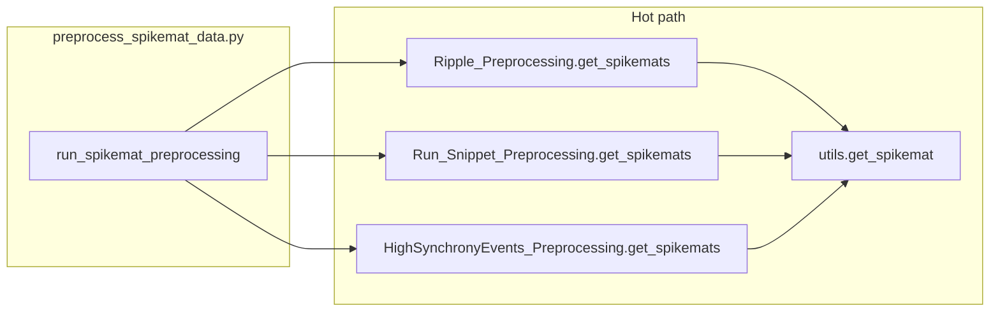

# Vectorize spikemat preprocessing (shared `get_spikemat`)

## Scope clarification

[`scripts/local/preprocess_spikemat_data.py`](h:\TEMP\Spike3DEnv_ExploreUpgrade\Spike3DWorkEnv\HippocampalSWRDynamics\scripts\local\preprocess_spikemat_data.py) only loads ratday data, constructs `Ripple_Preprocessing` / `Run_Snippet_Preprocessing` / `HighSynchronyEvents_Preprocessing`, and saves results. **There are no numeric hot loops in that script.** The parallel to the ratday speedup ([`ratday_init_speedup` plan](h:\TEMP\Spike3DEnv_ExploreUpgrade\Spike3DWorkEnv\Spike3D\.cursor\plans\ratday_init_speedup_51c0201f.plan.md)) is to optimize the **shared spikemat builder** used by that entrypoint.

## Bottleneck today

[`get_spikemat`](h:\TEMP\Spike3DEnv_ExploreUpgrade\Spike3DWorkEnv\HippocampalSWRDynamics\replay_structure\utils.py) (lines 145–168):

- **Per time bin**: two full-length boolean masks on `spike_times`, then a list comprehension over `place_cell_ids` counting `spike_ids_in_window == cell_id` — **O(n_spikes × n_place_cells)** per bin in the worst case.
- **`np.append` along axis 0** each iteration reallocates — quadratic behavior in the number of bins.
- Called from [`ripple_preprocessing.py`](h:\TEMP\Spike3DEnv_ExploreUpgrade\Spike3DWorkEnv\HippocampalSWRDynamics\replay_structure\ripple_preprocessing.py) (`get_spikemats`), [`run_snippet_preprocessing.py`](h:\TEMP\Spike3DEnv_ExploreUpgrade\Spike3DWorkEnv\HippocampalSWRDynamics\replay_structure\run_snippet_preprocessing.py), and [`highsynchronyevents.py`](h:\TEMP\Spike3DEnv_ExploreUpgrade\Spike3DWorkEnv\HippocampalSWRDynamics\replay_structure\highsynchronyevents.py) — so **one fix speeds all spikemat data types**.

## Implementation strategy

**1. Preserve semantics**

- Keep the same window definition: `timebin_start = start_time + k * time_window_advance_s`, `timebin_end = timebin_start + time_window_s`, loop while `timebin_end < end_time` (match existing while-boundary exactly; derive `n_bins` the same way or with an equivalent closed form and assert same shape on tests).
- Keep inclusion rule equivalent to current `(spike_times >= lo) == (spike_times < hi)` (XNOR), which matches in-window `(>= lo) & (< hi)` for ordered `lo < hi` and realistic spike times.
- Output dtype/shape: `(n_bins, len(place_cell_ids))` `int`, same as today.

**2. Precompute bin geometry once per call**

- `n_bins` from the same stopping rule as the while loop.
- `bin_starts = start_time + np.arange(n_bins) * time_window_advance_s` and `bin_ends = bin_starts + time_window_s`.

**3. Sort-once + `searchsorted` slices (avoid per-bin full scans)**

- Work with `order = np.argsort(spike_times)` and `t_sorted = spike_times[order]`, `ids_sorted = spike_ids[order]` (or document that callers already provide sorted times and skip if `np.all(np.diff(spike_times) >= 0)` — safer default is always sort for correctness).
- For each bin `k`, `i0 = np.searchsorted(t_sorted, bin_starts[k], side="left")`, `i1 = np.searchsorted(t_sorted, bin_ends[k], side="left")` for `[lo, hi)` — verify `side` matches `< hi` vs `<=` semantics of the original.
- Slice `ids_sorted[i0:i1]` only.

**4. Replace per-cell Python sums with `np.bincount`**

- Build a **dense column index** for place cells once per call, e.g. `max_id = int(spike_ids.max())` (guard empty), `col = np.full(max_id + 1, -1, dtype=np.int32); col[place_cell_ids] = np.arange(len(place_cell_ids))`.
- For each bin, `c = col[ids_slice]`; `m = c >= 0`; `row = np.bincount(c[m], minlength=len(place_cell_ids))`.
- Preallocate `out = np.zeros((n_bins, len(place_cell_ids)), dtype=int)` and assign `out[k] = row`.

**5. Complexity**

- From roughly **O(n_bins × (n_spikes + n_spikes × n_place_cells))** plus append overhead to **O(n_spikes log n_spikes + n_bins log n_spikes + n_bins × avg_spikes_per_bin)** with small constants.

**6. Tests**

- Add a focused test (e.g. [`tests/test_get_spikemat.py`](h:\TEMP\Spike3DEnv_ExploreUpgrade\Spike3DWorkEnv\HippocampalSWRDynamics\tests\test_get_spikemat.py)) that implements a **reference loop** mirroring the current logic (or keeps a private `_get_spikemat_reference` in the test file), then asserts **`np.array_equal`** against `utils.get_spikemat` for several cases: empty interval, single bin, overlapping windows (`advance < window`), non-place spikes mixed in, unsorted spike times, boundaries at bin edges.

**7. Optional follow-ups (out of scope unless you want them)**

- [`HighSynchronyEvents_Preprocessing.get_hse_times_s`](h:\TEMP\Spike3DEnv_ExploreUpgrade\Spike3DWorkEnv\HippocampalSWRDynamics\replay_structure\highsynchronyevents.py): the `while`/`for` + repeated `argwhere` can be tightened later (e.g. connected components on threshold crossings); smaller share of runtime than `get_spikemat` × many events.
- [`calc_poisson_emission_probabilities_log`](h:\TEMP\Spike3DEnv_ExploreUpgrade\Spike3DWorkEnv\HippocampalSWRDynamics\replay_structure\utils.py) still has a Python `for t` — different pipeline stage, not spikemat extraction.

## Files to change

| File | Change |
|------|--------|
| [`replay_structure/utils.py`](h:\TEMP\Spike3DEnv_ExploreUpgrade\Spike3DWorkEnv\HippocampalSWRDynamics\replay_structure\utils.py) | Rewrite `get_spikemat` as above; keep the public signature unchanged. |
| New [`tests/test_get_spikemat.py`](h:\TEMP\Spike3DEnv_ExploreUpgrade\Spike3DWorkEnv\HippocampalSWRDynamics\tests\test_get_spikemat.py) | Regression tests vs reference. |

No change required to [`preprocess_spikemat_data.py`](h:\TEMP\Spike3DEnv_ExploreUpgrade\Spike3DWorkEnv\HippocampalSWRDynamics\scripts\local\preprocess_spikemat_data.py) unless you want a docstring cross-link noting that performance lives in `utils.get_spikemat`.
