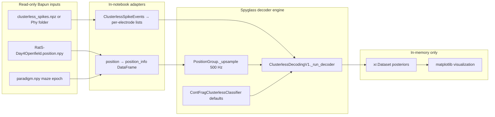

# Spyglass Clusterless Decoding — Bapun RatS Day4OpenField

## Context

RatS Day4OpenField is a **Bapun-format session**, not an NWB/Spyglass DataJoint session. The existing pipeline notebook [`InteractivePipelineLoadFromPickle_Bapun_RatS_D4OpenField.ipynb`](h:/TEMP/Spike3DEnv_ExploreUpgrade/Spike3DWorkEnv/Spike3D/OpenField/InteractivePipelineLoadFromPickle_Bapun_RatS_D4OpenField.ipynb) already runs **RTC clusterless decoding** via `ClusterlessRTCPositionDecoder`; this new notebook demonstrates the **Spyglass clusterless decoding path** instead.

Spyglass tutorial [41_Decoding_Clusterless](h:/TEMP/Spike3DEnv_ExploreUpgrade/Spike3DWorkEnv/spyglass/notebooks/41_Decoding_Clusterless.ipynb) normally requires a full DataJoint stack (`UnitWaveformFeaturesGroup`, `PositionGroup`, `ClusterlessDecodingSelection`, `ClusterlessDecodingV1.populate()`), which **writes to MySQL and disk** (`.nc`/`.pkl` under `SPYGLASS_ANALYSIS_DIR`).

**Constraint:** The notebook must be **read-only at runtime** — no DB inserts, no pickle/NPZ saves, no pipeline state writes. The only repo change is adding the new notebook file itself.

## Architecture



## Notebook file (created manually)

**[`Spike3D/OpenField/Spyglass_ClusterlessDecoding_Bapun_RatS_D4OpenField.ipynb`](h:/TEMP/Spike3DEnv_ExploreUpgrade/Spike3DWorkEnv/Spike3D/OpenField/Spyglass_ClusterlessDecoding_Bapun_RatS_D4OpenField.ipynb)** exists — a focused, standalone example (not a copy of the 14k-line pipeline notebook).

**Current state (manual scaffold):**

| Section | Status |
|---------|--------|
| Cell 0 — IPython magics + typing imports | Done |
| Section 1 — Overview markdown | Pending |
| Section 2 — Spyglass/NeuroPy imports + session path config | Pending |
| Sections 3–8 — adapters, load, decode, visualize, notes | Pending |

Remaining work fills in sections 1–8 below; no new files needed.

## Notebook sections

### 1. Overview markdown

- Session: `IdentifyingContext(format_name='bapun', animal='RatS', session_name='Day4OpenField')`
- On-disk folder: `{data_root}/Bapun/RatS/Day4Openfield` (note lowercase `f`)
- Basename: `RatS-Day4Openfield`
- Single **`maze`** epoch (RatS open-field layout)
- References Spyglass tutorial 41 and explains why this notebook bypasses DataJoint
- Explicit **read-only guarantee**: no `insert1`, `populate`, `save_*`, or pickle writes

### 2. Imports and session paths

Minimal imports (no full `NeuropyPipeline`):

- `BapunDataSessionFormat` / session load for position + paradigm
- `ClusterlessSpikeEvents`, `load_clusterless_spike_events`, `extract_clusterless_spike_events_from_phy_folder` from NeuroPy
- `ClusterlessDecodingV1` from [`spyglass/decoding/v1/clusterless.py`](h:/TEMP/Spike3DEnv_ExploreUpgrade/Spike3DWorkEnv/spyglass/src/spyglass/decoding/v1/clusterless.py)
- `PositionGroup._upsample` from [`spyglass/decoding/v1/core.py`](h:/TEMP/Spike3DEnv_ExploreUpgrade/Spike3DWorkEnv/spyglass/src/spyglass/decoding/v1/core.py)
- `ContFragClusterlessClassifier` from `non_local_detector.models`
- Reuse the data-root widget pattern from the existing RatS D4 notebook

Default paths (overridable):

- `basedir = {data_root}/Bapun/RatS/Day4Openfield`
- Phy fallback: `basedir/SORTING/folder_KS4_v1_phy` or legacy `spyk-circ/RatS-Day4Openfield/RatS-Day4Openfield-merged.GUI`

### 3. In-notebook adapter helpers (no new library files)

**`clusterless_events_to_spyglass_spike_lists(events)`**

Convert `ClusterlessSpikeEvents` → Spyglass `_run_decoder` format:

- `spike_times`: `list[np.ndarray]` — one array per electrode index
- `spike_waveform_features`: `list[np.ndarray]` — shape `(n_spikes, n_marks)` per electrode

Spyglass expects this per-electrode list format (see `UnitWaveformFeatures.fetch_data` in [`waveform_features.py`](h:/TEMP/Spike3DEnv_ExploreUpgrade/Spike3DWorkEnv/spyglass/src/spyglass/decoding/v1/waveform_features.py)).

**`bapun_position_to_spyglass_position_info(position, t_start, t_stop, upsample_rate=500)`**

- Slice position to maze epoch using `position.time_slicer`
- Build `pd.DataFrame` indexed by time with columns `position_x`, `position_y` (from Bapun `x`/`y`)
- Upsample via `PositionGroup._upsample(..., upsample_rate=500)` — same 500 Hz default as Spyglass tutorial 41

**`build_is_training_mask(position_info, encoding_interval)`**

- Mirror Spyglass `make_fetch` logic: mark training times within encoding interval, exclude NaN position rows

### 4. Load data (read-only)

1. Load Bapun session (position + paradigm only; skip pipeline pickle)
2. Read maze epoch bounds from `session.epochs` / paradigm
3. Load clusterless events:
   - **Prefer** existing `{basename}.clusterless_spikes.npz` if present
   - **Else** call `extract_clusterless_spike_events_from_phy_folder(phy_path, electrode_mode="channel")` **in memory only** (do not call `save_clusterless_spike_events`)
4. Slice events to maze epoch with `.time_slice(...)`

### 5. Configure Spyglass decoder parameters

Use Spyglass defaults from [`DecodingParameters.contents`](h:/TEMP/Spike3DEnv_ExploreUpgrade/Spike3DWorkEnv/spyglass/src/spyglass/decoding/v1/core.py):

```python
decoding_params = ContFragClusterlessClassifier()
decoding_kwargs = {"is_training": is_training}
```

Optional commented cell showing tutorial overrides (`position_std=12.0`, `waveform_std=24.0`, `block_size=10000`).

### 6. Run decoding in memory (no persistence)

Per your preference: **short test window first**, with a top-of-notebook flag to expand to full maze.

```python
# Default: ~15 s test decode inside maze (mirrors Spyglass tutorial 41)
encoding_interval = np.array([[maze_start, maze_start + 60.0]])   # 60 s training
decoding_interval = np.array([[maze_start + 30.0, maze_start + 45.0]])  # 15 s decode

classifier, results = ClusterlessDecodingV1()._run_decoder(
    key={"estimate_decoding_params": False},
    decoding_params=decoding_params,
    decoding_kwargs=decoding_kwargs,
    position_info=position_info,
    position_variable_names=["position_x", "position_y"],
    spike_times=spike_times,
    spike_waveform_features=spike_waveform_features,
    encoding_interval=encoding_interval,
    is_training=is_training,
    decoding_interval=decoding_interval,
)
```

**Do not call:** `ClusterlessDecodingV1.populate()`, `_save_decoder_results()`, `DecodingOutput.insert1()`, or `DecodingOutput().cleanup()`.

### 7. Visualization (read-only)

Static matplotlib plots (no figurl/kachery — those upload data):

- MAP decoded `(x, y)` trajectory vs measured position for the decode window
- Optional heatmap of marginal posterior over time
- Display `results` xarray summary (`acausal_posterior`, `acausal_state_probabilities`)

### 8. Notes / troubleshooting markdown

- Contrast with existing RTC path in [`rtc_clusterless_decoder.py`](h:/TEMP/Spike3DEnv_ExploreUpgrade/Spike3DWorkEnv/pyPhoPlaceCellAnalysis/src/pyphoplacecellanalysis/Analysis/Decoder/rtc_clusterless_decoder.py)
- RAM warning referencing [`2026-06-30_MemoryAllocationIssue_in_clusterless_decoding.md`](h:/TEMP/Spike3DEnv_ExploreUpgrade/Spike3DWorkEnv/Spike3D/EXTERNAL/DEVELOPER_NOTES/2026-06-30_MemoryAllocationIssue_in_clusterless_decoding.md): expand to full maze only after short-window success
- What would be needed for **full** Spyglass DataJoint workflow (NWB conversion + notebooks 40–41 populate chain) — documented but not executed

## What we explicitly avoid

| Action | Reason |
|--------|--------|
| NWB import / Spyglass DB setup | Writes DB + analysis files |
| `ClusterlessDecodingV1.populate()` | Writes `.nc`/`.pkl` + DB rows |
| Saving pickles, NPZ, or pipeline state | User read-only constraint |
| Modifying existing notebooks or library code | Scope is one new example notebook |
| figurl/kachery interactive views | External upload; not required for example |

## Dependencies

- `spyglass-neuro` is available transitively via [`pyPhoPlaceCellAnalysis/pyproject.toml`](h:/TEMP/Spike3DEnv_ExploreUpgrade/Spike3DWorkEnv/pyPhoPlaceCellAnalysis/pyproject.toml) (editable path to `../spyglass`)
- Run from Spike3D venv: `uv sync --all-extras` in [`Spike3D/`](h:/TEMP/Spike3DEnv_ExploreUpgrade/Spike3DWorkEnv/Spike3D) if needed
- **No MySQL / DataJoint database required** for this notebook (importing spyglass modules is sufficient; no table queries)

## Verification

After completing remaining notebook sections:

1. Run cells sequentially with `basedir` pointing at RatS Day4Openfield data
2. Confirm no files created/modified under session dir or `SPYGLASS_ANALYSIS_DIR`
3. Confirm `results` is an `xr.Dataset` with `acausal_posterior` and sensible MAP trajectory plot
4. Optionally flip flag to full maze epoch once short-window decode succeeds
