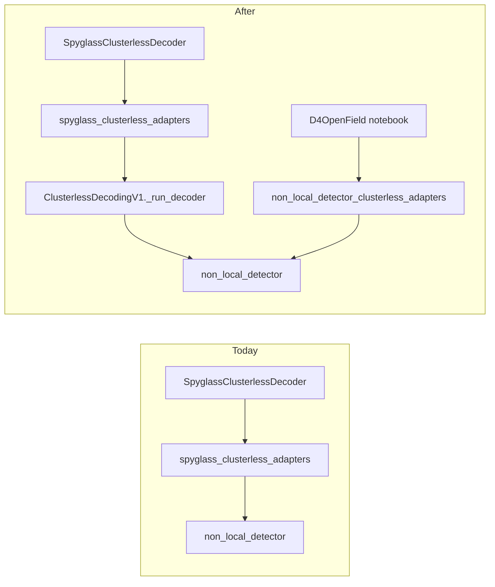

# Split NLD vs Spyglass Clusterless Adapters

## Context

Today's [`spyglass_clusterless_adapters.py`](h:/TEMP/Spike3DEnv_ExploreUpgrade/Spike3DWorkEnv/pyPhoPlaceCellAnalysis/src/pyphoplacecellanalysis/Analysis/Decoder/spyglass_clusterless_adapters.py) and the example notebook [`Spyglass_ClusterlessDecoding_Bapun_RatS_D4OpenField.ipynb`](h:/TEMP/Spike3DEnv_ExploreUpgrade/Spike3DWorkEnv/Spike3D/OpenField/Spyglass_ClusterlessDecoding_Bapun_RatS_D4OpenField.ipynb) both **mirror** Spyglass logic and call `non_local_detector` directly (to avoid DataJoint login from `import spyglass`).

Spyglass itself is also an NLD wrapper: [`ClusterlessDecodingV1._run_decoder`](h:/TEMP/Spike3DEnv_ExploreUpgrade/Spike3DWorkEnv/spyglass/src/spyglass/decoding/v1/clusterless.py) constructs `ClusterlessDetector(**decoding_params)` then `fit`/`predict`.

**Chosen approach:** use the real Spyglass **in-memory** API (`ClusterlessDecodingV1._run_decoder`, `PositionGroup._upsample`, `spyglass.decoding.v1.utils.*`). Do **not** use `populate()` / DecodingOutput / MySQL writes. Lazy-import Spyglass at call time so module import of our adapters does not force DataJoint config; raise a clear error pointing users at the NLD adapters if Spyglass/DJ is unavailable.

## 1. Move working NLD implementation

Create [`non_local_detector_clusterless_adapters.py`](h:/TEMP/Spike3DEnv_ExploreUpgrade/Spike3DWorkEnv/pyPhoPlaceCellAnalysis/src/pyphoplacecellanalysis/Analysis/Decoder/non_local_detector_clusterless_adapters.py) by moving the current adapters file contents essentially as-is:

- `SpyglassClusterlessDecodingParameters` → rename to `NonLocalDetectorClusterlessDecodingParameters` (keep a temporary alias if any external code still needs the old name during migration)
- `run_clusterless_decoder_in_memory` (NLD-direct `ClusterlessDetector`)
- Local mirrors: `upsample_position_for_decoding`, `_get_valid_fit_predict_kwargs`, `_concatenate_interval_results`
- Shared NeuroPy glue (still needed by both paths): `clusterless_events_to_spyglass_spike_lists`, `pfnd_to_spyglass_position_info`, `build_is_training_mask`, `epochs_from_pfnd`, memory helpers, `nld_posterior_*` mapping onto PfND grids

Keep function signatures single-line where possible; two blank lines between methods/classes.

## 2. Rewrite `spyglass_clusterless_adapters.py` to call Spyglass

Replace mirrored NLD runner/helpers with thin wrappers:

- `upsample_position_for_decoding(...)` → lazy `PositionGroup._upsample`
- `run_clusterless_decoder_in_memory(...)` → lazy `ClusterlessDecodingV1._run_decoder(None, ...)` (instance method does not use `self` for the NLD path)
- Prefer Spyglass utils: `get_valid_kwargs`, `concatenate_interval_results`, `create_interval_labels` when needed locally
- Keep `SpyglassClusterlessDecodingParameters` here (defaults still from `ContFragClusterlessClassifier()` / Spyglass DecodingParameters semantics)
- Re-export NeuroPy conversion + posterior mapping from the NLD adapters module so existing imports from `spyglass_clusterless_adapters` (e.g. [`DefaultComputationFunctions.py`](h:/TEMP/Spike3DEnv_ExploreUpgrade/Spike3DWorkEnv/pyPhoPlaceCellAnalysis/src/pyphoplacecellanalysis/General/Pipeline/Stages/ComputationFunctions/DefaultComputationFunctions.py), batch helpers) keep working with minimal churn

## 3. Update `SpyglassClusterlessDecoder`

In [`spyglass_clusterless_decoder.py`](h:/TEMP/Spike3DEnv_ExploreUpgrade/Spike3DWorkEnv/pyPhoPlaceCellAnalysis/src/pyphoplacecellanalysis/Analysis/Decoder/spyglass_clusterless_decoder.py):

- Continue importing from `spyglass_clusterless_adapters` (now Spyglass-backed)
- Update docstrings/comments: Spyglass in-memory `_run_decoder` path (engine still NLD underneath)
- Keep public API (`decode`, `decode_specific_epochs`, `compute_all`, `overwrite_standard_decoders`) unchanged
- Remove direct `from non_local_detector...` typing import if Spyglass types are preferred; otherwise keep `ClusterlessDetector` as return type since that is what Spyglass returns

## 4. Call-site / test / notebook updates

- [`tests/test_spyglass_clusterless_decoder.py`](h:/TEMP/Spike3DEnv_ExploreUpgrade/Spike3DWorkEnv/pyPhoPlaceCellAnalysis/tests/test_spyglass_clusterless_decoder.py): move NLD-helper unit tests to import from `non_local_detector_clusterless_adapters`; keep decoder mock patch on the Spyglass adapters' `run_clusterless_decoder_in_memory` (or patch `ClusterlessDecodingV1._run_decoder`)
- [`DefaultComputationFunctions.py`](h:/TEMP/Spike3DEnv_ExploreUpgrade/Spike3DWorkEnv/pyPhoPlaceCellAnalysis/src/pyphoplacecellanalysis/General/Pipeline/Stages/ComputationFunctions/DefaultComputationFunctions.py) / batch helpers: prefer continued imports from `spyglass_clusterless_adapters` via re-exports (minimal edit)
- Update the open-field notebook to import the preserved NLD helpers from `non_local_detector_clusterless_adapters` so it stays DJ-free and matches its documented intent

## Out of scope

- Full DataJoint pipeline (`ClusterlessDecodingSelection` + `populate()`, Writing `.nc`/`.pkl`)
- New `NonLocalDetectorClusterlessDecoder` class (adapters file is enough; notebook/pipeline keep using NLD helpers or Spyglass decoder as today)
