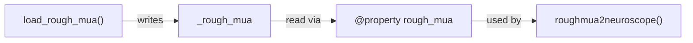

# Add read-only property accessors to SpykingCircusIO

## Context

[`spykingcircusio.py`](h:\TEMP\Spike3DEnv_ExploreUpgrade\Spike3DWorkEnv\NeuroPy\neuropy\io\spykingcircusio.py) currently stores one instance attribute directly:

- `self.rough_mua` — assigned in `load_rough_mua()` as an `h5py.File`

The class also references `self._obj` internally (for `basePath`, `goodchans`, `files`), but `_obj` is never assigned in this file and is already private infrastructure — it will **not** be exposed as a public property (same as `_raw_traces` in [`binarysignalio.py`](h:\TEMP\Spike3DEnv_ExploreUpgrade\Spike3DWorkEnv\NeuroPy\neuropy\io\binarysignalio.py)).

This task mirrors the prior [`binarysignalio.py`](h:\TEMP\Spike3DEnv_ExploreUpgrade\Spike3DWorkEnv\NeuroPy\neuropy\io\binarysignalio.py) refactor: private backing fields + read-only `@property` accessors with return-type annotations.

## Changes (single file)

**File:** [`neuropy/io/spykingcircusio.py`](h:\TEMP\Spike3DEnv_ExploreUpgrade\Spike3DWorkEnv\NeuroPy\neuropy\io\spykingcircusio.py)

### 1. Add typing imports

```python
from __future__ import annotations

from typing import Optional
```

(Keep existing `numpy`, `h5py`, and `Epoch` imports.)

### 2. Initialize backing field in `__init__`

```python
def __init__(self) -> None:
    self._rough_mua: Optional[h5py.File] = None
```

This avoids `AttributeError` before `load_rough_mua()` is called and gives a concrete type for the property.

### 3. Add read-only property accessor

```python
@property
def rough_mua(self) -> Optional[h5py.File]:
    return self._rough_mua
```

No setter — external assignment is blocked; internal writes go to `_rough_mua`.

### 4. Update internal assignment site

In `load_rough_mua()`, change:

```python
self.rough_mua = h5py.File(mua_filename[0], "r+")
```

to:

```python
self._rough_mua = h5py.File(mua_filename[0], "r+")
```

### 5. Leave read sites unchanged

`roughmua2neuroscope()` can continue using `self.rough_mua` (reads through the property). No behavioral change for callers.

## Type inference rationale

| Property | Inferred type | Reason |
|----------|---------------|--------|
| `rough_mua` | `Optional[h5py.File]` | Set only by `load_rough_mua()`; `None` before load; `h5py.File(...)` on assignment |

## Out of scope (pre-existing, not changed)

- `_obj` is referenced but never initialized in `__init__` — fixing that would be a separate task
- `write_epochs` is a `@staticmethod` with no instance state
- No `__getstate__`/`__setstate__` exists today, so no pickle migration is needed (unlike `BinarysignalIO`)

## Verification

After edits:
- Read lints on `spykingcircusio.py`
- Confirm public API unchanged: `obj.rough_mua` still works for reads after `load_rough_mua()`


