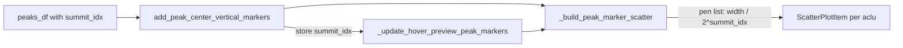

# Summit-index marker thickness in TrialByTrialActivityWindow

## Context

Peak markers are drawn in [`TrialByTrialActivityWindow.py`](h:\TEMP\Spike3DEnv_ExploreUpgrade\Spike3DWorkEnv\pyPhoPlaceCellAnalysis\src\pyphoplacecellanalysis\GUI\PyQtPlot\Widgets\ContainerBased\TrialByTrialActivityWindow.py) via:

- `_build_vertical_tick_symbol` — QPainterPath vertical line symbol
- `_build_peak_marker_scatter` — one `pg.ScatterPlotItem` per aclu (batched ticks)
- `add_peak_center_vertical_markers` — main entry point; expects `peaks_df` with `aclu`, `trial_idx`, `peak_center_x`
- `_update_hover_preview_peak_markers` — re-draws markers on hover using stored `plots_data.peak_center_markers_df`

Currently every marker shares a single pen (`width=1.5`). The upstream peak dataframe already includes `summit_idx` (0 = tallest peak, 1 = second tallest, …) from [`PeakPromenence._build_1d_peak_prominence_df`](h:\TEMP\Spike3DEnv_ExploreUpgrade\Spike3DWorkEnv\pyPhoPlaceCellAnalysis\src\pyphoplacecellanalysis\External\peak_prominence2d.py) and is exposed via `computing_trial_peak_promenences()` in [`DirectionalPlacefieldGlobalComputationFunctions.py`](h:\TEMP\Spike3DEnv_ExploreUpgrade\Spike3DWorkEnv\pyPhoPlaceCellAnalysis\src\pyphoplacecellanalysis\General\Pipeline\Stages\ComputationFunctions\MultiContextComputationFunctions\DirectionalPlacefieldGlobalComputationFunctions.py).

PyQtGraph `ScatterPlotItem` accepts **`pen` as a list** (one pen per point), so we can keep the efficient one-scatter-per-aclu design.

## Thickness rule

For each marker row:

```python
pen_width = base_pen_width / (2 ** summit_idx)
```

- `summit_idx == 0` → full thickness (default `1.5`)
- `summit_idx == 1` → half (`0.75`)
- `summit_idx == 2` → quarter (`0.375`)
- …

`base_pen_width` is taken from the caller-supplied `pen` (via `pen.widthF()` when a `QPen` is passed), falling back to `1.5`.

## Implementation (single file)

All edits in [`TrialByTrialActivityWindow.py`](h:\TEMP\Spike3DEnv_ExploreUpgrade\Spike3DWorkEnv\pyPhoPlaceCellAnalysis\src\pyphoplacecellanalysis\GUI\PyQtPlot\Widgets\ContainerBased\TrialByTrialActivityWindow.py):

### 1. Add a small pen-width helper (classmethod)

Add `_peak_marker_pen_widths_from_summit_idx(summit_idx, base_pen_width: float)` that:
- Accepts a 1D array-like of `summit_idx` (aligned with filtered x/y arrays)
- Returns `base_pen_width / np.power(2.0, summit_idx.astype(int))`
- If `summit_idx` is `None`, return `None` (uniform pen)

Add `_peak_marker_pens_from_summit_idx(summit_idx, base_pen=None)` that builds a **list of `pg.mkPen(...)`** objects (copying color/style from `base_pen`, varying only `width`).

### 2. Extend `_build_peak_marker_scatter`

```813:837:h:\TEMP\Spike3DEnv_ExploreUpgrade\Spike3DWorkEnv\pyPhoPlaceCellAnalysis\src\pyphoplacecellanalysis\GUI\PyQtPlot\Widgets\ContainerBased\TrialByTrialActivityWindow.py
    def _build_peak_marker_scatter(cls, peak_center_x: NDArray, trial_idx: NDArray, pen=None, trial_half_height: float = 0.45) -> Optional[pg.ScatterPlotItem]:
        ...
        if pen is None:
            pen = pg.mkPen('w', width=1.5)
        a_scatter = pg.ScatterPlotItem(..., pen=pen, ...)
```

Changes:
- Add optional `summit_idx: Optional[NDArray] = None`
- Apply the same `valid_mask` filtering to `summit_idx` when provided
- When `summit_idx` is present: pass `pen=_peak_marker_pens_from_summit_idx(...)` (list) to `ScatterPlotItem`
- When absent: keep current single-pen behavior (backward compatible)

### 3. Update `add_peak_center_vertical_markers`

- Docstring: note optional `summit_idx` column; document thickness scaling
- When selecting columns for `active_peaks_df`, include `summit_idx` if present:

```python
marker_cols = ['aclu', 'trial_idx', 'peak_center_x']
if 'summit_idx' in peaks_df.columns:
    marker_cols.append('summit_idx')
active_peaks_df = peaks_df.loc[..., marker_cols].copy()
```

- Pass `summit_idx=aclu_peaks_df['summit_idx'].to_numpy()` into `_build_peak_marker_scatter` when available
- Persist `summit_idx` in `plots_data.peak_center_markers_df` so hover preview stays consistent

### 4. Update `_update_hover_preview_peak_markers`

- After filtering `aclu_peaks_df`, pass `summit_idx` through to `_build_peak_marker_scatter` when the column exists in stored `peak_center_markers_df`

## Data flow



## Usage (unchanged call site, richer input)

Pass `summit_idx` in the dataframe — no API break:

```python
a_TbyT_activity_win.add_peak_center_vertical_markers(
    all_decoders_peak_prominence_df[['aclu', 'trial_idx', 'peak_center_x', 'summit_idx']]
)
```

If `summit_idx` is omitted, all markers remain uniform thickness.

## Out of scope

- No changes to [`peak_prominence2d.py`](h:\TEMP\Spike3DEnv_ExploreUpgrade\Spike3DWorkEnv\pyPhoPlaceCellAnalysis\src\pyphoplacecellanalysis\External\peak_prominence2d.py) — `summit_idx` is already computed correctly
- No notebook edits (per workspace rule)
- No new tests unless you want them (no existing tests for this widget)

## Verification

After implementation, visually confirm on a TrialByTrialActivity window fed `all_decoders_peak_prominence_df`:
- Dominant peaks (`summit_idx=0`) are thickest
- Secondary/tertiary peaks on the same trial row are progressively thinner
- Hover-preview markers match main subplot markers for the hovered aclu
