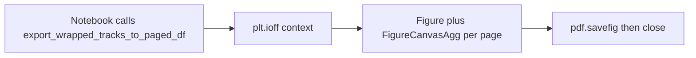

# Suppress Matplotlib Windows During Track PDF Export

**Goal:** Calling `FigureToImageHelpers.export_wrapped_tracks_to_paged_df` from a notebook (or batch) writes the PDF without opening large interactive Matplotlib GUI windows.

**Root cause:** In [`ExportHelpers.py`](h:\TEMP\Spike3DEnv_ExploreUpgrade\Spike3DWorkEnv\pyPhoPlaceCellAnalysis\src\pyphoplacecellanalysis\General\Mixins\ExportHelpers.py), the live export path creates each page with:

```python
fig, axes = plt.subplots(nrows=len(page_chunks), figsize=figsize, dpi=dpi, constrained_layout=True)
```

Under a QtAgg backend (normal when the Spike2D PyQt GUI is running), that allocates a real window. Default `dpi=600` with `figsize=(8, 11)` makes those windows huge (~4800×6600 px). `plt.close(fig)` already runs after `pdf.savefig`, but the window still appears between create and close.

The same file already suppresses interactive display for other exporters via `with plt.ioff():` (e.g. `programmatic_display_to_PDF`, `programmatic_render_to_file`). `plt.ioff()` alone is not enough on QtAgg — windows can still open.

**Chosen approach:** For export-only page figures, construct each `Figure` with `FigureCanvasAgg` (non-GUI) inside `with plt.ioff():`, then save/close as today. No notebook cell changes; no API change; export remains silent by default.



## File to change

- Modify only: [`pyphoplacecellanalysis/General/Mixins/ExportHelpers.py`](h:\TEMP\Spike3DEnv_ExploreUpgrade\Spike3DWorkEnv\pyPhoPlaceCellAnalysis\src\pyphoplacecellanalysis\General\Mixins\ExportHelpers.py) — method `FigureToImageHelpers.export_wrapped_tracks_to_paged_df` (~lines 1127–1196).

## Implementation

1. Import `Figure` and `FigureCanvasAgg` next to the existing matplotlib imports inside that method (the DEP sibling already imported `FigureCanvasAgg`).
2. Wrap the `with backend_pdf.PdfPages(...)` block in `with plt.ioff():`.
3. Replace `plt.subplots(...)` with Agg-backed figure construction equivalent to:

```python
fig = Figure(figsize=figsize, dpi=dpi, layout='constrained')
FigureCanvasAgg(fig)
axes = fig.subplots(nrows=len(page_chunks))
if len(page_chunks) == 1:
    axes = [axes]
```

4. Keep existing `pdf.savefig(fig)` / `plt.close(fig)` cleanup unchanged.
5. Do not change the notebook call site, `dpi`/`figsize` defaults, or public kwargs (silent export is the correct default for a file-writer).

## Verification

- Re-run the notebook cell that calls `export_wrapped_tracks_to_paged_df` (e.g. JS15 lines 32–35): no new Matplotlib toolbar windows; PDF still written to `output_pdf_path`.
- Spot-check that page content/layout is unchanged (same figsize/dpi/constrained layout).
