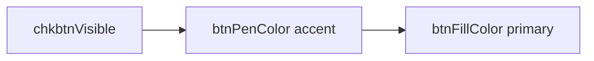
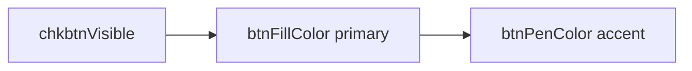

# Swap primary/accent color button order in EpochRenderConfigWidget

## Context

The screenshot shows `EpochIntervalsVisualConfigs` rows built from [`EpochRenderConfigWidget`](h:\TEMP\Spike3DEnv_ExploreUpgrade\Spike3DWorkEnv\pyPhoPlaceCellAnalysis\src\pyphoplacecellanalysis\GUI\Qt\Widgets\EpochRenderConfigWidget\EpochRenderConfigWidget.py) instances (via `build_single_epoch_display_config_widget`).

Current middle-row layout in [`EpochRenderConfigWidget.ui`](h:\TEMP\Spike3DEnv_ExploreUpgrade\Spike3DWorkEnv\pyPhoPlaceCellAnalysis\src\pyphoplacecellanalysis\GUI\Qt\Widgets\EpochRenderConfigWidget\EpochRenderConfigWidget.ui) (`horizontalLayout`):



| Widget | Config property | Role |
|--------|-----------------|------|
| `btnPenColor` | `pen_QColor` / `pen_color` | Accent / outline |
| `btnFillColor` | `brush_QColor` / `brush_color` | Primary / fill |

This matches the screenshot (white accent left, colored primary right) but is counter-intuitive. The user wants primary left, accent right.

## Why API stays unchanged

All Python logic references widgets **by object name**, not visual position:

- [`initUI`](h:\TEMP\Spike3DEnv_ExploreUpgrade\Spike3DWorkEnv\pyPhoPlaceCellAnalysis\src\pyphoplacecellanalysis\GUI\Qt\Widgets\EpochRenderConfigWidget\EpochRenderConfigWidget.py) connects `btnPenColor` → `pen_QColor`, `btnFillColor` → `brush_QColor`
- [`get_ui_element_list`](h:\TEMP\Spike3DEnv_ExploreUpgrade\Spike3DWorkEnv\pyPhoPlaceCellAnalysis\src\pyphoplacecellanalysis\GUI\Qt\Widgets\EpochRenderConfigWidget\EpochRenderConfigWidget.py) zips widgets to config fields by **name-matched list order**, independent of layout order
- [`EpochDisplayConfig`](h:\TEMP\Spike3DEnv_ExploreUpgrade\Spike3DWorkEnv\pyPhoPlaceCellAnalysis\src\pyphoplacecellanalysis\PhoPositionalData\plotting\mixins\epochs_plotting_mixins.py) field names (`pen_color`, `brush_color`) are untouched

Swapping only the `<item>` order in the `.ui` file preserves every caller contract.

## Planned changes

### 1. Reorder color buttons in the `.ui` layout (primary change)

In [`EpochRenderConfigWidget.ui`](h:\TEMP\Spike3DEnv_ExploreUpgrade\Spike3DWorkEnv\pyPhoPlaceCellAnalysis\src\pyphoplacecellanalysis\GUI\Qt\Widgets\EpochRenderConfigWidget\EpochRenderConfigWidget.ui), within `horizontalLayout` (lines ~154–255), change item order to:



- Keep `chkbtnVisible` first (fixed-width eye toggle)
- Move the entire `btnFillColor` `<item>` block before `btnPenColor`
- Do **not** rename widgets or alter the `<customwidgets>` ColorButton promotion block

### 2. Set 2:1 width ratio for primary vs accent

After the swap, give the color buttons unequal horizontal stretch so accent is half the width of primary.

**Preferred approach** — small addition in `EpochRenderConfigWidget.initUI()` after `loadUi` (reliable, no obscure `.ui` stretch XML):

```python
hl = self.ui.horizontalLayout
hl.setStretch(hl.indexOf(self.ui.chkbtnVisible), 0)
hl.setStretch(hl.indexOf(self.ui.btnFillColor), 2)
hl.setStretch(hl.indexOf(self.ui.btnPenColor), 1)
```

Also set `sizePolicy` on both `ColorButton`s to horizontal `Expanding` in the `.ui` (or via `initUI`) so stretch factors actually take effect; currently both have only `minimumSize` width 10.

### 3. Optional tooltip clarity (low risk, recommended)

Update tooltips in the `.ui` file to reduce ambiguity:

- `btnFillColor`: `"Primary (Fill) Color"`
- `btnPenColor`: `"Accent (Pen) Color"`

No Python/API impact.

## Files to modify

| File | Change |
|------|--------|
| [`EpochRenderConfigWidget.ui`](h:\TEMP\Spike3DEnv_ExploreUpgrade\Spike3DWorkEnv\pyPhoPlaceCellAnalysis\src\pyphoplacecellanalysis\GUI\Qt\Widgets\EpochRenderConfigWidget\EpochRenderConfigWidget.ui) | Swap color button items; optional tooltip + `sizePolicy` |
| [`EpochRenderConfigWidget.py`](h:\TEMP\Spike3DEnv_ExploreUpgrade\Spike3DWorkEnv\pyPhoPlaceCellAnalysis\src\pyphoplacecellanalysis\GUI\Qt\Widgets\EpochRenderConfigWidget\EpochRenderConfigWidget.py) | ~3 lines in `initUI()` for `setStretch` |

**Out of scope** (unless you want consistency later): `_tempProtoOnly_EpochRenderConfigsListWidget.ui`, `EpochRenderConfigWidget_bak.ui`, and `EpochRenderTimebinSelectorWidget.ui` — duplicates/prototypes not used by `EpochIntervalsVisualConfigs`.

## Validation

1. Run the built-in test at the bottom of `EpochRenderConfigWidget.py`:
   `python EpochRenderConfigWidget.py` (or via project env)
2. Confirm middle row order: **eye | colored primary | narrower accent**
3. Change each color button and verify `config_from_state()` still maps `brush_QColor` ↔ `btnFillColor`, `pen_QColor` ↔ `btnPenColor`
4. Spot-check a live `EpochIntervalsVisualConfigs` dock with `custom_paradigm` sub-widgets
