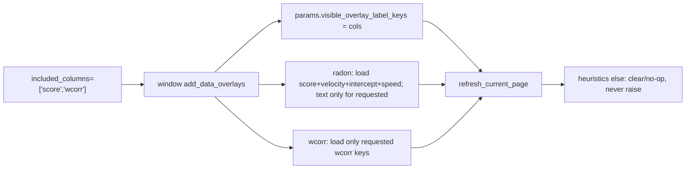

# Sync `included_columns` with label visibility

## Problem

Three bugs block `add_data_overlays(included_columns=['score', 'wcorr'])`:

1. **Window-level auto-extend** in [`stacked_epoch_slices.py`](h:/TEMP/Spike3DEnv_ExploreUpgrade/Spike3DWorkEnv/pyPhoPlaceCellAnalysis/src/pyphoplacecellanalysis/Pho2D/stacked_epoch_slices.py) — when enable flags are True, user lists are mutated with full defaults (`score/velocity/intercept/speed` + `wcorr/P_decoder/pearsonr`), so `['score','wcorr']` is ignored.
2. **Radon builder hard-unpack** in [`DecoderPredictionError.py`](h:/TEMP/Spike3DEnv_ExploreUpgrade/Spike3DWorkEnv/pyPhoPlaceCellAnalysis/src/pyphoplacecellanalysis/General/Pipeline/Stages/DisplayFunctions/DecoderPredictionError.py) — `_subfn_build_radon_transform_plotting_data` requires exactly four columns and unpacks them, so `included_columns` filtered to `['score']` crashes / skips.
3. **Heuristics remove path raises** — `DecodedSequenceAndHeuristicsPlotDataProvider._callback_update_curr_single_epoch_slice_plot` (~3252) raises `NotImplementedError('have not yet implemented removing')` when `enable_decoded_sequence_and_heuristics_curve` is False, which aborts `refresh_current_page()` during `add_data_overlays` (user traceback).

## Approach

Treat a **non-empty** `included_columns` as the display selection (same role as `visible_overlay_label_keys`). Keep loading structural radon columns needed for the fit line separately. Make the heuristics disable/remove path a safe no-op so refresh never crashes.



## Changes

### 1. Window `PhoPaginatedMultiDecoderDecodedEpochsWindow.add_data_overlays`

In [`stacked_epoch_slices.py`](h:/TEMP/Spike3DEnv_ExploreUpgrade/Spike3DWorkEnv/pyPhoPlaceCellAnalysis/src/pyphoplacecellanalysis/Pho2D/stacked_epoch_slices.py) (~2284):

- Capture `user_provided_columns = deepcopy(included_columns) if included_columns else None`
- **If user provided a non-empty list**: use it as-is (no extend). Normalize alias `radon` → `score` for column loading. Call `self.update_params(visible_overlay_label_keys=deepcopy(user_list))` so display filter matches add-time selection.
- **If empty/None**: keep current default behavior (extend from enable flags); leave `visible_overlay_label_keys` alone (`None` = show all loaded).
- Avoid mutating the same list across the four-decoder loop (use a per-iteration copy).

### 2. Fix radon `_subfn_build_radon_transform_plotting_data`

In [`DecoderPredictionError.py`](h:/TEMP/Spike3DEnv_ExploreUpgrade/Spike3DWorkEnv/pyPhoPlaceCellAnalysis/src/pyphoplacecellanalysis/General/Pipeline/Stages/DisplayFunctions/DecoderPredictionError.py) (~1574):

- Always read structural columns from the full DF: `velocity`, `intercept`, `speed` (required for the line) plus `score` when present.
- Treat `radon_transform_column_names` as the **display-text** allow-list only.
- Populate `score_text` / `speed_text` / `intercept_text` only when the corresponding key is in that allow-list (empty string otherwise).
- Drop the 4-way unpack / `zip` that assumes all four names are in the list.
- Presence check: require structural cols in the DF; skip only if those are missing (not if display subset is smaller).

`decoder_build_single_radon_transform_data` stays: filter display keys from `included_columns` against `cls.column_names` (with `radon`→`score`).

### 3. Fix heuristics `NotImplementedError` on remove/disable

In `DecodedSequenceAndHeuristicsPlotDataProvider._callback_update_curr_single_epoch_slice_plot` (~3252):

- Initialize `out = None` before the enable branch.
- Replace the `else: raise NotImplementedError(...)` with a safe clear path:
  - If stored artists exist under `plots[plots_group_identifier_key][data_index_value]`, try to remove matplotlib artists when present (best-effort; ignore already-removed).
  - Set `out = None` and continue.
- Also when `should_enable_plot` is True but `a_partition_result is None`, leave `out = None` (avoid UnboundLocalError).

This unblocks `add_data_overlays` → `refresh_current_page` when the heuristics overlay is disabled or being cleared.

### 4. Docs

Update `add_data_overlays` / `update_params` docstrings briefly so both paths are documented as equivalent for label selection:

```python
paginated_multi_decoder_decoded_epochs_window.add_data_overlays(included_columns=['score', 'wcorr'])
# same display intent as:
paginated_multi_decoder_decoded_epochs_window.update_params(visible_overlay_label_keys=['radon', 'wcorr'])
paginated_multi_decoder_decoded_epochs_window.refresh_current_page()
```

## Non-goals

- No toolbar UI
- No change to master enable flags semantics
- No full rewrite of heuristics artist lifecycle beyond safe disable/remove
- Post-hoc `update_params(visible_overlay_label_keys=...)` remains the way to retoggle without rebuild
