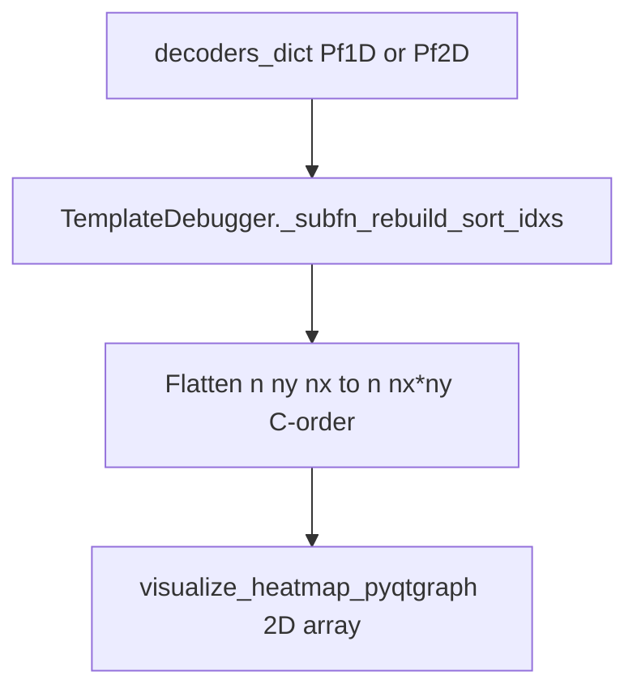

# True 2D support for TemplateDebugger stack

## What already works (no change needed for the core “posterior” story)

- `**[BinByBinDecodingDebugger.py](h:/TEMP/Spike3DEnv_ExploreUpgrade/Spike3DWorkEnv/pyPhoPlaceCellAnalysis/src/pyphoplacecellanalysis/GUI/PyQtPlot/Widgets/ContainerBased/BinByBinDecodingDebugger.py)**` already distinguishes **true spatial 2D** via `_bin_by_bin_true_2d_posterior_layout` (`decoder.ndim >= 2` and `p_x_given_n.ndim == 3`), draws **per–time-bin `(nx, ny)`** posteriors on row 1, and sets template row **xRange** to `flat_position_size` for 2D decoders (see build/update around lines 536–576 and 647–661).
- `**[BaseTemplateDebuggingMixin._subfn_rebuild_sort_idxs](h:/TEMP/Spike3DEnv_ExploreUpgrade/Spike3DWorkEnv/pyPhoPlaceCellAnalysis/src/pyphoplacecellanalysis/GUI/PyQtPlot/Widgets/ContainerBased/TemplateDebugger.py)`** already **reshapes** `(n_cells, nx, ny) → (n_cells, nx*ny)` with C-order and fixes `active_pfs_img_extents` (lines 240–243).

So **bin-by-bin debugging + per-bin templates** already match the “true 2D posterior + flattened 2D tuning strip” design from [the existing plan note](h:/TEMP/Spike3DEnv_ExploreUpgrade/Spike3DWorkEnv/Spike3D/.cursor/plans/2d_bin-by-bin_posteriors_ce23ba32.plan.md).

## Gap: four-dock `TemplateDebugger` (directional templates)

`[TemplateDebugger._subfn_rebuild_sort_idxs](h:/TEMP/Spike3DEnv_ExploreUpgrade/Spike3DWorkEnv/pyPhoPlaceCellAnalysis/src/pyphoplacecellanalysis/GUI/PyQtPlot/Widgets/ContainerBased/TemplateDebugger.py)` (classmethod ~858) builds `sorted_pf_tuning_curves` as a **list of arrays** and `img_extents_dict` from `**xbin` span only** (line 884). For 2D decoders, `pdf_normalized_tuning_curves` indexed as `[indices, :]` yields shape `**(n_cells, nx, ny)`**.

Downstream issues:

1. `**[visualize_heatmap_pyqtgraph](h:/TEMP/Spike3DEnv_ExploreUpgrade/Spike3DWorkEnv/pyPhoPlaceCellAnalysis/src/pyphoplacecellanalysis/Pho2D/matplotlib/visualize_heatmap.py)**` only coerces `ndim == 1` to 2D; **3D input is invalid** for `ImageItem`.
2. **Build/update loops** use `for v in curr_data[cell_i, :]` (e.g. lines 983–984, 1150–1151). For 3D `curr_data`, `curr_data[cell_i, :]` is **2D**, so the inner iteration is wrong.
3. `**enable_pf_peak_indicator_lines`**: `x_offset = curr_pf_peak_locations[cell_i]` assumes a **scalar** along the old 1D x-axis. For 2D CoMs this is often a **length-2** vector; it must be mapped to a **single x** in `[0, nx·ny)` consistent with the flattened strip (same convention as decode / occupancy).

**Design choice (minimal, consistent with bin-by-bin row 2):** keep each cell row as a **single horizontal strip** of length `nx*ny` (C-order ravel), not a miniature `(nx, ny)` image per row (that would be a separate, larger UI project).

## Implementation plan

### 1. Flatten curves and extents in `TemplateDebugger._subfn_rebuild_sort_idxs`

After the existing computation of `sorted_pf_tuning_curves` (list comprehension ~~876) and `img_extents_dict` (~~884), add a **per-decoder loop** over `enumerate(decoders_dict.items())`:

- Let `cur = sorted_pf_tuning_curves[i]`, `dec` the decoder.
- If `int(dec.ndim) >= 2` and `cur.ndim == 3`: `_n, _nx, _ny = cur.shape`; `cur = np.reshape(cur, (_n, _nx * _ny), order="C")`; set `active_pfs_img_extents_dict[name] = [0.0, 0.0, float(_nx * _ny), float(len(sorted_neuron_IDs_lists[i]))]`.
- Assign back into `sorted_pf_tuning_curves[i]`.

This mirrors `[BaseTemplateDebuggingMixin._subfn_rebuild_sort_idxs](h:/TEMP/Spike3DEnv_ExploreUpgrade/Spike3DWorkEnv/pyPhoPlaceCellAnalysis/src/pyphoplacecellanalysis/GUI/PyQtPlot/Widgets/ContainerBased/TemplateDebugger.py)` lines 240–243.

### 2. Peak lines for 2D in directional build/update

In `[_subfn_buildUI_directional_template_debugger_data](h:/TEMP/Spike3DEnv_ExploreUpgrade/Spike3DWorkEnv/pyPhoPlaceCellAnalysis/src/pyphoplacecellanalysis/GUI/PyQtPlot/Widgets/ContainerBased/TemplateDebugger.py)` and `[_subfn_update_directional_template_debugger_data](h:/TEMP/Spike3DEnv_ExploreUpgrade/Spike3DWorkEnv/pyPhoPlaceCellAnalysis/src/pyphoplacecellanalysis/GUI/PyQtPlot/Widgets/ContainerBased/TemplateDebugger.py)`, where `enable_pf_peak_indicator_lines` sets `x_offset`:

- Prefer `**float(np.argmax(curr_data[cell_i]))`** when `curr_data.ndim == 2` and `**int(a_decoder.ndim) >= 2**` (after step 1, this is the common case), so the marker aligns with the flattened tuning row.
- Keep existing scalar behavior for 1D decoders.

(Optional small shared `@staticmethod` on `TemplateDebugger` or module-level helper to avoid duplicating the condition in build vs update.)

### 3. Supporting class: incremental sort with 2D keys

`[paired_incremental_sorting](h:/TEMP/Spike3DEnv_ExploreUpgrade/Spike3DWorkEnv/NeuroPy/neuropy/utils/indexing_helpers.py)` (line ~562) sorts with `key=lambda item: item[1]`. For **2D CoM arrays**, this can raise the same ambiguity `**paired_individual_sorting` already guards** (try/except using `item[1][0]` ~610–614).

- Update `**paired_incremental_sorting`** to use the **same strategy** as `paired_individual_sorting`: try the simple key; on failure, sort using a **tuple key** `tuple(np.asarray(item[1], dtype=float).ravel())` (lexicographic `(x, y)`), or fall back to `item[1][0]` to match existing behavior.

This keeps `**use_incremental_sorting=True`** viable for Pf2D `TrackTemplates` without forcing `use_incremental_sorting=False`.

### 4. Out of scope / non-goals

- `**build_pf1D_heatmap_with_labels_and_peaks**`: still 1D-oriented; live call sites are commented / legacy; leave unless you need it for 2D.
- **Per-cell literal `(nx, ny)` thumbnails** in `TemplateDebugger`: not required for parity with bin-by-bin debugging; would need a different layout and interaction model.
- **BinByBin posteriors**: already implemented; only revisit if you find a remaining edge case (e.g. decoder reference in `plots_data`).

## Verification

- **1D / pseudo-2D**: `TemplateDebugger.init_templates_debugger` with existing 1D decoders — unchanged visuals (single-axis extents, scalar peaks).
- **2D**: Pf2D decoders in all four template slots — heatmaps render (2D `curr_curves`), colored rows match flattened length `nx*ny`, peak lines at argmax bin; toggling incremental vs separate sorting both succeed after NeuroPy fix.

