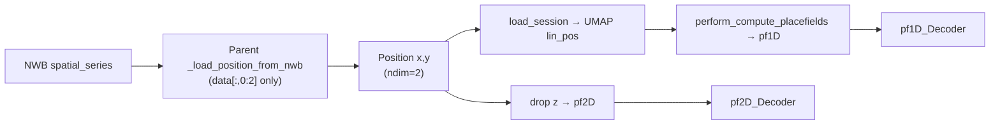
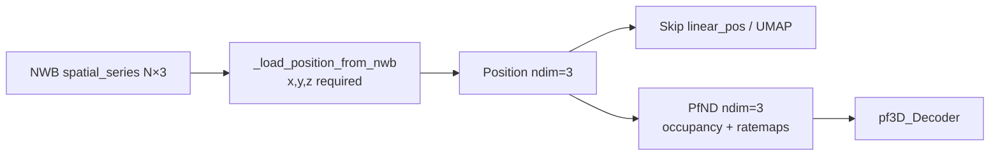

# ThreeDimSpatial 3D Position and Placefield Pipeline

## Current behavior (problem)



- [`NWBDataSessionFormat._load_position_from_nwb`](file:///home/halechr/repos/NeuroPy/neuropy/core/session/Formats/Specific/NWBDataSessionFormat.py) hard-crops to `data[:, 0:2]`, discarding any z column.
- [`perform_compute_placefields`](file:///home/halechr/repos/NeuroPy/neuropy/analyses/placefields.py) always builds **pf1D** (from `linear_pos_obj` + UMAP) and **pf2D** (x,y only).
- [`PfND.setup/compute`](file:///home/halechr/repos/NeuroPy/neuropy/analyses/placefields.py) only implements ndim 1 and 2; ndim 3 falls through to 2D logic (TODO at line 901).
- [`PlacefieldComputations`](file:///home/halechr/repos/pyPhoPlaceCellAnalysis/src/pyphoplacecellanalysis/General/Pipeline/Stages/ComputationFunctions/PlacefieldComputations.py) and [`DefaultComputationFunctions._perform_position_decoding_computation`](file:///home/halechr/repos/pyPhoPlaceCellAnalysis/src/pyphoplacecellanalysis/General/Pipeline/Stages/ComputationFunctions/DefaultComputationFunctions.py) always produce pf1D/pf2D and pf1D_Decoder/pf2D_Decoder.
- [`DANDI001754NWBDataSessionFormat`](file:///home/halechr/repos/NeuroPy/neuropy/core/session/Formats/Specific/DANDI001754NWBDataSessionFormat.py) hardcodes 2D `grid_bin_bounds=(((0,255),(0,255)))` and `linearization_parameters=dict(method='umap', ...)`.

**Local data note:** inspected NWB at `/media/halechr/BETAMAX1/Data/DANDI/ThreeDimSpatial/001754/sub-Rat1/sub-Rat1_ses-19980425T124500_behavior+ecephys.nwb` currently has `spatial_series.data.shape == (N, 2)`. Per your choice, the loader will **require 3 columns** and raise a clear error until updated NWB files are available. Delete stale export caches (`export/001754/.../*.position.npy`) after NWB update.

## Target behavior



- No pf1D, pf1D_dt, pf1D_Decoder, or UMAP linearization for `dandi_nwb_001754`.
- pf3D uses [`PlacefieldND`](file:///home/halechr/repos/NeuroPy/neuropy/analyses/placefields.py) (`np.histogramdd`) for true volumetric occupancy/spike maps.
- [`BayesianPlacemapPositionDecoder`](file:///home/halechr/repos/pyPhoPlaceCellAnalysis/src/pyphoplacecellanalysis/Analysis/Decoder/reconstruction.py) already has 3D posterior/marginal handling (`is_3D_decoder`, z-marginals); wire it to pf3D.

---

## 1. Session format: 3D position loading and no 1D path

**Primary file:** [`DANDI001754NWBDataSessionFormat.py`](file:///home/halechr/repos/NeuroPy/neuropy/core/session/Formats/Specific/DANDI001754NWBDataSessionFormat.py)

Add overrides (minimal edits to parent):

- **`_load_position_from_nwb`**: read `spatial_series.data`; if `shape[1] < 3`, raise `ValueError` naming session/file and expected `(N,3)`; else `Position.from_separate_arrays(t_rel, x, y, z)`.
- **`load_session`**: after core load, **skip** `_compute_linear_position_if_possible` / isomap fallback entirely for this format (do not populate `lin_pos`). Still run flattened-spike build, passing `z=session.position.z` via existing `**position_additional_variables_dict` in [`FlattenedSpiketrains.interpolate_spike_positions`](file:///home/halechr/repos/NeuroPy/neuropy/core/flattened_spiketrains.py).
- **`_get_session_specific_parameters`**: extend for 3D:
  - `grid_bin_bounds`: 3-tuple of (min,max) per axis — compute from data at config-build time or use fixed bounds after first successful load (initial placeholder `((0,255),(0,255),(0,255))` until z range is known from updated NWB).
  - `linearization_parameters`: set `method='none'` (or remove umap dependency).
  - Add format flags on `HardcodedProcessingParameters` (see §2): `spatial_dimensionality=3`, `skip_1d_placefields=True`, `skip_1d_decoders=True`.
- **`build_active_computation_configs`**: override to set 3D pf params:
  - `grid_bin`: 3-tuple via extended `compute_position_grid_bin_size(x,y,z,num_bins=(32,32,32))` (or match legacy 64-bin density per axis).
  - `smooth`: `(2.0, 2.0, 2.0)`.
  - `grid_bin_bounds` from hardcoded/session-specific params.

Optional: bump cache invalidation — if cached `.position.npy` has no `z` column, force reload from NWB (check in `load_session` before using cache).

---

## 2. Shared format metadata

**File:** [`BaseDataSessionFormats.py`](file:///home/halechr/repos/NeuroPy/neuropy/core/session/Formats/BaseDataSessionFormats.py)

Extend `HardcodedProcessingParameters` with optional fields (non-breaking defaults for other formats):

- `spatial_dimensionality: Optional[int] = None` (None → legacy 1D+2D pipeline)
- `skip_1d_placefields: bool = False`
- `skip_1d_decoders: bool = False`

Add helper on base format class:

- `get_spatial_dimensionality(sess)` → reads hardcoded params, else `sess.position.ndim`.

Extend `compute_position_grid_bin_size` to accept optional `z` and return a 3-tuple when provided.

---

## 3. NeuroPy: true 3D PfND computation

**File:** [`placefields.py`](file:///home/halechr/repos/NeuroPy/neuropy/analyses/placefields.py)

### `PfND.setup` (ndim == 3 branch)
- Include `'z'` in NA-drop columns (fix TODO at line 901).
- Parse `grid_bin_bounds` as `(x_range, y_range, z_range)`; build `xbin, ybin, zbin` (extend [`bin_pos_nD`](file:///home/halechr/repos/NeuroPy/neuropy/utils/mixins/binning_helpers.py) to accept optional `z` + 3-element `bin_size` / `num_bins`, or call `PlacefieldND` binning inline).
- Add `binned_z` via generalized [`build_position_df_discretized_binned_positions`](file:///home/halechr/repos/NeuroPy/neuropy/analyses/placefields.py) / `build_df_discretized_binned_position_columns` (already N-D capable).

### `PfND.compute` (ndim == 3 branch)
- Occupancy: `PlacefieldND._compute_occupancy(pos_xyz, [xbin,ybin,zbin], ...)`.
- Per-neuron tuning: interpolate `spk_z`, call `PlacefieldND._compute_tuning_map`.
- Build `Ratemap(..., zbin=self.zbin, occupancy=occupancy_3d)`.

### `perform_compute_placefields`
Add format-aware path ( driven by `computation_config.spatial_dimensionality` or `skip_1d_placefields` ):

```python
# New behavior for ThreeDimSpatial
if spatial_dimensionality == 3:
    pf3D = PfND.from_config_values(..., position=active_pos)  # keep x,y,z
    return None, None, pf3D  # or return pf3D as third value
```

Cleanest API: add `perform_compute_placefields_3d(...)` returning `pf3D` only, and have pipeline call it for `dandi_nwb_001754`.

Skip: `compute_linearized_position`, `drop_dimensions_above(2)`, pf1D/pf2D entirely for this format.

**File:** [`time_dependent_placefields.py`](file:///home/halechr/repos/NeuroPy/neuropy/analyses/time_dependent_placefields.py) — add matching `pf3D_dt` path (optional for initial PR; can stub/skip `_perform_time_dependent_placefield_computation` for 001754 if not needed immediately).

---

## 4. pyPhoPlaceCellAnalysis: pipeline computations

### [`PlacefieldComputations.py`](file:///home/halechr/repos/pyPhoPlaceCellAnalysis/src/pyphoplacecellanalysis/General/Pipeline/Stages/ComputationFunctions/PlacefieldComputations.py)
- Branch on `sess.config.format_name == 'dandi_nwb_001754'` (or `spatial_dimensionality == 3`):
  - Set `computed_data['pf3D']` via `perform_compute_placefields_3d`.
  - Set `computed_data['pf1D'] = None`, `computed_data['pf2D'] = None` (or omit keys and guard downstream).

### [`DefaultComputationFunctions.py`](file:///home/halechr/repos/pyPhoPlaceCellAnalysis/src/pyphoplacecellanalysis/General/Pipeline/Stages/ComputationFunctions/DefaultComputationFunctions.py)
- Add `_perform_position_decoding_computation_3d` (or branch inside existing fn):
  - Build `pf3D_Decoder = BayesianPlacemapPositionDecoder(..., pf=pf3D, ...)`.
  - Skip pf1D_Decoder / pf2D_Decoder when `skip_1d_decoders`.
- Guard `_perform_two_step_position_decoding_computation` and clusterless decoders: skip or 3D-only for this format (two-step currently raises for ndim > 2).

### [`NeuropyPipeline.py`](file:///home/halechr/repos/pyPhoPlaceCellAnalysis/src/pyphoplacecellanalysis/General/Pipeline/NeuropyPipeline.py)
- For `dandi_nwb_001754`, update expected `computed_data` keys in compare/save paths to `['pf3D', 'pf3D_Decoder']` instead of pf1D/pf2D.

### Batch / multi-context helpers
- In [`batch_user_completion_helpers.py`](file:///home/halechr/repos/pyPhoPlaceCellAnalysis/src/pyphoplacecellanalysis/General/Batch/BatchJobCompletion/UserCompletionHelpers/batch_user_completion_helpers.py), gate Bapun-style multi-context / pf2D-dependent completion fns to skip (or no-op with warning) for `dandi_nwb_001754` until 3D equivalents exist.

---

## 5. Tests

**NeuroPy** (new/extended tests alongside [`test_dandi_001695_nwb_data_session_format.py`](file:///home/halechr/repos/NeuroPy/tests/test_dandi_001695_nwb_data_session_format.py)):

- Synthetic NWB/minimal mock with `(N,3)` spatial series → position has `z`, `ndim==3`.
- Loader rejects `(N,2)` with actionable error for 001754 format.
- PfND 3D smoke test: small random x,y,z + spikes → occupancy shape `(nx-1, ny-1, nz-1)`, ratemap ndim 3.

**pyPhoPlaceCellAnalysis** (light integration):

- Mock `ComputationResult` with 3D position → `_perform_baseline_placefield_computation` produces `pf3D` and no pf1D_Decoder.

---

## 6. Migration / operator steps

After code lands:

1. Ensure NWB files include z in `behavior/position/spatial_series` (3rd column).
2. Delete stale caches: `export/001754/<subject>/<session>/*.position.npy` and pipeline pickle if it was built from 2D position.
3. Reload via `DataSessionLoader.dandi_nwb_001754_session(...)` and rerun pipeline compute for ES0/MC0/task_GLOBAL filters.

---

## Scope boundaries

- **In scope:** loading x,y,z; 3D pf/occupancy/ratemap/decoder; skip 1D decoders and UMAP linearization for `dandi_nwb_001754`.
- **Out of scope (follow-ups):** 3D display functions, two-step 3D decoder, time-dependent pf3D_dt, importing legacy NWB `ecephys/rate_maps` 64×64 tables (2D only), notebook edits (per your rule — ask before touching `.ipynb`).
