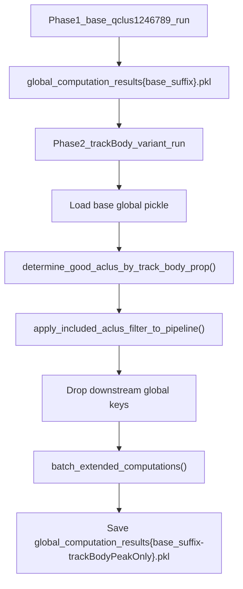

# Track-body peak batch variant

## Goal

Run the full extended batch pipeline (rank order, merged decoders, trial-by-trial, etc.) restricted to aclus whose **primary peak is on the track straightaway on both long and short tracks (LR and RL)**—as a **separate pickle variant**, without re-running `pf_computation` / `split_to_directional_laps`.

## Architecture (two-phase workflow)



**Phase 1** (existing active config in [`ProcessBatchOutputs_qclus1246789_Only.ipy`](h:/TEMP/Spike3DEnv_ExploreUpgrade/Spike3DWorkEnv/Spike3D/ProcessBatchOutputs_qclus1246789_Only.ipy)): produces base suffix `_withNormalComputedReplays-qclu_[1, 2, 4, 6, 7, 8, 9]-frateThresh_2.0`.

**Phase 2** (new commented section in same file): loads that base pickle, applies body-peak aclu filter in-memory, drops downstream keys, recomputes missing global computations, saves to `-trackBodyPeakOnly` suffix.

## Code changes

### 1. Parameterize existing detector (no new top-level function)

In [`PendingNotebookCode.py`](h:/TEMP/Spike3DEnv_ExploreUpgrade/Spike3DWorkEnv/pyPhoPlaceCellAnalysis/src/pyphoplacecellanalysis/SpecificResults/PendingNotebookCode.py) (~lines 141–205):

- Add kwargs to `determine_good_aclus_by_track_body_prop`:
  - `minimum_inclusion_fr_Hz: float = 2.0`
  - `included_qclu_values: Optional[List[int]] = None`
  - `require_both_directions: bool = True` (default keeps current both-dirs logic; LR-only available if needed)
- Pass these into `directional_laps_results.get_templates(...)` instead of hardcoded values.
- Intersect result with `track_templates.any_decoder_neuron_IDs` before return.
- Remove the stray expression-statement `both_body_aclus_both_dirs ## [...]` at end of function body.

### 2. One new top-level function: apply filter to pipeline

Add **`apply_included_aclus_filter_to_pipeline(curr_active_pipeline, included_aclus, debug_print=False)`** in the same file (near the existing broken `filtered_by_frate_and_qclu` block ~15883):

This is the only new public function. It will:

1. Require `'DirectionalLaps'` in `global_computation_results.computed_data`.
2. Intersect `included_aclus` with neurons present in decoders.
3. Replace `DirectionalLaps` in-place:
   ```python
   filtered = directional_laps_results.filtered_by_included_aclus(included_aclus)
   curr_active_pipeline.global_computation_results.computed_data['DirectionalLaps'] = filtered
   ```
4. Call `find_downstream_dependencies(provided_global_keys=['DirectionalLaps'])` and `perform_drop_computed_result` for all returned global keys except `'DirectionalLaps'`.
5. Return a small dict for logging: `included_aclus`, `n_included`, `dropped_global_keys`.

**Do not** call `DirectionalMergedDecoders.filtered_by_included_aclus` (method does not exist); downstream objects are dropped and recomputed instead.

Optionally leave `filtered_by_frate_and_qclu` as-is (unused/broken) to minimize diff scope.

### 3. Batch hook (single insertion point)

In [`BatchCompletionHandler.try_compute_global_computations_if_needed`](h:/TEMP/Spike3DEnv_ExploreUpgrade/Spike3DWorkEnv/pyPhoPlaceCellAnalysis/src/pyphoplacecellanalysis/General/Batch/BatchJobCompletion/BatchCompletionHandler.py) (~line 615, after global pickle load, before `batch_extended_computations`):

Add optional handler fields (passed via `batch_session_completion_handler_kwargs`):

```python
apply_track_body_aclu_filter: bool = False
track_body_filter_minimum_inclusion_fr_Hz: Optional[float] = None
track_body_filter_included_qclu_values: Optional[List] = None
```

When `apply_track_body_aclu_filter` is True:

```python
from pyphoplacecellanalysis.SpecificResults.PendingNotebookCode import (
    determine_good_aclus_by_track_body_prop,
    apply_included_aclus_filter_to_pipeline,
)
included_aclus = determine_good_aclus_by_track_body_prop(
    curr_active_pipeline,
    minimum_inclusion_fr_Hz=self.track_body_filter_minimum_inclusion_fr_Hz or 2.0,
    included_qclu_values=self.track_body_filter_included_qclu_values,
)
apply_included_aclus_filter_to_pipeline(curr_active_pipeline, included_aclus, debug_print=True)
```

Downstream recomputation happens automatically because dropped keys fail validators during `batch_extended_computations`.

### 4. Split load/save suffix for derived variant

In [`python_template.py.j2`](h:/TEMP/Spike3DEnv_ExploreUpgrade/Spike3DWorkEnv/pyPhoPlaceCellAnalysis/src/pyphoplacecellanalysis/Resources/Templates/python_template.py.j2) (~lines 49–186):

- Keep `parameter_specifier_str` = load suffix (`override_custom_pickle_suffix`).
- Add optional `parameter_output_specifier_str` = `override_custom_pickle_output_suffix|default(override_custom_pickle_suffix)`.
- Use `parameter_specifier_str` for **load** paths (`override_file`).
- Use `parameter_output_specifier_str` for **global output** path only:
  - `global_computation_results_override_output_file = ... f'global_computation_results{parameter_output_specifier_str}.pkl'`
- Session pickle load/save stays on load suffix (body filter does not change session-level pf computation).

Pass `override_custom_pickle_output_suffix` through existing `**renderer_script_generation_kwargs` in [`pythonScriptTemplating.py`](h:/TEMP/Spike3DEnv_ExploreUpgrade/Spike3DWorkEnv/pyPhoPlaceCellAnalysis/src/pyphoplacecellanalysis/General/Batch/pythonScriptTemplating.py) (no signature change needed—already accepts `**kwargs`).

### 5. Commented variant section in batch driver

Add a clearly labeled block in [`ProcessBatchOutputs_qclus1246789_Only.ipy`](h:/TEMP/Spike3DEnv_ExploreUpgrade/Spike3DWorkEnv/Spike3D/ProcessBatchOutputs_qclus1246789_Only.ipy) after the active suffix config (~line 260):

```python
# =============================================================================
# VARIANT: track-body primary peaks only (Phase 2 — requires Phase 1 base pickle)
# =============================================================================
# base_suffix = "_withNormalComputedReplays-qclu_[1, 2, 4, 6, 7, 8, 9]-frateThresh_2.0"
# track_body_suffix = f"{base_suffix}-trackBodyPeakOnly"
# active_phase_dict['override_custom_pickle_suffix'] = base_suffix          # LOAD from base
# active_phase_dict['override_custom_pickle_output_suffix'] = track_body_suffix  # SAVE variant
# job_suffix = f"{track_body_suffix}_tbin_75ms"
# active_phase_dict['batch_session_completion_handler_kwargs'] = {
#     'apply_track_body_aclu_filter': True,
#     'track_body_filter_minimum_inclusion_fr_Hz': minimum_inclusion_fr_Hz,
#     'track_body_filter_included_qclu_values': included_qclu_values,
# }
# # Narrow force-recompute to downstream only (base DirectionalLaps is loaded then sliced):
# active_phase_dict['force_recompute_override_computations_includelist'] = [
#     'merged_directional_placefields', 'directional_decoders_decode_continuous',
#     'directional_decoders_evaluate_epochs', 'directional_decoders_epoch_heuristic_scoring',
#     'rank_order_shuffle_analysis', 'perform_wcorr_shuffle_analysis',
#     'jonathan_firing_rate_analysis', 'long_short_fr_indicies_analyses',
#     'long_short_endcap_analysis', 'long_short_decoding_analyses',
#     'trial_by_trial_metrics', 'directional_train_test_split',
#     # ... match your active extended_computations_include_includelist minus pf/split
# ]
```

Include brief comments: run Phase 1 first; uncomment Phase 2 block and comment out the active base-suffix lines when switching.

## Files touched

| File | Change |
|------|--------|
| [`PendingNotebookCode.py`](h:/TEMP/Spike3DEnv_ExploreUpgrade/Spike3DWorkEnv/pyPhoPlaceCellAnalysis/src/pyphoplacecellanalysis/SpecificResults/PendingNotebookCode.py) | Parameterize detector; add `apply_included_aclus_filter_to_pipeline` |
| [`BatchCompletionHandler.py`](h:/TEMP/Spike3DEnv_ExploreUpgrade/Spike3DWorkEnv/pyPhoPlaceCellAnalysis/src/pyphoplacecellanalysis/General/Batch/BatchJobCompletion/BatchCompletionHandler.py) | 3 new optional fields + hook in `try_compute_global_computations_if_needed` |
| [`python_template.py.j2`](h:/TEMP/Spike3DEnv_ExploreUpgrade/Spike3DWorkEnv/pyPhoPlaceCellAnalysis/src/pyphoplacecellanalysis/Resources/Templates/python_template.py.j2) | Optional output suffix for global pickle save path |
| [`ProcessBatchOutputs_qclus1246789_Only.ipy`](h:/TEMP/Spike3DEnv_ExploreUpgrade/Spike3DWorkEnv/Spike3D/ProcessBatchOutputs_qclus1246789_Only.ipy) | Commented Phase-2 variant section (user-approved) |

## Verification

1. Run Phase 1 (existing config) for one session; confirm base global pickle exists.
2. Uncomment Phase 2 block; regenerate scripts; run one session.
3. Confirm log prints ~10 body-peak aclus (session-dependent).
4. Confirm output file: `output/global_computation_results{base_suffix}-trackBodyPeakOnly.pkl`.
5. Confirm `DirectionalLaps` decoders contain only those aclus; downstream keys (`RankOrder`, `DirectionalMergedDecoders`, etc.) were recomputed.
6. Optional: call `compute_run_peak_matching_remapping_all(curr_active_pipeline, ...)` in notebook on loaded variant pickle—should see only body-peak rows.

## Out of scope (minimal diff)

- Fixing unused `filtered_by_frate_and_qclu` (returns deepcopy without writing back).
- Adding `RankOrder.filtered_by_included_aclus` (not needed—drop + recompute).
- New standalone `.ipy` file (user chose section in existing file only).
