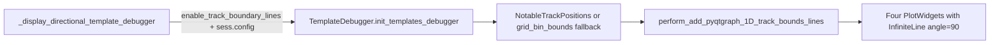

# Add TemplateDebugger 1D track boundary lines

## Goal

When `enable_track_boundary_lines=True`, draw the eight long/short platform boundary x-positions as full-height vertical dashed lines on each TemplateDebugger pf1D heatmap panel — the pyqtgraph equivalent of matplotlib [`perform_add_1D_track_bounds_lines`](h:/TEMP/Spike3DEnv_ExploreUpgrade/Spike3DWorkEnv/pyPhoPlaceCellAnalysis/src/pyphoplacecellanalysis/Pho2D/track_shape_drawing.py).

This is **separate** from `enable_pf_peak_indicator_lines` (per-cell CoM ticks). Leave peak-indicator code untouched.

## Approach



### 1. Shared pyqtgraph helper in `track_shape_drawing.py`

Add `perform_add_pyqtgraph_1D_track_bounds_lines(...)` next to the matplotlib helpers:

- Inputs: `plot_item` (or `PlotWidget`), `long_notable_x_platform_positions`, `short_notable_x_platform_positions`, `include_long`/`include_short`, optional pens
- For each x in the 4-tuple per track, create:
  ```python
  pg.InfiniteLine(pos=float(x), angle=90, movable=False, pen=pg.mkPen(..., style=Qt.DashLine))
  ```
  then `plot_item.addItem(line)`
- Pens from `LongShortDisplayConfigManager` long/short epoch configs (match matplotlib edgecolors; width ~1.0, dashed — same pattern as [`EpochsEditorItem`](h:/TEMP/Spike3DEnv_ExploreUpgrade/Spike3DWorkEnv/pyPhoPlaceCellAnalysis/src/pyphoplacecellanalysis/GUI/PyQtPlot/Widgets/GraphicsWidgets/EpochsEditorItem.py) track limit lines)
- Return `Dict[str, List[pg.InfiniteLine]]` like `{'long': [...], 'short': [...]}` for ownership/cleanup
- No text labels on the heatmaps (avoids clutter; matplotlib labels are optional and not needed for TemplateDebugger)

### 2. Resolve positions

Prefer session-accurate bounds; fall back to idealized geometry:

1. If `loaded_track_limits` / `sess_config` kwarg provided → `NotableTrackPositions.init_notable_track_points_from_session_config(...)` and `tuple(long_notable_x)`, `tuple(short_notable_x)`
2. Else derive from any decoder’s `pf.config.grid_bin_bounds` using the same `LinearTrackDimensions` + midpoint logic as [`add_vertical_track_bounds_lines`](h:/TEMP/Spike3DEnv_ExploreUpgrade/Spike3DWorkEnv/pyPhoPlaceCellAnalysis/src/pyphoplacecellanalysis/Pho2D/track_shape_drawing.py) (indices `[0,1,3,4]`)
3. If neither available → skip drawing (no crash)

In [`_display_directional_template_debugger`](h:/TEMP/Spike3DEnv_ExploreUpgrade/Spike3DWorkEnv/pyPhoPlaceCellAnalysis/src/pyphoplacecellanalysis/General/Pipeline/Stages/ComputationFunctions/MultiContextComputationFunctions/DirectionalPlacefieldGlobalComputationFunctions.py), pass `sess_config=owning_pipeline_reference.sess.config` (or `loaded_track_limits=...`) into `TemplateDebugger.init_templates_debugger` so real kdiba limits are used.

### 3. Wire into TemplateDebugger

File: [`TemplateDebugger.py`](h:/TEMP/Spike3DEnv_ExploreUpgrade/Spike3DWorkEnv/pyPhoPlaceCellAnalysis/src/pyphoplacecellanalysis/GUI/PyQtPlot/Widgets/ContainerBased/TemplateDebugger.py)

- Add `enable_track_boundary_lines: bool = True` to `init_templates_debugger` signature; store on `_out_params`
- Accept optional `sess_config` / `loaded_track_limits` / precomputed position tuples; store resolved `(long_xs, short_xs)` on `_out_data` or `_out_params`
- In `_subfn_buildUI_directional_template_debugger_data`, after each panel’s heatmap/`setRect` is ready:
  - Only for **1D** decoders (`a_decoder.ndim < 2`) — flattened 2D x is bin-index space, not track cm
  - If enabled and positions resolved, call the helper on `curr_win` (CustomPlotWidget)
  - Store results in `_out_ui.track_boundary_lines_dict[a_decoder_name]`
- Update path: boundary lines are static track geometry — create once in build; do not recreate on neuron-filter updates. If clearing a panel, leave boundary lines in place
- Always show **both** long and short sets on every panel (`include_long=True`, `include_short=True`), matching matplotlib default

### 4. Display-function surface

In `_display_directional_template_debugger`, pop/document `enable_track_boundary_lines` (default True) and forward it with `sess_config` so notebook calls work:

```python
curr_active_pipeline.display(
    '_display_directional_template_debugger',
    prepare_for_publication=True,
    enable_track_boundary_lines=True,  # default
)
```

Publication exports can pass `enable_track_boundary_lines=False` when a clean strip-only image is wanted.

## Out of scope

- Fixing / changing `enable_pf_peak_indicator_lines`
- Matplotlib track-bounds helpers
- Labels (L[0]…S[3]) on TemplateDebugger panels
