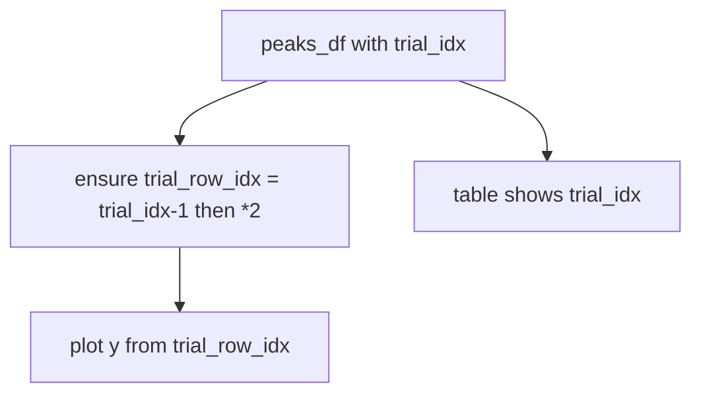

# Use `trial_row_idx` for peak visualization y-coords

## Problem

[`add_aclu_field_peak_id_debug_labels`](h:\TEMP\Spike3DEnv_ExploreUpgrade\Spike3DWorkEnv\pyPhoPlaceCellAnalysis\src\pyphoplacecellanalysis\GUI\PyQtPlot\Widgets\ContainerBased\TrialByTrialActivityWindow.py) already preserves original `trial_idx` and plots via:

```python
peaks_df['trial_row_idx'] = deepcopy(peaks_df['trial_idx']) - 1
peaks_df['trial_row_idx'] = peaks_df['trial_row_idx'] * 2
```

But [`add_peak_center_vertical_markers`](h:\TEMP\Spike3DEnv_ExploreUpgrade\Spike3DWorkEnv\pyPhoPlaceCellAnalysis\src\pyphoplacecellanalysis\GUI\PyQtPlot\Widgets\ContainerBased\TrialByTrialActivityWindow.py) still mutates `trial_idx` in place (lines 1202–1203) and stores that mutated column in `plots_data.peak_center_markers_df`. Hover redraws also read `trial_idx` for y-positioning.

## Approach

Single-file change in [`TrialByTrialActivityWindow.py`](h:\TEMP\Spike3DEnv_ExploreUpgrade\Spike3DWorkEnv\pyPhoPlaceCellAnalysis\src\pyphoplacecellanalysis\GUI\PyQtPlot\Widgets\ContainerBased\TrialByTrialActivityWindow.py).

Leave table APIs alone: `_update_hover_peak_prominence_table` / `set_all_decoders_peak_prominence_df` intentionally show original `trial_idx`.



## Changes

### 1. `add_peak_center_vertical_markers`

- Replace the in-place `trial_idx` mutate with the same create-if-missing `trial_row_idx` block used by labels.
- Keep `trial_idx` required as input (original 1-based identity); do not overwrite it.
- Set `marker_cols` to include `trial_row_idx` (and keep `trial_idx` if useful for stored DF identity; prefer storing both so hover/labels can reuse).
- Pass `aclu_peaks_df['trial_row_idx']` into `_build_peak_marker_scatter_items`.
- Update docstring y-span text to reference `trial_row_idx`.

### 2. Hover redraw helpers

- `_update_hover_preview_peak_markers`: use `aclu_peaks_df['trial_row_idx']` (assert/ensure column exists from stored `peak_center_markers_df`).
- `_update_hover_preview_aclu_field_peak_id_labels`: use `aclu_peaks_df['trial_row_idx']`.

### 3. `add_aclu_field_peak_id_debug_labels`

- Keep existing `trial_row_idx` creation block.
- Add `trial_row_idx` to `label_cols` so stored `aclu_field_peak_id_labels_df` has the plot y column for hover redraw.

### 4. Low-level builders (param rename for clarity)

Rename the y-position kwarg/local from `trial_idx` → `trial_row_idx` in:

- `_build_peak_marker_scatter`
- `_build_peak_marker_scatter_items`
- `_build_aclu_field_peak_id_label_items`

Call sites pass the DataFrame column `trial_row_idx`. No behavior change beyond the column source.

## Out of scope

- No changes to prominence-table column lists (remain `trial_idx`).
- No notebook edits.