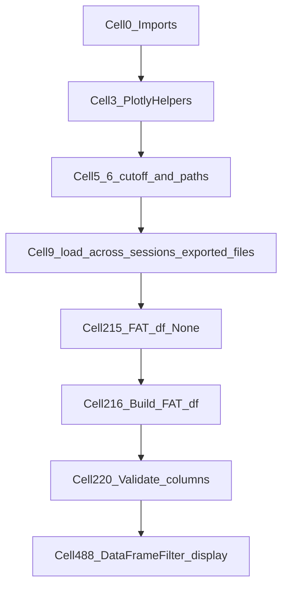

# Trim PhoDibaPaper2024.ipynb to FAT Plotly-only

## Scope (confirmed)

- **Keep:** minimal `FAT_df` → interactive Plotly via `DataFrameFilter` (`filtered_FAT_df`)
- **Delete:** ~482 cells (H5 loading, matplotlib publication figures, bokeh/altair, bootstrap/chi2, exports, exploration/debug, duplicate plotly paths, etc.)
- **Archive:** copy full notebook before any deletion

## Cells to keep (10 total, in this order)

| # | Index | Purpose |
|---|-------|---------|
| 1 | **0** | Imports, autoreload, `TODAY_DAY_DATE`, `known_bad_session_strs` |
| 2 | **3** | Plotly template, `save_plotly`, `fig_size_kwargs`, `resolution_multiplier` |
| 3 | **5** | `cuttoff_date` |
| 4 | **6** | `collected_outputs_directory`, `figures_folder` |
| 5 | **9** | `load_across_sessions_exported_files(...)` + unpack `df_results`, `t_delta` |
| 6 | **214** | Markdown: `# 2025-03-17 - Collecting Final FAT_CSV Results` |
| 7 | **215** | `FAT_df = None` (force-refresh hook) |
| 8 | **216** | Build `FAT_df` from `all_sessions_laps_time_bin_df` (`run_fat`) |
| 9 | **220** | Column validation (`data_grain`, `animal`) + `ALL_GOOD` file list |
| 10 | **488** | `DataFrameFilter(FAT_df=..., active_plot_df_name='filtered_FAT_df')` + `display()` |

**Explicitly deleted** (among many others):
- Cell **2** (matplotlib / `AcrossSessionsResults` — not used by kept path)
- Cells **117–132** (legacy pre-FAT Plotly + old `DataFrameFilter`)
- Cell **222** (FAT split into `all_sessions_*` — not needed for `filtered_FAT_df` mode)
- Cells **383, 487, 489** (alternate/split-df plotters; **489** is redundant `df_filter.show()`)
- Cells **10–491** except the keep-list above

## Execution flow after trim

Run top-to-bottom on a fresh kernel; total runtime still dominated by **cell 9 (~1.5 min)**.

## Implementation steps

### 1. Archive the full notebook

Copy [`EXTERNAL/PhoDibaPaper2024Book/PhoDibaPaper2024.ipynb`](h:\TEMP\Spike3DEnv_ExploreUpgrade\Spike3DWorkEnv\Spike3D\EXTERNAL\PhoDibaPaper2024Book\PhoDibaPaper2024.ipynb) to:

`EXTERNAL/PhoDibaPaper2024Book/PhoDibaPaper2024_FULL_ARCHIVE_2026-08-31.ipynb`

(No git commit unless you ask.)

### 2. Filter cells programmatically

Use a short Python script (or notebook JSON edit) to:
- Keep only indices `[0, 3, 5, 6, 9, 214, 215, 216, 220, 488]`
- **Clear outputs** on all surviving cells (removes most of the ~9700-line bulk from embedded DataFrames/plots)
- Reset `execution_count` to `null` on kept code cells

### 3. Small content fixes in kept cells (only where needed)

- **Cell 5:** Set active `cuttoff_date` to `datetime(2026, 8, 28)` (your latest FAT exports). The notebook currently has `datetime(2025, 10, 2)` active and `2026-08-28` commented as "Not working" — after trim, that comment should be removed or updated once validated.
- **Cell 488:** Ensure `replay_name` / `time_bin_size` match values present in `FAT_df` (currently `frateThresh_2.0` / `0.060`). Add a one-line comment pointing user to `FAT_df.neuropy.get_flat_unique_values(...)` if widget selection fails.

No library changes in [`AcrossSessionResults.py`](h:\TEMP\Spike3DEnv_ExploreUpgrade\Spike3DWorkEnv\pyPhoPlaceCellAnalysis\src\pyphoplacecellanalysis\SpecificResults\AcrossSessionResults.py).

### 4. Verify trimmed notebook

- Open trimmed notebook, run all cells top-to-bottom
- Confirm: `FAT_df` builds, validation prints `ALL GOOD!`, `df_filter.display()` renders Plotly widget
- Confirm archive copy opens and still has all 492 cells

## Side effects to be aware of

- [`EXTERNAL/PhoDibaPaper2024Book/_toc.yml`](h:\TEMP\Spike3DEnv_ExploreUpgrade\Spike3DWorkEnv\Spike3D\EXTERNAL\PhoDibaPaper2024Book\_toc.yml) still points at `PhoDibaPaper2024` — the trimmed notebook becomes the book chapter (much shorter). Full content remains in the archive file.
- Any workflow that relied on tagged cells (`run_main`, `run_for_publication`, `run_fig4_bootstrap`, etc.) outside the keep-list will no longer exist in this notebook.

## Result

- **Before:** 492 cells, ~9700 lines (heavy outputs)
- **After:** 10 cells, linear FAT → Plotly pipeline, archive preserved alongside
