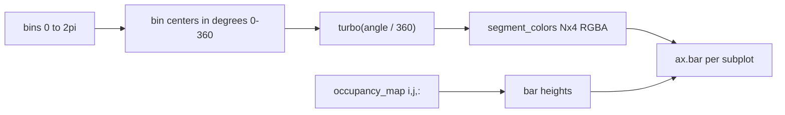

# Turbo-colored polar histogram segments

## Target

[`PendingNotebookCode.py`](h:\TEMP\Spike3DEnv_ExploreUpgrade\Spike3DWorkEnv\pyPhoPlaceCellAnalysis\src\pyphoplacecellanalysis\SpecificResults\PendingNotebookCode.py) — `plot_spatial_angular_distributions` (lines 12397–12445).

## Problem

`ax.hist(..., histtype='stepfilled')` draws all angular bins in one default color. Matplotlib’s polar `hist` does not accept a per-bin color array, so per-segment coloring requires switching to `bar`.

## Approach

Replace the `hist` call with a polar `bar` plot (same pattern already used in the adjacent `radial_histogram` helper at line 12457), and precompute segment colors once outside the spatial loop.



### 1. Precompute colors (once, before spatial loops)

After `bins = np.linspace(0, 2*np.pi, n_angles+1)`:

```python
widths = np.diff(bins)
angle_deg_centers = np.degrees(bins[:-1] + widths / 2)  # matches linspace(0, 360, n_angles+1) bin centers
segment_colors = mpl.colormaps['turbo'](angle_deg_centers / 360.0)
```

- Uses existing imports: `matplotlib as mpl` (line 26) and `from matplotlib import cm, pyplot as plt` (line 15).
- Bin centers align with how direction bins are defined elsewhere in this file (`np.linspace(0, 360, n_dir_bins + 1)` in `compute_3d_occupancy_map`).

### 2. Replace `hist` with colored `bar` (inside loop)

Replace:

```python
_new_radial_ax.hist(bins[:-1], bins=bins, weights=values, density=False, histtype='stepfilled')
```

With:

```python
_new_radial_ax.bar(bins[:-1], values, width=widths, bottom=0, align='edge', color=segment_colors, edgecolor='none')
```

- `align='edge'` keeps wedge placement identical to the current histogram (left edge at each bin edge).
- `edgecolor='none'` avoids dark seams between colored wedges.

### 3. Add 0–360° turbo colorbar

After the spatial loop, attach a colorbar to the unused main Cartesian `ax` (already created by `plt.subplots`):

```python
_heading_norm = mpl.colors.Normalize(vmin=0, vmax=360)
_heading_sm = mpl.cm.ScalarMappable(cmap='turbo', norm=_heading_norm)
_heading_sm.set_array([])
fig.colorbar(_heading_sm, ax=ax, label='Heading (degrees)', orientation='vertical', fraction=0.02, pad=0.01)
ax.set_visible(False)  # hide empty main axes; colorbar remains
```

- Single shared colorbar for the whole figure (not one per mini polar subplot).
- Label matches the [0, 360] degree convention used for direction binning in this module.

## Scope

- **In scope:** `plot_spatial_angular_distributions` only (user-selected lines).
- **Out of scope:** `plot_spatial_angular_distributions_alt`, `radial_histogram`, or other functions unless you want them updated later.

## Verification

Manually run existing usage from the docstring:

```python
fig, ax = plot_spatial_angular_distributions(occupancy_map, subsample_factor=4)
plt.show()
```

Confirm:
- Each wedge in every mini polar plot has a distinct turbo hue matching its heading bin.
- Colorbar spans 0–360° with turbo gradient.
- Spatial layout and subsampling unchanged.
