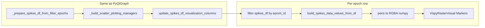

# Vispy shader-based multi-epoch spike raster

## Context

- `[plot_multiple_raster_plot](h:\TEMP\Spike3DEnv_ExploreUpgrade\Spike3DWorkEnv\pyPhoPlaceCellAnalysis\src\pyphoplacecellanalysis\General\Pipeline\Stages\DisplayFunctions\SpikeRasters.py)` (lines 1178–1274) prepares data with `_prepare_spikes_df_from_filter_epochs`, `_build_scatter_plotting_managers`, `unit_sort_manager.update_spikes_df_visualization_columns`, then per epoch filters spikes and calls `[Render2DScrollWindowPlotMixin.build_spikes_all_spots_from_df](h:\TEMP\Spike3DEnv_ExploreUpgrade\Spike3DWorkEnv\pyPhoPlaceCellAnalysis\src\pyphoplacecellanalysis\GUI\PyQtPlot\Widgets\Mixins\Render2DScrollWindowPlot.py)` which internally uses `[build_spikes_data_values_from_df](h:\TEMP\Spike3DEnv_ExploreUpgrade\Spike3DWorkEnv\pyPhoPlaceCellAnalysis\src\pyphoplacecellanalysis\GUI\PyQtPlot\Widgets\Mixins\Render2DScrollWindowPlot.py)` — producing **(t, y) ndarrays** and **per-spike QPen** (emphasis-aware) but also building a **list of dicts** (`all_spots`) that is expensive at scale.
- Current `[vispy_raster.py](h:\TEMP\Spike3DEnv_ExploreUpgrade\Spike3DWorkEnv\pyPhoPlaceCellAnalysis\src\pyphoplacecellanalysis\Pho2D\vispy\vispy_raster.py)` is invalid: `VispyRasterVisual(ScrollingLinesVisual)` is undefined, and `raster_example` uses `app` without importing vispy’s `app`.
- No circular import risk: `SpikeRasters.py` does not reference `vispy_raster`.

## Design

### 1. `VispyRasterVisual` (performant + flexible)

- **Base rendering**: subclass or thin wrapper around `[vispy.scene.visuals.Markers](https://vispy.org/api/vispy.scene.visuals.markers.html)` (already OpenGL shader-based — this satisfies “shader-based” without maintaining custom GLSL unless you later need non-marker geometry).
- **Geometry**: spike ticks as `**symbol='vbar'`** (vertical bar), with `pos` shaped `(N, 2)` in **data coordinates** `(t, y)` matching PyQtGraph’s scatter (`pxMode=False` semantics). `size` controls bar extent in **physical pixels** (vispy convention); map from `build_scatter_plot_kwargs` / user `scatter_plot_kwargs` where practical (e.g. use `size` from kwargs; document mapping).
- **Colors**: build `(N, 4)` `float32` RGBA from the same `curr_spike_pens` list that `build_spikes_data_values_from_df` returns — extract Qt color via `pen.color().getRgbF()` in a tight loop or small vectorized helper (still far cheaper than allocating N dicts + QBrush objects for vispy).
- **Public API** (flexibility):
  - `set_spike_arrays(t, y, rgba, *, symbol=..., size=..., edge_width=0, scaling=True)` — hot path for updates.
  - Optional `set_from_build_result(...)` that accepts `(curr_spike_t, curr_spike_y, curr_spike_pens, ...)` from the mixin to avoid duplicating filter logic.
  - `markers` property exposing the underlying `Markers` for `set_gl_state`, `order`, etc.
- **Composition**: inherit `scene.Node` and hold a child `Markers` (mirrors patterns like `TrajectorySegmentsVisual` in `[vispy_helpers.py](h:\TEMP\Spike3DEnv_ExploreUpgrade\Spike3DWorkEnv\pyPhoPlaceCellAnalysis\src\pyphoplacecellanalysis\Pho2D\vispy\vispy_helpers.py)`) so callers can attach transforms or grids as siblings.

### 2. `plot_multiple_raster_plot_vispy` (same **arguments** as PyQtGraph version)

- **Signature**: mirror `[plot_multiple_raster_plot](h:\TEMP\Spike3DEnv_ExploreUpgrade\Spike3DWorkEnv\pyPhoPlaceCellAnalysis\src\pyphoplacecellanalysis\General\Pipeline\Stages\DisplayFunctions\SpikeRasters.py)` — `filter_epochs_df`, `spikes_df`, `included_neuron_ids`, `unit_sort_order`, `unit_colors_list`, `scatter_plot_kwargs`, `epoch_id_key_name`, `scatter_app_name`, `defer_show`, `active_context`, `**kwargs`.
- **Pipeline**: duplicate the **data** steps from lines 1193–1219 (imports from `SpikeRasters`: `_prepare_spikes_df_from_filter_epochs`, `_build_scatter_plotting_managers`, `build_scatter_plot_kwargs`, plus `Render2DScrollWindowPlotMixin` from `Render2DScrollWindowPlot`).
- **Per epoch** (replace pg row):
  - Filter `spikes_df` like line 1229.
  - Call `Render2DScrollWindowPlotMixin.build_spikes_data_values_from_df(..., should_return_data_tooltips_kwargs=False)` to get `**curr_spike_t`, `curr_spike_y`, `curr_spike_pens`** without building `all_spots`.
  - Convert pens → `rgba`, instantiate `VispyRasterVisual(parent=view.scene, ...)`, call `set_spike_arrays`.
  - **Layout**: `SceneCanvas` + `central_widget.add_grid()`; one `**grid.add_view(row=int(an_epoch.Index), col=0)`** per epoch (same row index convention as PyQtGraph). Use `**PanZoomCamera`** (or project-standard camera from `[vispy_cameras.py](h:\TEMP\Spike3DEnv_ExploreUpgrade\Spike3DWorkEnv\pyPhoPlaceCellAnalysis\src\pyphoplacecellanalysis\Pho2D\vispy\vispy_cameras.py)` if appropriate) and set `camera.rect` to `[left, bottom, width, height]` matching `setXRange(an_epoch.start, an_epoch.stop)` and `setYRange(0, n_cells-1)`.
- **Optional parity**: lightweight horizontal separators — either a second `Line` visual per row at half-integer `y` or defer to a follow-up; keep first iteration minimal unless trivial.
- **Return value**: document explicitly (differs from PyQtGraph): e.g. `**(canvas, plots_bundle, plots_data)`** where `plots_bundle` holds `views`, `raster_visuals` dict keyed by epoch index, and `grid` reference; `plots_data` is the same `RenderPlotsData` from `SpikeRasters` for manager continuity. If `defer_show=True`, `show=False` on canvas. `scatter_app_name` → `canvas.title` or ignored if decorate=False.
- `**active_context`**: accept for API parity; pass through only if an existing vispy pattern consumes it (otherwise no-op with comment).

### 3. File hygiene in `vispy_raster.py`

- Remove duplicate/unused imports; fix `raster_example` (`from vispy import app` and `app.run()`).
- Drop incorrect `ScrollingLinesVisual` inheritance; keep the **demo** as separate from the raster API or rewrite it to use the new visual briefly.

### 4. Data-flow sketch

## Testing / validation

- Smoke test with a small `filter_epochs_df` and subset of spikes: correct row count, `camera.rect` per epoch, marker positions align with PyQtGraph for the same dataframe.
- Large-N sanity: time spent not dominated by `all_spots` list construction (profile optional).

## Out of scope (unless you ask)

- Full tooltip / picking parity with `ScatterItemData` (would use vispy picking APIs separately).
- Custom raw GLSL visual (only if Markers prove insufficient for tick aspect ratio in data space).

