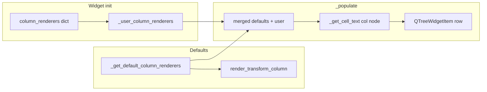

# Extensible column renderers for VispySceneTreeWidget

## Context

[vispy_helpers.py](h:\TEMP\Spike3DEnv_ExploreUpgrade\Spike3DWorkEnv\pyPhoPlaceCellAnalysis\src\pyphoplacecellanalysis\Pho2D\vispy\vispy_helpers.py) defines `VispySceneTreeWidget` with six columns: Type, Name, Visible, Order, Opacity, Transform. Currently `_populate()` builds each row with hard-coded logic (e.g. Transform column shows only `transform.__class__.__name_`_). The goal is to allow custom rendering of tree cell text via a simple, discoverable API, and to add a first concrete example: a Transform column renderer that shows location for NullTransform, STTransform, and MatrixTransform.

## Design: column renderer framework

- **Registry**: The widget will maintain a mapping from column name (header label) to a callable `(node: Node) -> str`. Columns that are not plain text (e.g. Visible with checkbox) are excluded from this registry.
- **Defaults**: Internal default renderers for Type, Name, Order, Opacity, and Transform (current behavior for Type/Name/Order/Opacity; Transform will be upgraded to the new location-aware renderer).
- **Extensibility**: 
  - Optional `column_renderers: Optional[Dict[str, Callable[[Node], str]]] = None` in `__init__` to pass overrides/additions at construction.
  - A method `register_column_renderer(column_name: str, renderer: Callable[[Node], str])` so users can add or override renderers after construction.
- **Lookup**: When building a row in `_populate()`, for each text column use the merged map (defaults + user): if a renderer is registered for that column name, call it with `node`; otherwise keep the current inline logic as fallback (so existing behavior remains if we only add the new default for Transform).

**Column names** (from existing headers): `'Type'`, `'Name'`, `'Visible'`, `'Order'`, `'Opacity'`, `'Transform'`. Only Type, Name, Order, Opacity, Transform participate in the renderer registry; Visible stays as checkbox and is not rendered by a callable.

## Implementation details

### 1. Widget changes in [vispy_helpers.py](h:\TEMP\Spike3DEnv_ExploreUpgrade\Spike3DWorkEnv\pyPhoPlaceCellAnalysis\src\pyphoplacecellanalysis\Pho2D\vispy\vispy_helpers.py)

- **Imports**: Add `Callable` to typing if not already present; no new package deps. Optionally import vispy transform types for the default Transform renderer: `from vispy.visuals.transforms import NullTransform, STTransform` and use `scene.transforms.MatrixTransform` or vispy’s linear module for type checks.
- `**__init__`**:
  - Add `column_renderers: Optional[Dict[str, Callable[[Node], str]]] = None`.
  - Store `self._user_column_renderers = dict(column_renderers or {})`.
- **Default renderers**: Add a method `_get_default_column_renderers()` that returns a dict with:
  - `'Type'`: `lambda n: n.__class__.__name__`
  - `'Name'`: `lambda n: '' if n.name is None else str(n.name)`
  - `'Order'`: `lambda n: str(getattr(n, 'order', ''))`
  - `'Opacity'`: current opacity formatting (e.g. `f'{float(getattr(n,"opacity",1)):0.3f}'` or `''` if not float)
  - `'Transform'`: a new helper (see below) that returns type + location string.
- **Merged lookup**: Add `_get_cell_text(column_name: str, node: Node) -> str`: merge defaults with `_user_column_renderers`; if column has a renderer (default or user), call it; else return a safe fallback (e.g. `''` or keep one-off logic only for columns that never have a default, to avoid duplicating logic).
- `**_populate()`**: Replace the current list built from inline expressions with building each text column via `_get_cell_text(header_name, node)`. Keep storing the node in `UserRole` and setting the Visible checkbox from `node.visible` unchanged.
- `**register_column_renderer(column_name: str, renderer: Callable[[Node], str])**`: Set `self._user_column_renderers[column_name] = renderer`. Optionally call `rebuild()` if the widget is already built (or document that user should call `rebuild()` to refresh).

### 2. Transform location renderer (first example)

- Add a **module-level** function, e.g. `render_transform_column(node: Node) -> str`, so it can be used as the default Transform renderer and also as a documented example for users who want to register custom renderers.
- Behavior:
  - `transform = getattr(node, 'transform', None)`. If `None`, return `''`.
  - **NullTransform**: return e.g. `"NullTransform (identity)"`.
  - **STTransform**: use `.translate` and `.scale` (vispy exposes these as properties). Format e.g. `"STTransform t(1.0, 2.0, 0.0) s(1.0, 1.0, 1.0)"` with a few decimals. Handle 2D/3D by formatting the length that exists.
  - **MatrixTransform**: read `.matrix` (4x4). Translation in an affine 4x4 is typically the last column (indices 12,13,14 in row-major 1D, or [0:3, 3] / [3, 0:3] depending on layout). Use a safe extraction (e.g. last column or last row for translation) and format as `"MatrixTransform t(x, y, z)"`. If matrix is identity, can show `"MatrixTransform (identity)"`.
  - For any other transform type, fallback to `transform.__class__.__name__` so unknown types still show something.
- Use short, readable formatting (e.g. 2–3 decimal places) so the column doesn’t grow too wide.

### 3. Docstring / usage example

- In the class docstring of `VispySceneTreeWidget`, add a short “Custom column renderers” section: show how to override or add a renderer via `register_column_renderer('Transform', render_transform_column)` (or pass `column_renderers={'Transform': render_transform_column}` in the constructor), and mention that the default Transform column now shows location for NullTransform, STTransform, and MatrixTransform.

## Files to modify

- **[vispy_helpers.py](h:\TEMP\Spike3DEnv_ExploreUpgrade\Spike3DWorkEnv\pyPhoPlaceCellAnalysis\src\pyphoplacecellanalysis\Pho2D\vispy\vispy_helpers.py)** only: implement the registry, `_get_cell_text`, `_get_default_column_renderers`, `register_column_renderer`, refactor `_populate()` to use them, add `render_transform_column()` and use it as the default Transform renderer, and extend the class docstring.

## Out of scope

- No changes to `predicitive_decoding_vispy.py` or other callers; the widget remains backward compatible (same constructor signature aside from optional `column_renderers`).
- No new tests in this plan (can be added later if desired).
- No support for customizing the Visible column via a renderer (it remains a checkbox driven by `node.visible`).

## Mermaid: data flow

