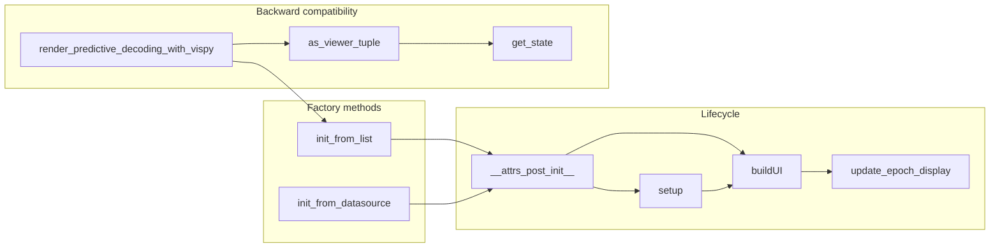

# Refactor render_predictive_decoding_with_vispy to Class-Based PredictiveDecodingVispyWidget

## Target file

- [PredictiveDecodingComputations.py](h:\TEMP\Spike3DEnv_ExploreUpgrade\Spike3DWorkEnv\pyPhoPlaceCellAnalysis\src\pyphoplacecellanalysis\General\Pipeline\Stages\ComputationFunctions\MultiContextComputationFunctions\PredictiveDecodingComputations.py) (lines 6800–8227: vispy function; 8229–8372: export function)

## Reference pattern: PredictiveDecodingDisplayWidget

- **Location**: same file, lines 5058–5333+ (class definition, `init_from_container`, `init_from_datasource`, `__attrs_post_init__`, `setup`, `buildUI`).
- **Pattern**: `@define(slots=False, repr=False, eq=False)` with explicit fields; classmethods `init_from_container` / `init_from_datasource` that build and return an instance; `__attrs_post_init__` runs `self.setup()` then `self.buildUI()`; `setup()` initializes data (datasource, extent, etc.); `buildUI()` creates window, docks/views, controls, then calls `update_displayed_epoch(active_epoch_idx)`.

## Design

### 1. New class: `PredictiveDecodingVispyWidget`

- **Decorator**: Use `@function_attributes(...)` (or `@metadata_attributes`) and `@define(slots=False, repr=False, eq=False)` consistent with `PredictiveDecodingDisplayWidget`.
- **Name**: `PredictiveDecodingVispyWidget` to distinguish from the matplotlib-based `PredictiveDecodingDisplayWidget` and keep the same naming style.

### 2. Instance attributes (replace `state` dict and function parameters)

**Data / config (from current function args):**

- `epoch_flat_mask_future_past_result: Optional[List[MatchingPastFuturePositionsResult]] = None`
- `a_decoded_filter_epochs_df: pd.DataFrame` (or optional if using datasource-only path)
- `a_flat_matching_results_list_ds: Optional[MaskDataSource] = None` (set in setup when built from list)
- `curr_position_df: pd.DataFrame`
- `pf_decoder: BasePositionDecoder`
- `decoded_result: DecodedFilterEpochsResult`
- `active_epoch_idx: int = 0`
- Display options: `current_traj_seconds_pre_post_extension`, `past_future_trajectory_extension_seconds` (parsed to start/end), `start_end_extension_max_opacity`, `show_full_position_background`, `require_angle_match`, `color_matches_by_matching_angle`, `enable_debug_plot_trajectory_average_angle_arrows`, `minimum_included_matching_sequence_length`, plus any other `**kwargs` that are stored.

**Derived in setup():**

- `xbin`, `ybin` (from `pf_decoder`)
- `num_epochs` (from `a_flat_matching_results_list_ds.p_x_given_n_list`)
- `recording_t_min`, `recording_t_max` (from `curr_position_df` or filter epochs)
- `past_future_trajectory_start_extension_seconds`, `past_future_trajectory_end_extension_seconds` (parsed from `past_future_trajectory_extension_seconds`)

**UI / vispy (created in buildUI):**

- `canvas`, `main_window`, `grid`
- Views: `past_view`, `posterior_2d_view`, `future_view`, `time_bin_grid`, `time_bin_views`, `combined_timeline_view`, `colorbar_view`
- Controls: `epoch_slider`, `epoch_value_label`
- Mutable visual lists: `past_lines`, `future_lines`, `time_bin_images`, `time_bin_labels`, `past_mask_contours`, `posterior_mask_contours`, `future_mask_contours`, `colorbar_rects`, `colorbar_texts`, `centroid_dots`, `centroid_arrows`, `trajectory_debug_arrows`, `full_position_background_line`, `timeline_ticks`
- Single refs: `posterior_img`, `epoch_info_text`, `current_position_line`, `timeline_bar`, `timeline_epoch_rect`, `timeline_epoch_triangle`
- `current_epoch_idx: int` (synced with slider)
- `max_time_bins_to_show: int = 12`

Use `field(default=Factory(list))` or `field(default=None)` for lists/singles as appropriate so that `update_epoch_display` can clear and repopulate them.

### 3. Factory methods

- `**init_from_list(cls, epoch_flat_mask_future_past_result, a_decoded_filter_epochs_df, curr_position_df, pf_decoder, decoded_result, active_epoch_idx=0, **kwargs)**`  
Builds `MaskDataSource` via `MaskDataSource.init_from_list_of_MatchingPastFuturePositionsResult(...)`, then constructs instance with `a_flat_matching_results_list_ds=that_ds`, `a_decoded_filter_epochs_df=a_decoded_filter_epochs_df`, and the rest of the args. No `__attrs_post_init__` that builds UI from a “container” is needed for this path; we still call `setup()` then `buildUI()` in `__attrs_post_init__`.
- `**init_from_datasource(cls, datasource: MaskDataSource, curr_position_df, pf_decoder, decoded_result, active_epoch_idx=0, **kwargs)**`  
Same as `PredictiveDecodingDisplayWidget.init_from_datasource`: build instance with `a_flat_matching_results_list_ds=datasource`, `a_decoded_filter_epochs_df=datasource.filter_epochs`, and other args. This keeps the same entry point as the widget for datasource-based usage.

In both factories, pass through display kwargs (`current_traj_seconds_pre_post_extension`, `past_future_trajectory_extension_seconds`, etc.) into the constructor.

### 4. Lifecycle

- `**__attrs_post_init__(self)**`  
  - If `a_flat_matching_results_list_ds` is None but `epoch_flat_mask_future_past_result` and `a_decoded_filter_epochs_df` are provided, build `a_flat_matching_results_list_ds` (same logic as current function).  
  - Call `self.setup()` then `self.buildUI()`.
- `**setup(self)**`  
  - Ensure `a_flat_matching_results_list_ds` is set (from list if needed).  
  - Set `xbin`, `ybin`, `num_epochs`, `recording_t_min`, `recording_t_max`, and parsed extension seconds from `pf_decoder` / `curr_position_df` / `a_decoded_filter_epochs_df`.  
  - No vispy/Qt creation here.
- `**buildUI(self)**`  
  - Move all current “create canvas, main window, grid, views, slider, connect signals, set cameras, add bbox lines” into this method, storing results in instance attributes.  
  - Connect slider: `valueChanged` → update label; `sliderReleased` → `self.update_epoch_display(epoch_slider.value())`.  
  - Connect canvas `key_press` → Left/Right arrow call `self.update_epoch_display(self.current_epoch_idx ± 1)`.  
  - Call `self.update_epoch_display(self.active_epoch_idx)` at the end.  
  - Call `main_window.show()` and `main_window.resize(...)`.

### 5. Update logic

- `**update_epoch_display(self, new_epoch_idx: int)**`  
  - Copy the current body of the closure `update_epoch_display` (lines ~7048–8172) into this method.  
  - Replace every `state['key']` with `self.key` (and ensure those attributes exist on the class as above).  
  - Replace `num_epochs` (local in closure) with `self.num_epochs`.  
  - Use `self.minimum_included_matching_sequence_length` and other display options from `self`.  
  - Keep all logic (clear visuals, prepare epoch data via `self.a_flat_matching_results_list_ds._prepare_epoch_data(...)`, render past/posterior/future, timeline, colorbar, etc.) unchanged except for the state → self mapping.

### 6. Backward compatibility for callers and export

- `**as_viewer_tuple(self) -> tuple**`  
Return `(self.main_window, self.canvas, self.get_state())` so existing code that expects `(main_window, canvas, state)` still works.
- `**get_state(self) -> dict**`  
Return a dict with at least: `num_epochs`, `epoch_slider`, `epoch_value_label`, `update_epoch_display` (bound method). Export uses `state['num_epochs']`, `state['epoch_slider']`, `state.get('update_epoch_display')`, and `canvas`; so the bound method and slider/label refs are enough. Other keys used only inside `update_epoch_display` are now on `self`, so they need not be in the dict unless export or other code expects them.
- `**render_predictive_decoding_with_vispy(...)` (keep as function)**  
Implement as: create widget via `PredictiveDecodingVispyWidget.init_from_list(...)` (or `init_from_datasource` if the caller passes a pre-built datasource; for the current docstring that takes `epoch_flat_mask_future_past_result` and `a_decoded_filter_epochs_df`, use `init_from_list`). Return `widget.as_viewer_tuple()`. So the function becomes a thin wrapper (~10–15 lines) and preserves the existing signature and return type.
- `**export_vispy_viewer_epochs(viewer_tuple, ...)**`  
Allow `viewer_tuple` to be either the tuple `(main_window, canvas, state)` or a `PredictiveDecodingVispyWidget` instance. At the start: `if hasattr(viewer_tuple, 'as_viewer_tuple'): viewer_tuple = viewer_tuple.as_viewer_tuple()` (or check for `get_state` and then unpack `main_window, canvas = viewer_tuple.main_window, viewer_tuple.canvas` and `state = viewer_tuple.get_state()`). Then existing unpacking `main_window, canvas, state = viewer_tuple` works.

### 7. Helper methods (optional but clearer)

- `**_clear_epoch_visuals(self)**`  
Extract the “clear all lists and detach visuals” block from `update_epoch_display` into a helper to keep `update_epoch_display` readable.
- `**_render_colorbar(self, max_time_distance)**`, `**_render_past_trajectories(...)**`, `**_render_future_trajectories(...)**`, `**_render_posterior_and_centroids(...)**`, `**_render_timeline(...)**`  
Optional: break the large `update_epoch_display` into smaller methods that take the prepared epoch data and max_time_distance; this improves readability and testability without changing behavior.

### 8. Imports and vispy/Qt

- Keep vispy/Qt imports inside the class (e.g. in `buildUI` and `update_epoch_display`) or at the top of the methods that need them, same as the current function, to avoid import cost at module load if not used.

### 9. Docstrings and usage

- Class docstring: describe the widget (vispy-based, same data as `PredictiveDecodingDisplayWidget`), keyboard (Left/Right) and slider, and point to `init_from_list` / `init_from_datasource` and the preserved `render_predictive_decoding_with_vispy` usage.
- Preserve the docstring of `render_predictive_decoding_with_vispy` and add one line: “Implemented via `PredictiveDecodingVispyWidget.init_from_list(...)`; returns `(main_window, canvas, state)` for compatibility.”

### 10. Order of edits

1. **Add the class** `PredictiveDecodingVispyWidget` (with all attributes, `__attrs_post_init__`, `setup`, `buildUI`, `update_epoch_display`, `get_state`, `as_viewer_tuple`, `init_from_list`, `init_from_datasource`) **above** the current `render_predictive_decoding_with_vispy` function (e.g. so the function starts around the same line number as before or slightly later). The class will be long (~1,400 lines) but a single coherent block.
2. **Replace the body** of `render_predictive_decoding_with_vispy` with the thin wrapper that instantiates the widget and returns `widget.as_viewer_tuple()`.
3. **Update `export_vispy_viewer_epochs**` to accept either the tuple or the widget instance (as in section 6).

## Summary diagram

## Files to change

| File                                                                                                                                                                                                                                                    | Change                                                                                                                                                                       |
| ------------------------------------------------------------------------------------------------------------------------------------------------------------------------------------------------------------------------------------------------------- | ---------------------------------------------------------------------------------------------------------------------------------------------------------------------------- |
| [PredictiveDecodingComputations.py](h:\TEMP\Spike3DEnv_ExploreUpgrade\Spike3DWorkEnv\pyPhoPlaceCellAnalysis\src\pyphoplacecellanalysis\General\Pipeline\Stages\ComputationFunctions\MultiContextComputationFunctions\PredictiveDecodingComputations.py) | Add `PredictiveDecodingVispyWidget` class; replace `render_predictive_decoding_with_vispy` body with wrapper; update `export_vispy_viewer_epochs` to accept widget or tuple. |

No new files. Existing callers of `render_predictive_decoding_with_vispy(...)` and `export_vispy_viewer_epochs(viewer_tuple, ...)` continue to work unchanged.