# PredictiveDecodingVispyWidget Cleanup and OO Refactor

## Target

- [PredictiveDecodingComputations.py](h:\TEMP\Spike3DEnv_ExploreUpgrade\Spike3DWorkEnv\pyPhoPlaceCellAnalysis\src\pyphoplacecellanalysis\General\Pipeline\Stages\ComputationFunctions\MultiContextComputationFunctions\PredictiveDecodingComputations.py): class `PredictiveDecodingVispyWidget` (approx. lines 6804–7598) and the thin wrapper `render_predictive_decoding_with_vispy` (7599–7672).

## Duplication Summary

| Duplication                         | Location (approx.)                               | Size                                       | Fix                                                                                                              |
| ----------------------------------- | ------------------------------------------------ | ------------------------------------------ | ---------------------------------------------------------------------------------------------------------------- |
| Past vs future trajectory rendering | 7230–7322 (past), 7465–7572 (future)             | ~90 lines each                             | Single `_render_trajectory_side(...)` parameterized by anchor time, default hue, view, lines list, timeline list |
| Time-bin color arrays               | 7144–7148, 7193, 7422, 7456–7460                 | 4 places                                   | One `_time_bin_colors(n_bins, alpha=0.9)` returning `(n_bins, 4)`                                                |
| Segment row → time bin index        | 7240–7210 (past), 7496–7504 (future)             | ~12 lines each                             | `_segment_row_to_time_bin_idx(segment_row_idx, epoch_idx)`                                                       |
| Start/end trajectory extension      | Past block (7225–7271), Future block (7470–7545) | ~25 lines × 2                              | `_extend_trajectory_xy_opacity(x_valid, y_valid, opacity, t_coords, ...)`                                        |
| Clear visuals                       | _clear_epoch_visuals 7050–7115                   | 15+ repeated “for x in list; list.clear()” | Loop over list of (list_attr_name,) and optional single-ref names; one helper or inline loop                     |
| Timeline tick drawing               | 7589–7596                                        | Two identical loops                        | One loop over `past_trajectory_colors_and_times + future_trajectory_colors_and_times`                            |

## Implementation Plan

### 1. Add private helpers (inside the class)

- `**_time_bin_colors(self, n_bins: int, alpha: float = 0.9) -> np.ndarray**`  
Returns `(n_bins, 4)` float32 array: for each index `t_idx` set `hue = (t_idx / max(n_bins, 1)) % 1.0`, `rgb = colorsys.hsv_to_rgb(hue, 0.8, 0.9)`, row = `(r, g, b, alpha)`. Use this for:
  - Main `time_bin_colors` in `update_epoch_display` (replace inline loop).
  - View borders: `view_time_bin_colors = self._time_bin_colors(n_bins_to_show, alpha=1.0)[:, :3]` (replace the list comp that calls `hsv_to_rgb` 3× per index at line 7422).
  - Contour colors: `contour_time_bin_colors = self._time_bin_colors(n_mask_t_bins, alpha=0.7)`.
- `**_segment_row_to_time_bin_idx(self, segment_row_idx: int, epoch_idx: int) -> Optional[int]**`  
If `epoch_flat_mask_future_past_result` is None or `epoch_idx` out of range, return None. Else get `curr_epoch_result = epoch_flat_mask_future_past_result[epoch_idx]`; if no `centroids_df` or `a_centroids_search_segments_df`, return None. If `segment_row_idx >= len(search_df)` return None. Get `actual_segment_idx` from `search_df.iloc[segment_row_idx]['segment_idx']`, find `matching_t_bins = centroids_df[centroids_df['segment_idx'] == actual_segment_idx].index`, return `matching_t_bins[0]` if non-empty else None.  
Use in both past and future trajectory blocks when resolving `matched_t_idx` from `segment_row_idx`.
- `**_extend_trajectory_xy_opacity(self, x_valid, y_valid, opacity, t_coords, traj_t_min, traj_t_max) -> Tuple[np.ndarray, np.ndarray, np.ndarray]**`  
Applies start extension (prepend positions and opacity from `curr_position_df` in `[traj_t_min - start_extension, traj_t_min)` with solid `start_end_extension_max_opacity`) and end extension (append positions and opacity in `(traj_t_max, traj_t_max + end_extension]` with fade from `start_end_extension_max_opacity` to 0). Returns `(x_valid, y_valid, opacity)` (possibly extended). Use in both past and future trajectory rendering.
- `**_detach_and_clear_visual_lists(self, list_attr_names: Sequence[str], single_ref_attr_names: Optional[Sequence[str]] = None)**`  
For each name in `list_attr_names`: get list with `getattr(self, name)`, for each item set `item.parent = None`, then `list.clear()`. For each name in `single_ref_attr_names`: get ref, if not None set `parent = None` and set attribute to None.  
Refactor `_clear_epoch_visuals` to call this with the existing list/single names (or a single list of “list” vs “single” entries).

### 2. Unify past/future trajectory rendering

- `**_render_trajectory_side(self, positions_dict, epoch_anchor_t, default_hue, view, lines_list, trajectory_colors_and_times_out, max_time_distance, time_bin_colors, x_min, x_max, y_min, y_max, new_epoch_idx) -> None**`  
Single method that:
  - Iterates over `positions_dict.items()`.
  - Skips if `require_angle_match` and no valid `centroid_pos_traj_matching_angle_idx`.
  - For each positions_df: gets valid x, y (and t if present). Resolves `base_rgb`: if `color_matches_by_matching_angle` and valid match indices, `segment_row_idx = int(valid_match_indices[0])`, `matched_t_idx = self._segment_row_to_time_bin_idx(segment_row_idx, new_epoch_idx)`, then `base_rgb = time_bin_colors[matched_t_idx][:3]` or `colorsys.hsv_to_rgb(default_hue, 0.8, 0.9)`; else `base_rgb = colorsys.hsv_to_rgb(default_hue, 0.8, 0.9)`.
  - If `epoch_anchor_t` and `'t'` in positions_df: compute `mean_time`, append `(colorsys.hsv_to_rgb(default_hue, 0.8, 0.9), mean_time)` to `trajectory_colors_and_times_out`; compute `time_rel` and opacity; call `_extend_trajectory_xy_opacity` to get extended x, y, opacity.
  - Build per-vertex colors array (base_rgb + opacity), create Line visual, add to `lines_list`. If `enable_debug_plot_trajectory_average_angle_arrows` and `segment_Vp_deg` present, compute circular mean angle and add Arrow to `trajectory_debug_arrows` (parent=view.scene).
  - Call this twice from `update_epoch_display`: once for past (epoch_start_t, 0.0, past_view, past_lines, past_trajectory_colors_and_times), once for future (epoch_end_t, 0.5, future_view, future_lines, future_trajectory_colors_and_times). Pass `time_rel = t_coords - epoch_anchor_t` so past gets negative and future positive for opacity.

### 3. Break update_epoch_display into render-phase methods (optional but recommended)

Keep `update_epoch_display` as orchestrator that:

- Bounds-checks, updates current_epoch_idx and slider/label, calls `_clear_epoch_visuals`.
- Prepares shared context: `epoch_data`, `filter_epochs`, `epoch_start_t`/`epoch_end_t`, `p_x_given_n`, `posterior_2d`, `n_time_bins`, `time_bin_colors = self._time_bin_colors(n_time_bins, 0.9)`, `x_min/x_max/y_min/y_max`, `x_scale/y_scale`, `curr_matching_past_future_positions_df_dict`, `max_time_distance` (and img dimensions fallback).
- Calls in order: `_render_colorbar(max_time_distance)`, `_render_full_position_background()`, `_render_trajectory_side(..., past...)`, `_render_posterior_image_and_centroids(...)`, `_render_current_position_line(...)`, `_render_epoch_info_text(...)`, `_render_time_bin_grid(...)`, `_render_mask_contours(...)`, `_render_trajectory_side(..., future...)`, `_render_timeline(...)`, then canvas title/update/processEvents.

Extract each logical block into a method that receives the needed context (epoch_start_t, epoch_end_t, new_epoch_idx, time_bin_colors, x_min, x_max, y_min, y_max, x_scale, y_scale, curr_matching_past_future_positions_df_dict, max_time_distance, posterior_2d, p_x_given_n, etc.) so that `update_epoch_display` stays short and testable.

### 4. Timeline ticks

- Replace the two separate loops (past ticks, future ticks) with one loop over `itertools.chain(past_trajectory_colors_and_times, future_trajectory_colors_and_times)` (or `past_trajectory_colors_and_times + future_trajectory_colors_and_times`) that creates each tick line.

### 5. Backwards compatibility

- Per user request: do not worry about backwards compatibility with `render_predictive_decoding_with_vispy`. Options: (a) leave the function as a thin wrapper that returns `widget.as_viewer_tuple()` so existing callers still work; or (b) change it to return the widget instance only and update docstring. Plan assumes (a) unless you prefer (b)—no structural change to the wrapper required for the refactor.

### 6. Performance tweaks

- Use `_time_bin_colors` everywhere so time-bin colors are computed once per epoch (and once per n_bins for contours) instead of multiple ad-hoc loops and the 3×-per-index list comp at 7422.
- Keep vispy/Qt imports inside methods if they are already there; no need to move to module top for this refactor.

### 7. File and scope

- All changes in [PredictiveDecodingComputations.py](h:\TEMP\Spike3DEnv_ExploreUpgrade\Spike3DWorkEnv\pyPhoPlaceCellAnalysis\src\pyphoplacecellanalysis\General\Pipeline\Stages\ComputationFunctions\MultiContextComputationFunctions\PredictiveDecodingComputations.py) only. No new files. Class remains in the same file.

## Order of work

1. Add `_time_bin_colors` and replace all four time-bin color usages in `update_epoch_display`.
2. Add `_segment_row_to_time_bin_idx` and use it in both past and future trajectory blocks (before unifying).
3. Add `_extend_trajectory_xy_opacity` and use it in both past and future blocks.
4. Add `_detach_and_clear_visual_lists` and refactor `_clear_epoch_visuals` to use it.
5. Add `_render_trajectory_side` and replace the past block with a call; then replace the future block with a call. Remove the duplicated logic.
6. Unify timeline tick drawing into one loop.
7. Optionally extract render-phase methods (`_render_colorbar`, `_render_full_position_background`, `_render_posterior_image_and_centroids`, `_render_current_position_line`, `_render_epoch_info_text`, `_render_time_bin_grid`, `_render_mask_contours`, `_render_timeline`) and have `update_epoch_display` only prepare context and call them.

## Diagram (data flow after refactor)

```mermaid
flowchart TB
  subgraph update_epoch_display [update_epoch_display]
    prep[Prepare context]
    clear[_clear_epoch_visuals]
    colorbar[_render_colorbar]
    bg[_render_full_position_background]
    past[_render_trajectory_side past]
    posterior[_render_posterior_and_centroids]
    currline[_render_current_position_line]
    epochtext[_render_epoch_info_text]
    timebin[_render_time_bin_grid]
    contours[_render_mask_contours]
    future[_render_trajectory_side future]
    timeline[_render_timeline]
  end
  subgraph helpers [Helpers]
    time_bin_colors[_time_bin_colors]
    segment_to_tidx[_segment_row_to_time_bin_idx]
    extend[_extend_trajectory_xy_opacity]
    detach[_detach_and_clear_visual_lists]
  end
  prep --> time_bin_colors
  clear --> detach
  past --> segment_to_tidx
  past --> extend
  future --> segment_to_tidx
  future --> extend
```

