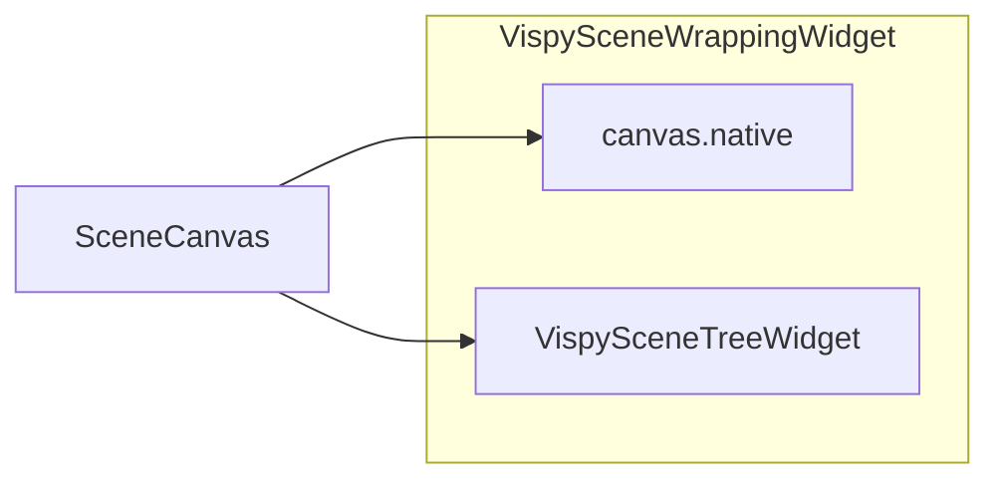

# Implement `VispySceneWrappingWidget`

## Current state

- In `[vispy_widgets.py](h:\TEMP\Spike3DEnv_ExploreUpgrade\Spike3DWorkEnv\pyPhoPlaceCellAnalysis\src\pyphoplacecellanalysis\Pho2D\vispy\vispy_widgets.py)`, `VispySceneWrappingWidget` (lines 377–441) duplicates the start of `[VispySceneTreeWidget](h:\TEMP\Spike3DEnv_ExploreUpgrade\Spike3DWorkEnv\pyPhoPlaceCellAnalysis\src\pyphoplacecellanalysis\Pho2D\vispy\vispy_widgets.py)` but **omits** `rebuild`, `_populate`, `_on_item_changed`, etc. `**__init__` calls `self.rebuild()`**, so the class cannot be instantiated.
- Elsewhere, vispy is embedded in Qt via `canvas.native` (e.g. `[predicitive_decoding_vispy.py](h:\TEMP\Spike3DEnv_ExploreUpgrade\Spike3DWorkEnv\pyPhoPlaceCellAnalysis\src\pyphoplacecellanalysis\Pho2D\vispy\predicitive_decoding_vispy.py)` ~1882), while the scene tree is a **separate** docked widget. A “wrapping” widget is still useful for simpler layouts (no dock system): one parent widget = GL view + inspector.
- `[vispy_helpers.py](h:\TEMP\Spike3DEnv_ExploreUpgrade\Spike3DWorkEnv\pyPhoPlaceCellAnalysis\src\pyphoplacecellanalysis\Pho2D\vispy\vispy_helpers.py)` duplicates `VispySceneTreeWidget` and exposes `VispyHelpers.create_scene_tree_widget`. **No change required there** for this task unless you later want a matching `create_scene_wrapping_widget` factory (optional follow-up).

## Intended behavior

- **Constructor**: `canvas: scene.SceneCanvas` (required), optional `parent`, optional `column_renderers` (forwarded to the tree), and layout toggles, e.g. `show_scene_tree: bool = True`, `tree_on_right: bool = True`, `tree_minimum_width: int = 200`, optional initial splitter stretch ratios or pixel `splitter_sizes`.
- **Layout**: `QSplitter` with `QtCore.Qt.Orientation.Horizontal` (default): add `canvas.native` and, when enabled, the internal `VispySceneTreeWidget(root_node=canvas.scene, canvas=canvas, parent=self, column_renderers=...)`. Order widgets so the tree is on the right when `tree_on_right` is true; swap order when false. When `show_scene_tree` is false, use a single-child layout (e.g. `QVBoxLayout` with only `canvas.native`) and set `self.scene_tree_widget = None`.
- **Public API** (align with existing call sites that use `.scene_tree_widget` and `.rebuild()`):
  - `self.canvas` — the `SceneCanvas`
  - `self.scene_tree_widget` — `VispySceneTreeWidget | None`
  - `rebuild(self) -> None` — if `self.scene_tree_widget` is not None, call its `rebuild()` (mirrors `[predicitive_decoding_vispy.py](h:\TEMP\Spike3DEnv_ExploreUpgrade\Spike3DWorkEnv\pyPhoPlaceCellAnalysis\src\pyphoplacecellanalysis\Pho2D\vispy\predicitive_decoding_vispy.py)` usage)
- **Window title**: `setWindowTitle('VispySceneWrappingWidget')` (fix copy-paste from tree widget).
- **Docstring**: Describe composite purpose, parameters, and that the tree reuses the same behavior as `VispySceneTreeWidget`.

## Implementation notes

- Reuse **composition**, not inheritance: do not duplicate tree columns, delegates, or `rebuild` logic.
- Use existing qtpy patterns in the file (`getattr` for `Qt.Orientation`, `QSizePolicy`, etc.) for PySide/PyQt compatibility, consistent with `VispySceneTreeWidget._init_ui`.
- Respect user style: **two blank lines between methods**, **single-line signatures** where reasonable, **minimal** diff (delete the broken duplicate methods only; add one cohesive class body).

## Verification

- Smoke test: `python -c` that builds a `SceneCanvas(show=False)`, constructs `VispySceneWrappingWidget(canvas)`, and calls `rebuild()` without error (no need to show a window in CI if headless is an issue—attribute existence and splitter child count are enough).

