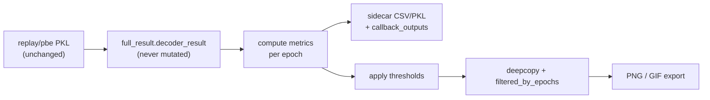

# W-maze posterior epoch quality scoring and filtering

## Goal

Extend [`figures_plot_nwb_wmaze_pbe_replay_decode_posteriors_completion_function`](h:\TEMP\Spike3DEnv_ExploreUpgrade\Spike3DWorkEnv\pyPhoPlaceCellAnalysis\src\pyphoplacecellanalysis\General\Batch\BatchJobCompletion\UserCompletionHelpers\batch_user_completion_helpers.py) so it:

1. **Computes** epoch-quality metrics (if not already cached) without mutating PKLs or original decode results
2. **Filters** both PBE and replay epochs before export using the tiered criteria from prior analysis
3. **Persists** metrics + filter summaries to `callback_outputs` and sidecar CSV/PKL files for reuse elsewhere

## Non-destructive contract



- Original `pbe_full_result` / `replay_full_result` and on-disk `*_2d_decoded_result.pkl` files are never modified.
- Export uses `decoded_epochs_result.filtered_by_epochs(...)` on a **deepcopy** only.
- Avoid `PositionLikePosteriorScoring.filter_to_position_like_epochs_only` for batch scoring (in-place masking risk + Linux memory leak from concatenating all epochs). Use **per-epoch** scoring instead.

## New reusable helper (for batch + notebook reuse)

Add two classmethods to [`PositionLikePosteriorScoring`](h:\TEMP\Spike3DEnv_ExploreUpgrade\Spike3DWorkEnv\pyPhoPlaceCellAnalysis\src\pyphoplacecellanalysis\SpecificResults\PendingNotebookCode.py) (tagged `WORKING`, next to existing PLI code ~line 4120):

### `compute_decoded_epochs_quality_metrics(...)`

Per-epoch loop over `DecodedFilterEpochsResult` (memory-safe):

| Stage | Implementation | Output columns |
|-------|----------------|----------------|
| Duration | `filter_epochs['duration']` | `duration`, `passes_duration` |
| PLI (primary) | For each time bin: reduce 4D posterior to 2D via **max across contexts** (same logic as existing filter), then `calculate_pli_score` | per-bin: `pli_score`, `is_position_like`; per-epoch: `n_position_like_bins`, `mean_pli_score`, `passes_pli` |
| Locality (secondary) | On **PLI-passing bins only**, build 3D `(nx, ny, n_t)` slice; call `DecodingLocalityMeasures.compute_locality_measures_for_posterior(..., gaussian_volume=None, alpha_list=[0.8])`; aggregate | `median_focality`, `median_peakiness`, `unimodal_fraction`, `passes_locality` |
| Sequentiality (optional) | Extract prominence masks from locality debug / `PeakPromenence`; run dilated Jaccard mask-overlap loop from [`SequenceBasedComputations.compute_temporal_sequentiality_measures`](h:\TEMP\Spike3DEnv_ExploreUpgrade\Spike3DWorkEnv\pyPhoPlaceCellAnalysis\src\pyphoplacecellanalysis\General\Pipeline\Stages\ComputationFunctions\MultiContextComputationFunctions\SequenceBasedComputations.py) (~1594–1704) on PLI-passing bins | `mean_seq_mask_overlap`, `total_path_cm`, `max_direction_change_deg`, `passes_sequentiality` |

Returns:
- `epoch_quality_df` — one row per epoch with all metrics + `passes_all` + `original_epoch_idx`
- `time_bin_quality_df` — optional long-form per-bin PLI (for debugging)
- `filter_config_dict` — thresholds used (for reproducibility)

### `filter_decoded_epochs_by_quality_metrics(...)`

- Input: full `DecodedFilterEpochsResult`, `epoch_quality_df`, threshold kwargs
- Logic: `included_idxs = epoch_quality_df[epoch_quality_df['passes_all']].index`
- If `max_epochs` set and more pass than cap: rank by `(n_position_like_bins, mean_pli_score, mean_seq_mask_overlap)` descending, take top N
- Output: `(filtered_deepcopy, included_original_epoch_idxs, filter_summary_dict)`

Extract sequentiality into a small private static `_compute_temporal_sequentiality_from_prominence_masks(...)` on the same class (or inline in `compute_decoded_epochs_quality_metrics`) rather than calling the unfinished `SequenceBasedComputations.compute_temporal_sequentiality_measures` classmethod.

## Changes to completion function

File: [`batch_user_completion_helpers.py`](h:\TEMP\Spike3DEnv_ExploreUpgrade\Spike3DWorkEnv\pyPhoPlaceCellAnalysis\src\pyphoplacecellanalysis\General\Batch\BatchJobCompletion\UserCompletionHelpers\batch_user_completion_helpers.py) (~3770–4053)

### New function parameters (defaults match existing conventions)

```python
enable_epoch_quality_filtering: bool = True,
force_recompute_epoch_quality: bool = False,
replay_min_duration_sec: Optional[float] = None,  # default: 2.0 * pbe_replay_decoding_time_bin_size
position_like_score_cutoff: float = 0.42,
num_min_position_like_t_bins: int = 3,
enable_locality_filter: bool = True,
max_median_focality: float = 0.15,
min_median_peakiness: float = 0.5,
min_unimodal_fraction: float = 0.7,
enable_sequentiality_filter: bool = False,
min_mean_seq_mask_overlap: float = 0.15,
min_total_path_cm: float = 5.0,
max_direction_change_deg: float = 120.0,
```

### New nested helper `_subfn_get_or_compute_epoch_quality(...)`

1. Resolve decoder bins: `full_result.decoder.xbin` / `.ybin` (always present on `DecodeSpecificEpochsResultWithDecodingInfo` PKL)
2. Sidecar paths:
   - `{CURR_BATCH_OUTPUT_PREFIX}_replay_epoch_quality_metrics.pkl` / `.csv`
   - `{CURR_BATCH_OUTPUT_PREFIX}_pbe_epoch_quality_metrics.pkl` / `.csv`
3. Load from sidecar if exists and `not force_recompute_epoch_quality`
4. Else call `PositionLikePosteriorScoring.compute_decoded_epochs_quality_metrics(...)` and save sidecar files

### New nested helper `_subfn_get_export_decoded_epochs_result(...)`

```python
if not enable_epoch_quality_filtering:
    return full_result.decoder_result, None, None
metrics = _subfn_get_or_compute_epoch_quality(...)
filtered, summary = PositionLikePosteriorScoring.filter_decoded_epochs_by_quality_metrics(
    deepcopy(full_result.decoder_result), metrics, max_epochs=spatial_gif_max_epochs, ...)
return filtered, metrics, summary
```

### Wire into export block (~4019–4041)

Replace direct `pbe_full_result.decoder_result` / `replay_full_result.decoder_result` with filtered copies from `_subfn_get_export_decoded_epochs_result` for **all four** export branches (PBE PNG, replay PNG, PBE GIF, replay GIF).

### Extended `callback_outputs`

```python
'pbe_epoch_quality_metrics_pkl_path': ...,
'pbe_epoch_quality_metrics_csv_path': ...,
'pbe_epoch_filter_summary': ...,
'replay_epoch_quality_metrics_pkl_path': ...,
'replay_epoch_quality_metrics_csv_path': ...,
'replay_epoch_filter_summary': ...,
```

Each `*_epoch_filter_summary` includes `n_epochs_before`, `n_epochs_after`, `n_epochs_exported`, threshold dict, and `included_original_epoch_idxs`.

## Default filter logic (`passes_all`)

```
passes_duration  = duration > replay_min_duration_sec
passes_pli       = n_position_like_bins >= num_min_position_like_t_bins
passes_locality  = (median_focality < max_median_focality) AND
                   (median_peakiness > min_median_peakiness) AND
                   (unimodal_fraction >= min_unimodal_fraction)   # skipped if enable_locality_filter=False
passes_sequentiality = (mean_seq_mask_overlap > min_...) AND ...   # only if enable_sequentiality_filter=True
passes_all = passes_duration AND passes_pli AND passes_locality [AND passes_sequentiality]
```

When `spatial_gif_max_epochs` is set, apply as **top-N cap after** `passes_all` (ranking), not as blind first-N.

## What stays unchanged

- PKL decode cache paths and `force_redecode` behavior
- `_subfn_export_wmaze_contextual_pf2D_*` helpers (receive already-filtered result)
- `drop_below_value` (visualization-only, post-filter)
- [`ProcessBatchOutputs_NWB_WMaze_Batch.ipy`](h:\TEMP\Spike3DEnv_ExploreUpgrade\Spike3DWorkEnv\Spike3D\ProcessBatchOutputs_NWB_WMaze_Batch.ipy) — no change required unless you want to tune kwargs later

## Verification

1. Run completion on one session with `enable_epoch_quality_filtering=True`; confirm `callback_outputs` reports `n_epochs_after << n_epochs_before` for replay
2. Confirm original `*_replay_2d_decoded_result.pkl` epoch count unchanged
3. Spot-check exported GIF count matches `n_epochs_exported`
4. Reload sidecar PKL on second run without `force_recompute_epoch_quality` — metrics should load, not recompute
