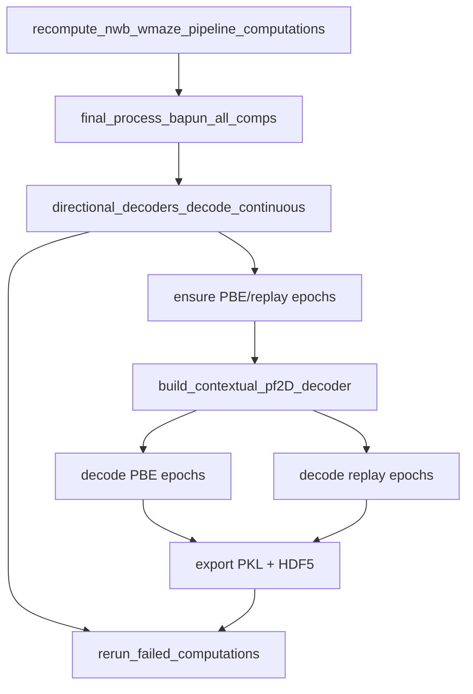

# W-Maze PBE/Replay 2D Decode Plan

## Answer: existing batch functions

**No existing user batch completion function does this end-to-end for DANDI W-Maze sessions.**

| Function | Overlap | Why it is not sufficient |
|---|---|---|
| [`generalized_decode_epochs_dict_and_export_results_completion_function`](h:\TEMP\Spike3DEnv_ExploreUpgrade\Spike3DWorkEnv\pyPhoPlaceCellAnalysis\src\pyphoplacecellanalysis\General\Batch\BatchJobCompletion\UserCompletionHelpers\batch_user_completion_helpers.py) | Decodes **PBE** (not replay) via pseudo2D/1D directional pipeline; exports CSVs | Requires `split_to_directional_laps` + `EpochComputations` (long/short KDiba-style infra). Replay is commented out in epoch decode dict. Not W-Maze contextual 2D decoder. |
| [`compute_and_export_decoders_epochs_decoding_and_evaluation_dfs_completion_function`](h:\TEMP\Spike3DEnv_ExploreUpgrade\Spike3DWorkEnv\pyPhoPlaceCellAnalysis\src\pyphoplacecellanalysis\General\Batch\BatchJobCompletion\UserCompletionHelpers\batch_user_completion_helpers.py) | Decodes **replay** epochs + exports HDF/CSVs | Uses **1D directional decoders** + `DirectionalLaps`/`RankOrder` (KDiba). Not 2D contextual decoder. |
| [`compute_and_export_session_alternative_replay_wcorr_shuffles_completion_function`](h:\TEMP\Spike3DEnv_ExploreUpgrade\Spike3DWorkEnv\pyPhoPlaceCellAnalysis\src\pyphoplacecellanalysis\General\Batch\BatchJobCompletion\UserCompletionHelpers\batch_user_completion_helpers.py) | Replay epoch variants + wcorr | KDiba alternative-replay workflow; 1D directional decoding. |
| [`compute_and_export_bapun_train_test_decoder_error_distance_completion_function`](h:\TEMP\Spike3DEnv_ExploreUpgrade\Spike3DWorkEnv\pyPhoPlaceCellAnalysis\src\pyphoplacecellanalysis\General\Batch\BatchJobCompletion\UserCompletionHelpers\batch_user_completion_helpers.py) | Supports `dandi_nwb` | **Laps only** (train/test position + context decoder). No PBE/replay. |

**Canonical notebook patterns to reuse** (already used for Bapun/NWB multi-context decoding):
- Epoch ensure: [`NWBDataSessionFormatRegisteredClass.POSTLOAD_estimate_laps_and_replays`](h:\TEMP\Spike3DEnv_ExploreUpgrade\Spike3DWorkEnv\NeuroPy\neuropy\core\session\Formats\Specific\NWBDataSessionFormat.py) (PBE via `compute_pbe_epochs`, replay via `replace_session_replays_with_estimates`, constrained to non-running periods)
- 2D decoder build: [`build_contextual_pf2D_decoder`](h:\TEMP\Spike3DEnv_ExploreUpgrade\Spike3DWorkEnv\pyPhoPlaceCellAnalysis\src\pyphoplacecellanalysis\SpecificResults\PendingNotebookCode.py) + [`_resolve_maze_epoch_names_for_multi_context_eval`](h:\TEMP\Spike3DEnv_ExploreUpgrade\Spike3DWorkEnv\pyPhoPlaceCellAnalysis\src\pyphoplacecellanalysis\SpecificResults\PendingNotebookCode.py)
- Per-epoch decode wrapper: [`DecodeSpecificEpochsResultWithDecodingInfo.init_by_decoding`](h:\TEMP\Spike3DEnv_ExploreUpgrade\Spike3DWorkEnv\pyPhoPlaceCellAnalysis\src\pyphoplacecellanalysis\SpecificResults\PendingNotebookCode.py)
- HDF export pattern: [`PosteriorExporting`](h:\TEMP\Spike3DEnv_ExploreUpgrade\Spike3DWorkEnv\pyPhoPlaceCellAnalysis\src\pyphoplacecellanalysis\Pho2D\data_exporting.py) (as used in `compute_and_export_decoders_epochs_decoding_and_evaluation_dfs_completion_function`)



## Implementation

### 1. Add a small reusable epoch-ensure helper (PendingNotebookCode)

Add `ensure_nwb_wmaze_pbe_and_replay_epochs(curr_active_pipeline, overwrite_extant: bool = False) -> dict` in [`PendingNotebookCode.py`](h:\TEMP\Spike3DEnv_ExploreUpgrade\Spike3DWorkEnv\pyPhoPlaceCellAnalysis\src\pyphoplacecellanalysis\SpecificResults\PendingNotebookCode.py):

- Guard: only run when `format_name == 'dandi_nwb'`.
- **Skip** if `sess.pbe` and `sess.replay` are both non-empty and `overwrite_extant=False`.
- Otherwise delegate to `NWBDataSessionFormatRegisteredClass.POSTLOAD_estimate_laps_and_replays(sess)` (requires laps — satisfied after `final_process_bapun_all_comps`).
- Return summary dict: `did_recompute_epochs`, `n_pbe`, `n_replay`, `n_non_pbe`.

This keeps batch logic thin and reuses the same estimation parameters already configured on NWB sessions.

### 2. Extend `recompute_nwb_wmaze_pipeline_computations_completion_function`

File: [`batch_user_completion_helpers.py`](h:\TEMP\Spike3DEnv_ExploreUpgrade\Spike3DWorkEnv\pyPhoPlaceCellAnalysis\src\pyphoplacecellanalysis\General\Batch\BatchJobCompletion\UserCompletionHelpers\batch_user_completion_helpers.py) (~lines 3637–3706)

**New parameters** (single-line signatures per project rules):
- `pbe_replay_decoding_time_bin_size: float = 0.060` (per your preference)
- `overwrite_pbe_replay_epochs: bool = False`
- `export_pbe_replay_decoding: bool = True`
- `export_pkl: bool = True`
- `export_hdf: bool = True`

**Insert after existing `final_process` + `directional_decoders_decode_continuous` block, before `rerun_failed_computations`:**

1. Call `ensure_nwb_wmaze_pbe_and_replay_epochs(...)`.
2. Resolve maze contexts: `_resolve_maze_epoch_names_for_multi_context_eval(curr_active_pipeline, maze_epoch_names=None)`.
3. Build decoder: `build_contextual_pf2D_decoder(curr_active_pipeline, epochs_to_create_global_from_names=resolved_maze_epoch_names)`.
4. Decode both epoch types via `DecodeSpecificEpochsResultWithDecodingInfo.init_by_decoding`:
   - PBE: `IdentifyingContext(epoch_name='pbe')`, `filter_epochs=sess.pbe`
   - Replay: `IdentifyingContext(epoch_name='replay')`, `filter_epochs=sess.replay`
   - Use `curr_active_pipeline.sess.spikes_df` (same as notebook examples).
5. **Export** (when `export_pbe_replay_decoding`):
   - PKL: `{BATCH_DATE}-{session}_pbe_2d_decoded_result.pkl` and `..._replay_2d_decoded_result.pkl` via `.save(pkl_output_path=...)`.
   - HDF5: wrap each result's `decoder_result` in a one-key dict and call `PosteriorExporting.perform_save_all_decoded_posteriors_to_HDF5(..., decoder_ripple_filter_epochs_decoder_result_dict={'contextual_pf2D': decoder_result}, ...)` with `data_identifier_str` like `(pbe_decoded_posteriors)` / `(replay_decoded_posteriors)` and `a_tbin_size=pbe_replay_decoding_time_bin_size` (mirror `compute_and_export_decoders_epochs_decoding_and_evaluation_dfs_completion_function`).

**Callback outputs** to add under `callback_outputs`:
- `pbe_replay_epochs_summary`
- `pbe_full_result`, `replay_full_result` (optional deepcopy omit if large — store paths only)
- `pbe_pkl_path`, `replay_pkl_path`, `pbe_hdf_path`, `replay_hdf_path`
- `pbe_replay_decode_error` (CapturedException, parallel to existing `recompute_error`)

Preserve existing try/except + `self.fail_on_exception` behavior.

### 3. Metadata / registration

- Update `@function_attributes` tags: add `pbe`, `replay`, `2D-decode`, `export`.
- Add `uses=[..., 'ensure_nwb_wmaze_pbe_and_replay_epochs', 'DecodeSpecificEpochsResultWithDecodingInfo', 'PosteriorExporting']`.
- No change needed to default completion dict — function is already registered at line ~4479.

### 4. Docstring example

Extend the function docstring with extract pattern:

```python
callback_outputs = across_session_results_extended_dict['recompute_nwb_wmaze_pipeline_computations_completion_function']
pbe_pkl_path = callback_outputs['pbe_pkl_path']
replay_hdf_path = callback_outputs['replay_hdf_path']
```

## Verification

After implementation, smoke-test on one loaded W-Maze pipeline pickle (same path used for existing W-Maze batch runs):

1. Confirm `sess.pbe` / `sess.replay` counts > 0 in callback summary.
2. Confirm PKL + HDF files exist under `collected_outputs_path`.
3. Confirm no new failed computations beyond pre-existing ones (`failed_computations_summary`).

No new unit tests unless you want them — existing batch functions in this file are integration-tested manually via notebook/batch runs.

## Risk notes

- **Laps prerequisite**: PBE/replay estimation intersects with non-running periods derived from laps. Running epoch ensure **after** `final_process_bapun_all_comps` avoids empty-epoch failures.
- **Memory**: 2D decode at 0.060 s is moderate; failures should surface in `pbe_replay_decode_error` without blocking the rest of the recompute pipeline unless `fail_on_exception=True`.
- **Replay vs ripple naming**: use `sess.replay` (NWB convention), not `ripple`.
