# Wire forwardicity into heuristic score pipeline

## Target

Persist `forwardicity`, `ratio_major_aligned_bins`, and `ratio_decoder_aligned_bins` as heuristic `filter_epochs` columns via the existing registration path used by `mseq_*`.

```mermaid
flowchart LR
  pending[PendingNotebookCode display] --> metric[forwardicity_score helpers]
  metric --> heuristicFile[heuristic_replay_scoring.py]
  heuristicFile --> regDict[build_all_bin_wise_subseq_partitioning_computation_fn_dict]
  regDict --> computeAll[compute_all_heuristic_scores]
  computeAll --> filterEpochs[filter_epochs columns]
  filterEpochs --> mergeDf[build_complete_all_scores_merged_df]
```

## 1. Move core helpers into heuristic module

In [`heuristic_replay_scoring.py`](h:/TEMP/Spike3DEnv_ExploreUpgrade/Spike3DWorkEnv/pyPhoPlaceCellAnalysis/src/pyphoplacecellanalysis/Analysis/Decoder/heuristic_replay_scoring.py):

- Move `forwardicity_score` and `main_sequence_positions` from [`PendingNotebookCode.py`](h:/TEMP/Spike3DEnv_ExploreUpgrade/Spike3DWorkEnv/pyPhoPlaceCellAnalysis/src/pyphoplacecellanalysis/SpecificResults/PendingNotebookCode.py) (lines ~142–283) to module level near the other score helpers (above `SubsequencesPartitioningResultScoringComputations`).
- Add a small decoder-direction map constant matching the display provider:
  `{'long_LR': -1.0, 'long_RL': 1.0, 'short_LR': -1.0, 'short_RL': 1.0}`.
- Keep `debug_print=False` as the default for pipeline use (display can still pass `True`).

## 2. Register three scalar bin-wise scores

On `SubsequencesPartitioningResultScoringComputations`:

- Add a private helper that computes the full tuple once from `partition_result` + optional `decoder_name`:
  - positions via `main_sequence_positions(partition_result)`
  - direction via the map (or `None` → NaN forwardicity / decoder ratio)
- Add three classmethods with the same signature as `mseq_*`, plus optional `decoder_name: Optional[str] = None`:
  - `bin_wise_forwardicity_fn` → `forwardicity`
  - `bin_wise_ratio_major_aligned_bins_fn` → `ratio_major_aligned_bins`
  - `bin_wise_ratio_decoder_aligned_bins_fn` → `ratio_decoder_aligned_bins`
- Register all three in `build_all_bin_wise_subseq_partitioning_computation_fn_dict` next to `mseq_dtrav`.

This auto-includes them in `HeuristicReplayScoring.get_all_score_computation_col_names()`.

## 3. Pass decoder name at the compute call site

In `HeuristicReplayScoring.compute_all_heuristic_scores` (~L3201–3208), the subseq loop currently does not pass decoder identity. Special-case the three new keys so the call includes `decoder_name=a_name` without changing existing `mseq_*` signatures.

Also update `SubsequencesPartitioningResult`’s convenience score dict (~L1590) so those three keys get `decoder_name=None` (safe defaults → NaN for decoder-aligned metrics; major-aligned still works).

## 4. Keep PendingNotebookCode / display working

In `PendingNotebookCode.py`:

- Remove the moved implementations.
- Re-import `forwardicity_score` and `main_sequence_positions` from `heuristic_replay_scoring` so existing notebook imports keep working.
- Point `ForwardicityPaginatedPlotDataProvider` at the same imports (behavior unchanged).

## 5. Old-data compatibility (required)

`_build_merged_score_metric_df` already intersects requested columns with columns present on the DFs, so merge of old results will simply omit the new columns.

The break risk is [`_workaround_validate_has_directional_decoded_epochs_heuristic_scoring`](h:/TEMP/Spike3DEnv_ExploreUpgrade/Spike3DWorkEnv/pyPhoPlaceCellAnalysis/src/pyphoplacecellanalysis/General/Pipeline/Stages/ComputationFunctions/MultiContextComputationFunctions/DirectionalPlacefieldGlobalComputationFunctions.py) (~L5089), which requires **all** names from `get_all_score_computation_col_names()`. Adding three keys would mark old sessions as incomplete.

Fix: exclude the three forwardicity column names from that validation’s required set (e.g. filter them out of `heuristic_score_col_names` before `PandasHelpers.require_columns`). Do **not** raise if they are absent.

`build_complete_all_scores_merged_df` already try/excepts `add_score_best_dir_columns`; missing forwardicity suffixed columns will be skipped without failing the merge.

## Out of scope

- No new pipeline computation stage name.
- No changes to radon/wcorr `_compute_all_df_score_metrics`.
- No notebook edits beyond the Python module re-exports above.
