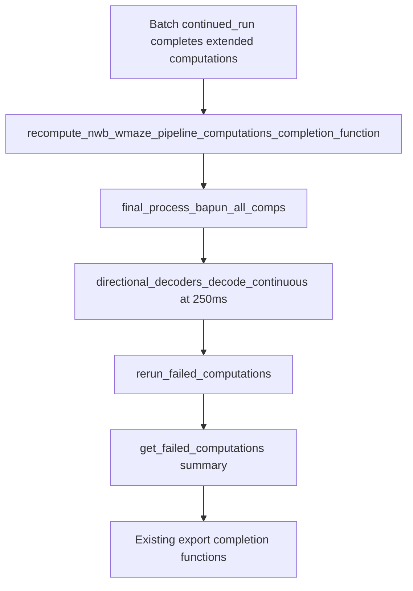

# WMaze manual recomputation user completion function

## What we're extracting

From [`scratch_extracted_notebook_code_for_batch.py`](Spike3D/SingleDayWTrackLearning/scratch_extracted_notebook_code_for_batch.py) lines 5–26 (matching the DANDI notebook cell in `InteractivePipelineLoadFromPickle_DANDI_SingleDayWTrackLearning_sub-JDS-SingleDay-JS14.ipynb`):

1. `final_process_bapun_all_comps(...)` — non-KDIBA preprocessing + placefield/decoding pipeline refresh (`active_data_mode_name='dandi_nwb'`, `posthoc_save=False`, `time_bin_size=0.500`, `overwrite_extant=True`, `fail_on_exception=True`)
2. `perform_specific_computation(['directional_decoders_decode_continuous'], time_bin_size=0.250)`
3. `rerun_failed_computations()`
4. `get_failed_computations()` — capture summary for batch outputs

Display/export code below line 26 in the scratch file is **out of scope**.



## 1. Add new completion function

**File:** [`batch_user_completion_helpers.py`](pyPhoPlaceCellAnalysis/src/pyphoplacecellanalysis/General/Batch/BatchJobCompletion/UserCompletionHelpers/batch_user_completion_helpers.py)

**Placement:** New section immediately after the Bapun train-test block (~line 3560), before `figures_plot_bapun_train_test_decoder_error_distance_completion_function`.

**Proposed name:** `recompute_nwb_wmaze_pipeline_computations_completion_function`

**Signature** (same standard batch callback shape as [`compute_and_export_bapun_train_test_decoder_error_distance_completion_function`](pyPhoPlaceCellAnalysis/src/pyphoplacecellanalysis/General/Batch/BatchJobCompletion/UserCompletionHelpers/batch_user_completion_helpers.py)):

```python
def recompute_nwb_wmaze_pipeline_computations_completion_function(self, global_data_root_parent_path, curr_session_context, curr_session_basedir, curr_active_pipeline, across_session_results_extended_dict: dict,
        active_data_mode_name: Optional[str] = None, posthoc_save: bool = False, final_process_time_bin_size: float = 0.500, overwrite_extant: bool = True, directional_decode_time_bin_size: float = 0.250, should_disable_cache: bool = False, fail_on_exception: bool = True, debug_print: bool = False) -> dict:
```

**Behavior:**

| Step | Implementation |
|------|----------------|
| Format gate | Skip with WARN unless `getattr(curr_session_context, 'format_name', None) == 'dandi_nwb'` (same pattern as bapun function's format check at line 3465) |
| Resolve mode | `active_data_mode_name = active_data_mode_name or getattr(curr_session_context, 'format_name', 'dandi_nwb')` |
| Recompute | `curr_active_pipeline = final_process_bapun_all_comps(curr_active_pipeline=curr_active_pipeline, active_data_mode_name=active_data_mode_name, posthoc_save=posthoc_save, time_bin_size=final_process_time_bin_size, overwrite_extant=overwrite_extant, fail_on_exception=fail_on_exception)` |
| Continuous decode | `curr_active_pipeline.perform_specific_computation(computation_functions_name_includelist=['directional_decoders_decode_continuous'], computation_kwargs_list=[{'time_bin_size': directional_decode_time_bin_size, 'should_disable_cache': should_disable_cache}], enabled_filter_names=None, fail_on_exception=fail_on_exception, debug_print=debug_print)` |
| Retry failures | `curr_active_pipeline.rerun_failed_computations(fail_on_exception=fail_on_exception)` |
| Capture status | `failed_computations = curr_active_pipeline.get_failed_computations()` → store a pickle-safe summary in `callback_outputs` (filter context → computation name → `str(exception)`), plus `n_failed_computation_contexts` |

**Error handling:** Single `try/except` around the full sequence (steps are sequential). Use `CapturedException` + respect `self.fail_on_exception` (re-raise), matching the train/test decoder function pattern at lines 3505–3510.

**`callback_outputs` keys** stored under `across_session_results_extended_dict['recompute_nwb_wmaze_pipeline_computations_completion_function']`:

- `active_data_mode_name`, `final_process_time_bin_size`, `directional_decode_time_bin_size`, `overwrite_extant`, `posthoc_save`
- `failed_computations_summary` (dict)
- `n_failed_computation_contexts` (int)
- `recompute_error` (optional `CapturedException` if we choose soft-fail path — prefer hard-fail via `self.fail_on_exception` like other compute functions)

**Decorators / docs:**

- `@function_attributes(..., tags=['dandi_nwb', 'wmaze', 'nwb', 'recompute', 'directional-decoders', 'non-kdiba'], ...)`
- Docstring with plain-Python usage example (per project docstring rule) showing how to read results from `across_session_results_extended_dict`

**Note:** No `assert self.collected_outputs_path.exists()` — this function does not write CSVs; batch save still happens via `BatchCompletionHandler` after all completion functions finish.

## 2. Wire into NWB WMaze batch driver

**File:** [`ProcessBatchOutputs_NWB_WMaze_Batch.ipy`](Spike3D/ProcessBatchOutputs_NWB_WMaze_Batch.ipy)

**Import** (line ~79): add `recompute_nwb_wmaze_pipeline_computations_completion_function` to the existing import from `batch_user_completion_helpers`.

**Register first** in `phase_any_run_custom_user_completion_functions_dict` (~line 600) so it runs before exports that depend on refreshed decoder state:

```python
phase_any_run_custom_user_completion_functions_dict = {
    'recompute_nwb_wmaze_pipeline_computations_completion_function': recompute_nwb_wmaze_pipeline_computations_completion_function,
    'compute_and_export_decoders_epochs_decoding_and_evaluation_dfs_completion_function': ...,
    ...
}
```

**Override kwargs** in `custom_user_completion_function_override_kwargs_dict` (~line 431): add entry aligned with batch time-bin settings:

```python
'recompute_nwb_wmaze_pipeline_computations_completion_function': dict(
    final_process_time_bin_size=0.500,
    directional_decode_time_bin_size=laps_decoding_time_bin_size,  # 0.250
    overwrite_extant=True,
    posthoc_save=False,
    fail_on_exception=True,
    debug_print=False,
),
```

## 3. Verification

- Import smoke test: `from pyphoplacecellanalysis.General.Batch.BatchJobCompletion.UserCompletionHelpers.batch_user_completion_helpers import recompute_nwb_wmaze_pipeline_computations_completion_function`
- Confirm `inspect.getsource` produces valid template code (function is self-contained with lazy imports inside body, like the bapun function)
- Optional: run one `continued_run` session script on a single WMaze subject and confirm `failed_computations_summary` is empty and downstream `compute_and_export_bapun_train_test_decoder_error_distance_completion_function` still succeeds

## Files changed

| File | Change |
|------|--------|
| [`batch_user_completion_helpers.py`](pyPhoPlaceCellAnalysis/src/pyphoplacecellanalysis/General/Batch/BatchJobCompletion/UserCompletionHelpers/batch_user_completion_helpers.py) | New ~60-line completion function |
| [`ProcessBatchOutputs_NWB_WMaze_Batch.ipy`](Spike3D/ProcessBatchOutputs_NWB_WMaze_Batch.ipy) | Import, dict registration (first), override kwargs |

No changes to [`scratch_extracted_notebook_code_for_batch.py`](Spike3D/SingleDayWTrackLearning/scratch_extracted_notebook_code_for_batch.py) unless you want a comment pointing to the new function afterward.
