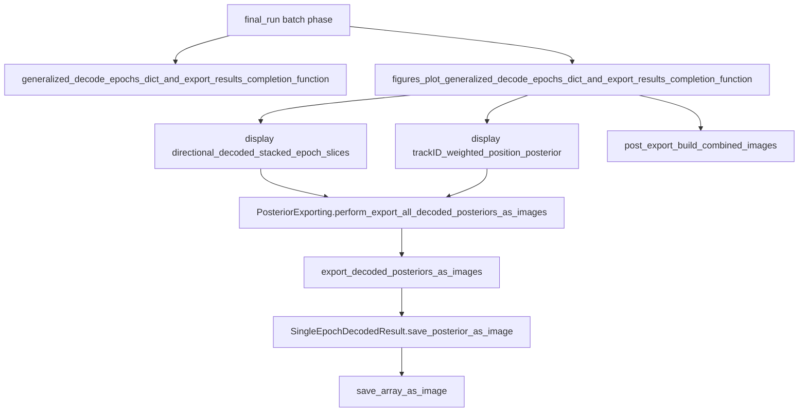

# Posterior Export Process

Technical reference for KDiba PBE/replay posterior **PNG** exporting (batch → disk → visualization handoff).

**Not covered here:** DataFrameFilter Solara Copy/Save composite dashboard PNGs.

---

## Mental model

1. Decode epoch posteriors into `DecodedFilterEpochsResult` dicts (laps + ripple/PBE).
2. Render each epoch’s `p_x_given_n` as a PNG.
3. Organize under `{date}/{session}/{laps|ripple}/{decoder}/{format}/`.
4. Stitch multi-decoder / multi-format composites into `combined/multi` for browsing.

Naming note: in the KDiba PNG tree, PBE-like epochs live under folder name **`ripple`**, not `pbe`.

---

## What batch must run

Registered in `pyPhoPlaceCellAnalysis/.../General/Batch/pythonScriptTemplating.py` under **`ProcessingScriptPhases.final_run`** (`phase3`):

| Order | Completion function | Role |
|-------|---------------------|------|
| 1 | `generalized_decode_epochs_dict_and_export_results_completion_function` | Builds `EpochComputations` / generic decode results (prerequisite for weighted / MultiColor export) |
| 2 | `figures_plot_generalized_decode_epochs_dict_and_export_results_completion_function` | Runs PNG display exports + `post_export_build_combined_images` |

Both live in `.../BatchJobCompletion/UserCompletionHelpers/batch_user_completion_helpers.py`.

### Required pipeline data

**Directional stacked export** needs global keys including `DirectionalDecodersEpochsEvaluations`, providing:

- `decoder_laps_filter_epochs_decoder_result_dict`
- `decoder_ripple_filter_epochs_decoder_result_dict`

typically keyed by `long_LR`, `long_RL`, `short_LR`, `short_RL`.

**TrackID-weighted / MultiColor export** needs `global_computation_results.computed_data['EpochComputations']` with pseudo2D decode contexts for `known_named_decoding_epochs_type` in `{'laps', 'pbe'}` and the configured `masked_time_bin_fill_type` variants.

---

## Call hierarchy



### Source anchors

| Step | Location |
|------|----------|
| Batch figure driver | `batch_user_completion_helpers.py` → `figures_plot_generalized_decode_epochs_dict_and_export_results_completion_function` |
| Display A (per-decoder 1D) | `DirectionalPlacefieldGlobalComputationFunctions.py` → `_display_directional_merged_pf_decoded_stacked_epoch_slices` (short name `directional_decoded_stacked_epoch_slices`) |
| Display B (weighted / MultiColor / shared-norm) | `EpochComputationFunctions.py` → `EpochComputationDisplayFunctions._display_decoded_trackID_weighted_position_posterior_withMultiColorOverlay` (short name `trackID_weighted_position_posterior`) |
| Core writer | `Pho2D/data_exporting.py` → `PosteriorExporting` |
| Per-epoch PNG | `Analysis/Decoder/reconstruction.py` → `SingleEpochDecodedResult.save_posterior_as_image` |
| Low-level image I/O | `pyPhoCoreHelpers/.../media_output_helpers.py` → `save_array_as_image` |
| Final composites | `PosteriorExporting.post_export_build_combined_images` (batch defaults: `epoch_name_list=['ripple']`, layout `greyscale_shared_norm`) |

Inside `perform_export_all_decoded_posteriors_as_images`: for each of `laps` / `ripple`, each decoder calls `export_decoded_posteriors_as_images` → per-epoch `save_posterior_as_image`. When `n_decoders > 1`, `_subfn_build_combined_output_images` writes `merged*` PNGs under `combined/{format}/`.

---

## Outputs produced

| Artifact | Pattern |
|----------|---------|
| Per-epoch posterior | `p_x_given_n[NNN].png` (zero-padded label, e.g. `p_x_given_n[067].png`) |
| Per-decoder format folders | `greyscale`, `color` (Oranges), `raw_rgba`, `greyscale_shared_norm`, `viridis_shared_norm` |
| Auto multi-decoder stitch | `combined/{format}/merged{G\|V}_laps[i].png`, `merged{G\|V}_ripple[i].png` |
| Final browse composites | `combined/multi/p_x_given_n[NNN].png` |
| Sibling data (not PNG) | `*(decoded_posteriors)*_tbin-….h5` via `PosteriorExporting.perform_save_all_decoded_posteriors_to_HDF5` |

Almost all still images are PNG (PIL). Continuous decode video (`output/videos/{result_name}.avi`) is a separate path.

---

## Where files are saved

Default parent (via `try_discover_default_collected_outputs_dir` / `find_first_extant_path`):

```
{collected_outputs}/figures/_temp_individual_posteriors/
```

Full tree:

```
{collected_outputs}/figures/_temp_individual_posteriors/
  {YYYY-MM-DD}/
    {animal}_{exper}_{session}/          # e.g. gor01_one_2006-6-09_1-22-43
      laps|ripple/
        {long_LR|long_RL|short_LR|short_RL}/
          {format}/p_x_given_n[NNN].png
        combined/
          {format}/merged….png
          multi/p_x_given_n[NNN].png
```

Known `collected_outputs` roots include:

- `K:/scratch/collected_outputs`
- turbo / NFS lab paths
- Dropbox MED-DibaLab variants
- `Spike3D/output/collected_outputs` (local)

Batch figure completion passes `parent_output_folder=self.collected_outputs_path`. Display helpers resolve into `figures/_temp_individual_posteriors` when parent discovery runs (passing an existing path as a **string** can skip discovery and write directly under that parent + date/session).

Example:

`K:/scratch/collected_outputs/figures/_temp_individual_posteriors/2025-06-03/gor01_two_2006-6-12_16-53-46/ripple/combined/multi/p_x_given_n[2].png`

---

## Transfer / visualization handoff

**Primary copy target for reviewing PBE/replay posteriors:**

```
…/ripple/combined/multi/*.png
```

Optionally also copy per-decoder `greyscale_shared_norm` (or other format) folders for side-by-side checks.

| Consumer | Needs | Notes |
|----------|-------|-------|
| Obsidian canvas | PNG folders under session export | `ObsidianCanvasHelper.build_canvas_for_exported_session_posteriors` (`pyPhoCoreHelpers/.../obsidian_canvas_helpers.py`) globs `p_x_given_n*.png` from `{session}/…/combined/multi` |
| Paper / DataFrameFilter hover | HDF5 | `LoadedPosteriorContainer.load_batch_hdf5_exports` — **not** the PNG tree |
| Manual review | File explorer / Obsidian vault | Copy the date/session tree (esp. `ripple/combined/multi`) to Dropbox / vault / review machine |

There is **no dedicated rsync/scp** for these PNGs; handoff is local copy (`shutil.copy2` in Obsidian helper) or manual transfer.

---

## Key parameters

| Knob | Where | Typical use |
|------|-------|-------------|
| `included_figures_names` | figures completion function | Which display exports run (includes `_display_directional_merged_pf_decoded_stacked_epoch_slices` and `_display_decoded_trackID_weighted_position_posterior_withMultiColorOverlay`) |
| `desired_height` | display / `HeatmapExportConfig` | Often ~1200 |
| `custom_export_formats` | `HeatmapExportConfig` / `HeatmapExportKind` | greyscale, color, raw_rgba, shared-norm variants |
| `post_export_build_combined_images_kwargs` | figures completion | Defaults: `epoch_name_list=['ripple']`, `greyscale_shared_norm` layout |
| `time_bin_size`, `masked_time_bin_fill_type` | display B / EpochComputations | e.g. `ignore`, `nan_filled`, `dropped` |
| `filter_epochs_ripple_df` | export path | Restrict which ripple/PBE epochs are written |
| `delete_previous_outputs_folder` | display kwargs | Clean prior export dirs |

---

## Related / secondary paths

### Sibling HDF5 (data reload, not PNG)

- Writer: `PosteriorExporting.perform_save_all_decoded_posteriors_to_HDF5`
- Often produced by other batch helpers (`compute_and_export_decoders_epochs_decoding_and_evaluation_dfs_completion_function`, `export_session_h5_file_completion_function`, etc.)
- Consumed by paper notebooks / `LoadedPosteriorContainer` for hover heatmaps

### W-Maze PBE / replay images

- `figures_plot_nwb_wmaze_pbe_replay_decode_posteriors_completion_function`
- Tree: `{collected_outputs}/{BATCH_DATE}-{session}_pbe_replay_posterior_images/{pbe|replay}/contextual_pf2D/{greyscale_shared_norm|viridis_shared_norm}/…`
- Uses `save_array_as_image` directly (not the full KDiba `perform_export_all…` tree)

### Interactive paginated export

- `PhoPaginatedMultiDecoderDecodedEpochsWindow.export_current_epoch_marginal_and_raster_images` / `perform_export_all_epochs_to_images`
- → `PosteriorExporting._perform_export_current_epoch_marginal_and_raster_images`
- Marginal + raster stacks (e.g. `all_decoders_posteriors_and_rasters_stack_image.png`) beside the UI export root
